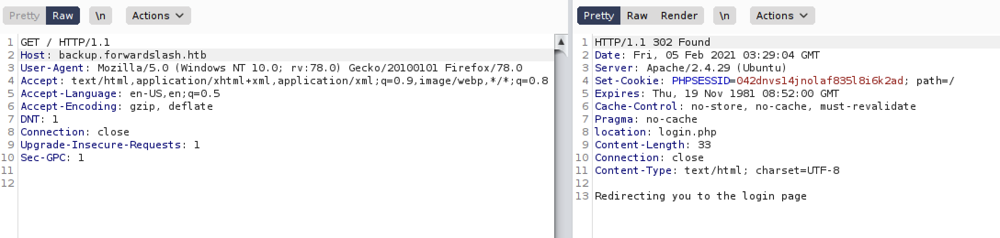

# Exercise: ForwardSlash

Discovering Ports and Services

As we did in the previous exercise, let’s start with an Nmap scan to identify the host’s ports and services. This scan should reveal a Linux machine running an Apache web server on port 80 and SSH on port 22:

┌─\[✗\]─\[rin@parrot\]─\[~/boxes/ForwardSlash\]

└──╼ $sudo nmap -v -sC -sV --min-rate=1000 -T4 -p- forwardslash.htb -oN Nmap/tcp-full

&lt;SNIP&gt;

PORT STATE SERVICE VERSION

22/tcp open ssh OpenSSH 7.6p1 Ubuntu 4ubuntu0.3 \(Ubuntu Linux; protocol 2.0\)

&lt;SNIP&gt;

80/tcp open http Apache httpd 2.4.29 \(\(Ubuntu\)\)

\| http-methods:

\|\_ Supported Methods: GET HEAD POST OPTIONS

\|\_http-server-header: Apache/2.4.29 \(Ubuntu\)

\|\_http-title: Backslash Gang

Service Info: OS: Linux; CPE: cpe:/o:linux:linux\_kernel

Searching for Virtual Hosts

Now let’s get some information about how ForwardSlash is using virtual host names for its site. In Burp, intercept the initial request sent to the server. Enable the Burp proxy in FoxyProxy on Firefox and send the request to the Repeater using CTL-R. Then sending the request to the server \(Figure 2-6\).


The request for the URL http://10.129.1.91 and its response

Notice that when you enter ForwardSlash’s IP address, the browser page gets redirected to forwardslash.htb: after sending the request, you should receive a response status code of 302 Found. This 302 status code tells the browser to redirect to http://forwardslash.htb.

We could choose to follow the redirect in Burp Suite, but instead, try changing the original request by replacing 10.10.10.183 with forwardslash.htb which illustrates that it is this value that determines the virtual host :

GET / HTTP/1.1

u Host: forwardslash.htb

User-Agent: Mozilla/5.0 \(Windows NT 10.0; rv:78.0\) Gecko/20100101 Firefox/78.0

Accept: text/html,application/xhtml+xml,application/xml;q=0.9,image/webp,\*/\*;q=0.8

Accept-Language: en-US,en;q=0.5

Accept-Encoding: gzip, deflate

DNT: 1

Connection: close

Upgrade-Insecure-Requests: 1

We replace the HOST field value with the virtual host u before sending the request. This time, the response status code is 200 OK, which means a page has been returned.

Add the hostname forwardslash.htb into the /etc/hosts file, along with the host’s IP address, and then return to http://forwardslash.htb in the browser. You should see a seemingly defaced home page saying that the site has been "pwned" by the Backslash Gang.


## Discovering the Site Structure

We can use gobuster to discover the structure of the site, as we did before. This time, though, let’s use a different wordlist, common.txt, that is part of the wordlists for the pre-installed application dirb, in /usr/share/wordlists/dirb

```bash
┌─[rin@parrot]─[~/boxes/ForwardSlash]
└──╼ $gobuster dir -t 50 -w /usr/share/wordlists/dirb/common.txt -u http://forwardslash.htb
<SNIP>
/.hta (Status: 403)
/.htpasswd (Status: 403)
/.htaccess (Status: 403)
/index.php (Status: 200)
/server-status (Status: 403)
```

This output doesn't reveal anything particularly interesting, other than the fact that the server is running PHP; we know this because the home page is index.php. Also notice that the /server-status page returns a 403 status code, which means we don't have access to it. Let’s try another search and specify some extensions of .txt, .php and .html with the -x flag:

```bash
┌─[rin@parrot]─[~/boxes/ForwardSlash]
└──╼ $gobuster dir -t 50 -w /usr/share/wordlists/dirb/common.txt -u http://forwardslash.htb -x php,txt,html
<SNIP>
/index.php (Status: 200)
/index.php (Status: 200)
/note.txt (Status: 200)
/server-status (Status: 40
```

This returns a file, note.txt which we can view with the curl command:

```bash
┌─[rin@parrot]─[~/boxes/ForwardSlash]
└──╼ $curl http://forwardslash.htb/note.txt

```

> Pain, we were hacked by some skids that call themselves the "Backslash Gang"... I know... That name... Anyway I am just leaving this note here to say that we still have that backup site so we should be fine.
>
> -chiv

This note suggests that there is a backup site, which means that it’s likely to be a virtual host. Let’s try to find it. Return to Burp, where you should still have the original request in the Repeater tab, and change the Host field to backup.forwardslash.htb. \(This seems like a likely name for the backup site.\) When you send this to the server, you should get a 302 redirect to a login.php page.



 Note that we could have also used gobuster to discover this virtual host using the vhost argument:

```bash
┌─[✗]─[rin@parrot]─[~/boxes/ForwardSlash]
└──╼ $gobuster vhost -w /usr/share/SecLists/Discovery/DNS/subdomains-top1million-20000.txt -u http://forwardslash.htb
<SNIP>
Found: backup.forwardslash.htb (Status: 302) [Size: 33]
```

Add backup.forwardslash.htb to the /etc/hosts file, then navigate to that URL on the browser to get to the same login page.


You’ve successfully fuzzed a website to discover its directory structure and file contents. You’ve also fuzzed virtual host names to discover a hidden site. This site has presented us with more to enumerate and the opportunity to find more information and vulnerabilities. We’ll leave ForwardSlash for now, and move on to cover enumeration of users and processes in the next chapter. We’ll return to ForwardSlash in Chapter 4, when we explore web vulnerabilities.

## On Your Own

Although we haven't covered enough yet to do an entire box on Hack The Box, you can try out what you have learned in this chapter on the Hack The Box machine OpenKeyS. Start by doing and nmap scan of the machine and record what ports and services you discovered. Note that this machine is not running Linux, but OpenBSD, which is very similar. You will find a web server running which you can explore. Run gobuster on this site and find the hidden directory /includes. When you go to this directory you can see that there is a misconfiguration which allows you to see the contents of the directory.


