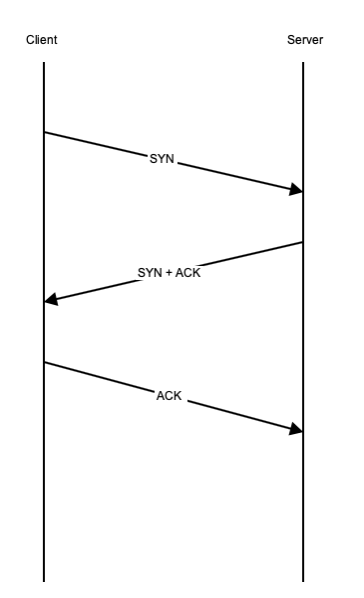

# Network Enumeration

If you’re going to access a machine through the Internet, it will be via TCP/IP, its network protocol. This is why it’s often valuable to perform network enumeration, which aims to discover the IP address of a machine of interest and the services it exposes to the network.

From outside an organization, the machines made accessible to via the network will typically provide services to the public, external clients, or remote staff. These machines are usually protected by firewalls that cordon the machine into a secure zone, sometimes referred to as a demilitarized zone \(DMZ\). This DMZ limits the machines’ access to other servers and networks internal to the organization, which are protected by other firewalls. Although a penetration tester will start from the outside, they’ll aim to eventually access the internal networks using a process called pivoting, which we’ll cover in Chapter 10.

In order to understand network enumeration, you’ll find it useful to understand how TCP/IP works, so this is what we will cover next.

### The TCP/IP Model

When accessing a target machine, you’ll usually make a network connection via TCP/IP. TCP/IP is the network protocol that underpins the internet, allowing applications to communicate with each other. Although you’ll find it useful to know how all layers of TCP/IP model operate, for now it’s enough to understand its essential components: how TCP/IP communication is initiated, how IP addresses identify the source and destination machines of these communication channels, and then how TCP/IP ports identify the actual programs that are either sending or receiving the messages on the machines. If you’re familiar with TCP/IP, feel free to skip ahead.

In order to send data, an application packages it and passes it through a series of conceptual layers. Each layer is responsible for handling a specific aspect of the communication protocol functionality. When an application wants to send data via TCP/IP, the data gets handled by the four different software layers to package the data up in a way that the network knows where to send the information to and how to handle the packets while they’re in transit.


The bottom link layer deals with transmission of messages, called packets, over the physical network connection. This connection is usually an ethernet cable in the case of a physical connection, and a Wi-Fi or cellular signal in the case of wireless connections. The next layer up is the internet layer that assembles packets for transportation over the link layer and uses IP addresses to identify the source and destinations of the packet.

TCP/IP actually consists of two main communication protocols; TCP \(Transmission Control Protocol\) and UDP \(User Datagram Protocol\). TCP is a connection-oriented protocol that is reliable, guaranteeing that all packets will arrive in the order in which they were sent and informing the applications if it couldn't send the packets reliably. UDP is a best-effort protocol; it does not guarantee the order of the packets that arrive, nor will it resend a packet if one gets dropped. The transport layer implements the actual functionality of TCP and UDP, using port numbers to identify the source and destination end points of the connection. Port numbers identify which application to deliver the packet to. Finally, the application layer implements protocols that determine the behaviors of applications and deal with things like authentication and encryption. Examples include HTTP, used for delivering web requests and replies, and SMTP, used for sending and receiving emails.

## The Structure of an IP Address

When a client wants to use TCP/IP to talk to another process, like a server on a different machine, it needs to know where to send messages.


First of all, it needs an IP address for the machine that is running the server. IP addresses are either in IPv4 \(IP version 4\) or IPv6 \(IP version 6\) format. We’ll be using with IPv4 because it’s still the most popular addressing scheme. An IPv4 address is a 32-bit number, divided into four eight-bit numbers separated by periods. For example, consider the IP address 192.168.0.1. In binary, that number would be comprised of 32 bits, as follows:

```text
IP:     192.168.0.1
Binary: 11000000101010000000000000000001
```

Of the 32 bits, a portion are used to identify a specific subnetwork. A subnetwork, or subnet, is a network in which all of the machines comprising it can talk directly to each other without passing through a router. The number of bits used to identify the subnet is usually denoted using Classless Inter-Domain Routing \(CIDR\) notation. For example, the subnet 192.168.1.0/24 indicates that 24 bits of the address are used to identify the network and only eight bits are used to identify hosts. An alternative to this notation is to use a subnetwork mask of the type 255.255.255.0 which will yield the network portion of an IP address. Masks work by taking the binary representation of the mask and the binary representation of the IP address and performing a logical "and" operation on the two numbers. When two bits in the same position are both 1, the result of the operation will be 1. If either bit is 0, the result of the and operation will be 0. For example, the address 192.168.1.1 and the network mask 255.255.255.0 in binary are:

```text
11000000101010000000000100000001 (192.168..1)
11111111111111111111111100000000 (255.255.55.0)
11000000101010000000000100000000 (192.168.1.0)
```

The result of the and operation is 192.168.1.0 which is the network that the host 192.168.1.1 belongs to.

In addition to the IP address of the machine, TCP/IP needs to know the specific port number that the server is listening on. Port numbers range from 0 and 65,535. Depending on the type of communication, the client may also be listening on a port for the server to send data to. In the example shown in Figure 2-2, the client is listening on port 6001 and is communicating with a server on the machine at 192.168.0.6 and port 8080.

## The TCP Three-Way Handshake

Much of what we will cover regarding network mapping and enumeration relies on the way in which TCP forms its connections during connection establishment between two machines. This process is called the TCP three-way handshake \(Figure 2-3\), and it involves the exchange of several packets that ensure both devices are available for the communication. During the handshake, each party shares an initial sequence number with the other party and the other party to acknowledge it. This sequence number is incremented each time a message is sent to the other party, allowing the two parties to keep track of which messages have been received. The handshake starts with the client sending a SYN \(synchronization\) packet to the server machine with a randomly chosen sequence number.



The SYN is actually a flag in the header portion of the packet. The server responds with a packet that has both he SYN and ACK \(acknowledgement\) flags set. Finally, the client responds with an ACK message of its own. If a client sends a SYN packet to a port that is closed or where there is no application listening, the response will be a message with the RST \(reset\) flag set. If no response is received after sending a SYN packet, the assumption is that the port is being filtered \(blocked\) by a firewall.

## Discovering a Target’s IP Addresses and Domains

The simplest way to discover if a host's IP address and if it is active is to send a ping message. Pings are messages sent using the Internet Control Management Protocol \(ICMP\), which is part of the Internet layer of the TCP/IP model. A ping is an ICMP echo request, and it should trigger an automatic response: if the host is online, it should reply with an ICMP echo reply message. In order to discover online hosts, you can create a bash script that loops through a sequence of addresses, pinging each host:

```bash
#!/bin/bash
 host_is_up() {
   ping -c 1 -w 1 "${ip}" > /dev/null
 }
for i in {1..254}; do
   ip="10.0.1.${i}"
   if host_is_up "${ip}"; then
       echo "${ip}"
   fi
done
```

In this code, we enter a loop, incrementing the variable i during each iteration, from 1 to 254 v. We use this number to create a new IP address using a network portion "10.0.1" and adding the variable i as the host portion \(note that you could pass this portion in as an argument to the script\). The code then calls the host\_is\_up function w with the newly created IP address as an argument. The host\_is\_up function sends a ping \(-c 1\) and waits one second for a reply \(-w 1\) u. This function will return a status code indicating whether the ping was successful, so we check for this code. If successful, we print IP address of the discovered host.

Through this script alone, you’ve essentially built a network discovery tool. As you’ll see shortly, though, most network discovery tools actually do a bit more than a sending simple ICMP echo requests.

## Discovering Open Ports

One of the first network enumeration tasks you’ll do once you’ve found an available host is discover open ports on this target. This is because we are interested in what services are running on the machine that we can potentially communicate with and therefore, exploit.

Certain well-known ports are associated with specific protocols and services. These ports, designated the Internet Assigned Numbers Authority \(IANA\), are ports 0 – 1,023 and these are reserved for well-known services such as FTP, SSH, HTTP, and DNS Ports numbered between 1,024 and 49,151 are called registered ports and are usually product and company specific. Dynamic ports, those between 49,152 and 65,535, are used for temporary connections or for private use. You should memorize certain well-known ports, as it makes reading Nmap scans and understanding services that use them, that much easier. After enough scanning, you’ll come to recognize them. They are shown here:

List of well-known TCP and UDP ports

| **Port** | **Service Name** | **Protocol** |
| :--- | :--- | :--- |
| 21 | FTP | TCP |
| 22 | SSH | TCP,UDP |
| 23 | Telnet | TCP,UDP |
| 25 | SMTP \(Simple Mail Transport Protocol\) | TCP,UDP |
| 53 | DNS \(Domain Name System\) | TCP,UDP |
| 69 | TFTP |  |
| 80 | HTTP | TCP |
| 88 | Kerberos Authentication |  |
| 110 | POP3 \(Post Office Protocol version 3\) | TCP |
| 135 | EPMAP / Microsoft RPC Locator Service | TCP,UDP |
| 137 | NetBIOS Name Service | TCP,UDP |
| 138 | NetBIOS Datagram Service | TCP,UDP |
| 139 | NetBIOS Session Service | TCP,UDP |
| 143 | IMAP |  |
| 161/162 | SNMP |  |
| 389 | LDAP |  |
| 443 | HTTPS | TCP |
| 445 | SMB |  |

The task of discovering open ports is not always easy. For a start, different operating systems implement slightly different responses to network packets arriving at a port. A machine may be behind a firewall, which determines what network traffic is allowed through and how open or closed ports appear to a scanner. But let’s start with the basics and go on from there.

## Scanning the Network with Nmap

Nmap \([https://Nmap.org/](https://nmap.org/)\) is many people’s go-to network scanner of choice and comes pre-installed on Parrot OS. This network mapper tool allows you to discover hosts, and then map the ports and software services behind those ports running on a machine.

Try scanning a publicly available machine, scanme.org, using Nmap’s default command, as follows:

```bash
$ sudo nmap scanme.org
Nmap scan report for scanme.org (45.33.32.156)
Host is up (0.20s latency).
Other addresses for scanme.org (not scanned): 2600:3c01::f03c:91ff:fe18:bb2f
rDNS record for 45.33.32.156: scanme.nmap.org
Not shown: 993 closed ports
PORT      STATE     SERVICE
21/tcp    open      ftp
22/tcp    open      ssh
80/tcp    open      http
554/tcp   open      rtsp
7070/tcp  open      realserver
9929/tcp  open      nping-echo
31337/tcp open      Elite
```

By default, Nmap checks that the host is on the network by doing a ping scan of it. But although it is called a ping scan \(or sometimes a ping sweep\), Nmap actually tries four different approaches to seeing if the host is up. The first is an ICMP echo request \(an actual ping\), the second sends a TCP SYN packet to port 443, and the third, a TCP ACK packet to port 80. Finally, the fourth is an ICMP timestamp request. The benefit of doing a variety of different scans is that it increases the chances of at least one succeeding in detecting the host if a firewall is set up to block pings for example.

Having determine that the host is up, Nmap will perform a SYN scan of the top 1000 ports, giving a report of the ports that are open. A SYN scan consists of sending SYN messages as if starting a TCP three-way handshake and seeing if the host responds with the SYN/ACK packet, which indicates an open port. If it receives an RST flag, it knows the port is closed, and it will mark the port as “filtered” if there is no response. The SYN scan is also known as a “stealthy” scan, because most hosts don’t notice these attempts to connect.

To do a SYN scan, though, you need to have root privileges \(which is why we entered sudo to run this command\). If you aren’t running Nmap as root, you’ll have to use a full TCP connect scan using the -sT flag:

```bash
$ nmap -sT scanme.org
```

In this case, Nmap fully connects to the port by performing the entire three-way handshake. This tends to be less efficient than the SYN scan, and noisier, although most good Intrusion Detection Systems \(IDS\) will detect both types of scans. The -sT scan should return the same results.

