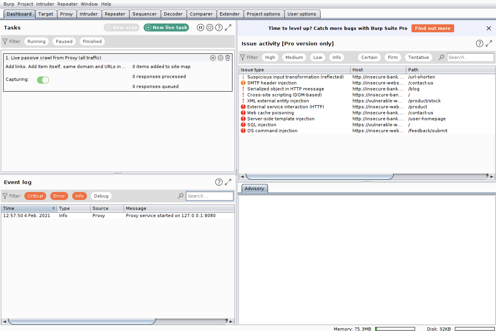

# Website Enumeration

Website Enumeration

Web applications are a prime target for attackers because they are generally externally facing; that is, they are directly accessible to the public. They also employ a variety of technologies to create functionality on the site designed to respond to users in real time. Moreover, the developers who program them haven’t traditionally had much experience in security. These dynamic websites may have exploitable vulnerabilities that an attacker can take advantage of.

Viewing HTTP Requests and Responses in Burp Suite

Web servers, the software that host websites, are programs responsible for sending the various files needed to display a webpage in response to a client’s requests. The client, which is usually a browser, then uses those files to display the webpage to the user. Machines serve websites over the Hypertext Transfer Protocol \(HTTP\), which you can think of as the language of web communications.

You can examine these HTTP requests and responses using an application called Burp Suite. Burp acts as a proxy server: in other words, it intercepts HTTP requests from a browser and passes the request to the server, then receives the HTTP response from the sever before passing it to the client. In doing so, Burp allows you to view the requests and responses generated when you perform various actions on a website, such as click buttons or fill out forms. As you’ll soon see, this information will become important in the exploitation of websites.

Exploring and Configuring Burp

You can start Burp Suite by selecting it from the Applications menu in Parrot OS under Pentesting &gt; Most Used Tools &gt; burpsuite. By default, Burp starts a proxy listener on port 8080, as you can see noted in the Event log on the dashboard \(Figure 2-2\).

HTTP usually communicates on port 80, while the encrypted version of the protocol, HTTPS, usually communicates on port 443. \(An Nmap run with scripts and versions \(-sC and -sV\), will report web servers running on different ports if it finds them.\) Because Burp is a proxy and intercepts requests, it listens on port 8080.

Burp has a range of capabilities, including capturing HTTP traffic, editing requests before sending them to a server, and even fuzzing the URLs and data in requests. URL fuzzing is the process of substituting different parts of the URL with words from a dictionary in order to discover the structure of the website. We can do this because, typically, a website uses a URL structure that map directly onto a directory structure under the root directory from which the website is run. The main thing we’ll use it for, however, is its interception and forwarding capabilities.

Although Burp has a built-in browser, you’ll have more flexibility if you use Firefox. You could directly configure Firefox to use the proxy, but constantly changing the configuration between proxied and non-proxied access would be tedious. Instead, you can use a browser add-on, such as FoxyProxy. To install FoxyProxy, add it to Firefox from its installation page \(https://addons.mozilla.org/en-US/firefox/addon/foxyproxy-standard/\).

Once FoxyProxy is installed, you can configure a proxy setting for Burp in the Options tab, as shown in Figure 2-4.

Configuring the Burp proxy in FoxyProxy

Specify the IP address of the proxy to be the localhost address 127.0.0.1 and the port number 8080.

Creating a Test Server

Let’s create our own web server so we can browse to it, then view the traffic this communication generates. We will create a test directory and a test file index.html. The name of the file is not important, but we chose it because the file for a website’s homepage is usually called index.html. Then start a Python web server on port 8000:

┌─\[rin@parrot\]─\[~/boxes/book\]

└──╼ $python3 -m http.server 8000

Serving HTTP on 0.0.0.0 port 8000 \(http://0.0.0.0:8000/\) ...

The http.server module will listen for HTTP GET requests on port 8000 and then serve the files requested from the directory it is running in.

Capturing Traffic

In Burp, select the Proxy tab and make sure that the Intercept is On button is selected. Switch on the Burp proxy in FoxyProxy, then access http://127.0.0.1:8000/index.html in the browser. The request should hang in the browser as it is intercepted in Burp. Its contents should be displayed in the Raw window \(Figure 2-4\).

Send this request to the Repeater tab in Burp using CTL-R, or right-clicking the window and selecting Send to Repeater. The Repeater in Burp allows requests to be viewed, edited, and then sent to the destination. It’s called the Repeater because this action can be repeated. We can now either drop the request or forward it to the server. You can see the history of all requests going through the proxy in the HTTP history tab \(the second tab in the Proxy section\). If you notice a number of requests from Firefox for the URL http://detectportal.firefox.com/ you can disable this by typing about:config in the URL search bar of Firefox, searching for “portal,” and switching network.captive-portal-service.enabled to false.

In the Repeater tab, you should see the request displayed in an editable window \(Figure 2-5\). If you click Send, this request will be sent to the server, and the reply will be displayed in the Response window. Let’s take a closer look at this HTTP request so you can understand its components.

HTTP Requests

The request you sent to the Repeater window is an example of an HTTP version 1.1 request. It should look like this:

GET /index.html HTTP/1.0

Host: 127.0.0.1:8000

User-Agent: Mozilla/5.0 \(Windows NT 10.0; rv:78.0\) Gecko/20100101 Firefox/78.0

The first line of all HTTP requests, called the request line, specifies the HTTP method used. HTTP methods identify the action of the request, and the two most commonly used ones are GET and POST, described below. The request line also specifies the uniform resource identifier \(URI\) or resource path being accessed \(in this case /index.html\) and the HTTP version \(HTTP/1.1\). The rest of the lines are header fields, which provide the server with additional information. The Host field provides the site’s host name and port, while the User-Agent field specifies details of the client sending the request, in this case Firefox. Optionally, there may be data in the body of the request, which comes after the headers. The request shown here doesn’t have a body.

A GET request specifies that the requestor wants a resource returned to it. This resource might be an HTML file, an image, a Javascript file, etc. To further specify the nature of the requested content, the URL in a GET request can also include parameters at the end of the request, after a ? symbol and separated from each other by the & character. For example, consider the following URL:

/update.php?id=1234&newname=newfile

This request URL passes two parameters: an id field with the value 1234 and a newname value newfile. The parameters are used by the application

On the other hand, POST requests include the parameters of the request in the body and not in the URL. POST requests are usually used when invoking functionality on the server such as processing a form, or uploading a file. A post request containing the information of the previous example might have a body like the following:

id=1234&newname=newfile

The body could also contain JSON formatted data.

HTTP Responses

When an HTTP server receives a request, it responds with a message that has a similar format to the request. A response looks something like this:

HTTP/1.0 200 OK

Server: SimpleHTTP/0.6 Python/3.9.1+

Date: Wed, 17 Feb 2021 02:14:21 GMT

Content-type: text/html

Content-Length: 37

Last-Modified: Thu, 04 Feb 2021 05:42:45 GMT

The first line is the status line and contains the protocol, HTTP/1.0 and then a status code \(200\) followed by the status text \(OK\). It is worth familiarizing yourself with a few of the more common status codes because you will encounter them when fuzzing, or when interacting with HTTP servers using Burp. Apart from 200, which means that the request was accepted and generally that it did what the request asked for, there is 403 which means "forbidden", usually because you are not authorized for that resource, 404 which means that the resource was "not found". Codes 301 and 307 are redirects, telling the requestor that the resource has moved to a different address. After the status line, there are header fields that include the server type and version, the date and then information about the type and length of the content that is being returned. The body of the response contains the actual content.

Directory Fuzzing

When learning about a website, you’ll probably want to know its layout and, if possible, information about files that comprise it. These files may be HTML files, or files that contain code written in languages such as PHP, ASP, ASPX, and Java. Although we might not be able to get access to the contents of the files we find, their names might give clues as to what functionality the website provides. A file called upload.php, for example, strongly suggests that the website supports file uploads of some sort.

One way to discover this information is to fuzz the URLs used in HTTP requests, starting with the root of the URL, which is equivalent to the site’s IP address. For instance, if we were to fuzz a URL http://127.0.0.1:8000/, we could simply add well-known directory names from a wordlist after the last slash, such as “uploads,” “backups,” or “admin.” To look for files, we could do the same, appending file extensions like .html, .php, .java, and so on.

You can use Gobuster \(and other applications such as dirb, dirbuster, wfuzz\) to fuzz a website and discover its directory structure and pages. There are a range of things you are trying to look out for when fuzzing a website. Some of those are:

* The directory listing feature not disabled: This would allow us to see the entire contents of the directory.
* Upload directories: This is useful if we manage to find a way to upload files that we can execute. In order to execute the files, we need to know where they were uploaded to.
* Program files that can be tested for uploading: If the website will execute code, we can try uploading files that will execute commands like a web shell, or even code that will give a reverse shell. Exploiting a website for local or remote file inclusion \(LFI/RFI\) allows us to either view the contents of local or remote files or execute them.
* Source code repository directories: Examples include .git. These directories may contain source code control files that will allow us to restore older versions of the code, which can tell us how the site functions. They might also contain information such as credentials.
* Sample applications that are still accessible: Some web servers come with example applications that demonstrate features of the product and are accessible by default when the server is installed.
* Interesting files: These might include backup files, archives, files containing data, and notes.

The key to your success in directory fuzzing is choosing the best word list or combination of word lists to try. You can find a collection of wordlists pre-installed on Parrot OS in /usr/share/wordlists.

Creating a Directory Structure to Fuzz

To practice using Gobuster, create a simple directory structure and some files under a Python web server. You can do this by entering the following commands:

mkdir www

cd www

mkdir uploads

mkdir images

mkdir css

mkdir secret

touch index.php

touch index.html

touch upload.php

touch config.php

Here, we use the mkdir command create a series of directories and the touch command to create empty files with common names.

Running Gobuster

Start the Python web server you created on port 8000 and run Gobuster:

┌─\[rin@parrot\]─\[~/boxes/book/www\]

└──╼ $gobuster dir -w /usr/share/wordlists/dirbuster/directory-list-2.3-medium.txt -x .php,.html -u http://127.0.0.1:8000

===============================================================

Gobuster v3.0.1

by OJ Reeves \(@TheColonial\) & Christian Mehlmauer \(@\_FireFart\_\)

===============================================================

\[+\] Url: http://127.0.0.1:8000

\[+\] Threads: 10

\[+\] Wordlist: /usr/share/wordlists/dirbuster/directory-list-2.3-medium.txt

\[+\] Status codes: 200,204,301,302,307,401,403

\[+\] User Agent: gobuster/3.0.1

\[+\] Extensions: php,html

\[+\] Timeout: 10s

===============================================================

2021/02/04 17:02:40 Starting gobuster

===============================================================

/index.php \(Status: 200\)

/index.html \(Status: 200\)

/images \(Status: 301\)

/uploads \(Status: 301\)

/upload.php \(Status: 200\)

/css \(Status: 301\)

/config.php \(Status: 200\)

/secret \(Status: 301\)

The dir argument tells Gobuster we’ll do a directory scan, the -w flag specifies the wordlist to use, the -x flag specifies the extensions of files to search for, and the -u flag specifies the target URL to which Gobuster will append the words from the wordlist. As you can see, it takes very little time to identify all of the directories and files we created.

Fuzzing Virtual Hostnames

Web servers often host multiple sites with different URLs by using virtual hosts. This allows one web server to give each of its sites a meaningful name using subdomains. For example, the URL of the subdomain www.company.com might belong to the main public website, but it might have other sites, such as shoppingcart.company.com, linked to the same server.

It is useful to be able to enumerate these subdomains because they may lead to hidden functionality and information. While it may be possible to discover the subdomains from the source code of public sites, fuzzing is sometimes the only way of uncovering them.

Technically, virtual hosts work by putting the virtual host name in a HOST header of the HTTP request, as detailed above. The web server will use this header to decide which site to serve to the client. We can fuzz virtual hosts explicitly with gobuster using syntax similar to the directory fuzzing example. We’ll just use the vhost argument instead of dir:

┌─\[rin@parrot\]─\[~\]

└──╼ $**gobuster vhost -w /usr/share/SecLists/Discovery/DNS/subdomains-top1million-110000.txt -u http://company.com**

Here we’re using a different wordlist from SecLists \(/usr/share/SecLists/Discovery/DNS/subdomains-top1million-110000.txt\). SecLists is a series of files containing commonly used words used for fuzzing of passwords, directories, virtual hosts, and so on. It is pre-installed on Parrot OS.

Obtaining Hostnames from DNS Zone Transfers

Each virtual host needs its own entry in a DNS server. The Domain Name System \(DNS\) nameserver is the server that is responsible for translating hostnames, such as www.company.com, into their corresponding IP address. When you enter a hostname in your browser, the request goes to a DNS server, which forwards it to the IP address hosting the site. Different nameservers handle hostnames belonging to different domains.

In the enumeration phase of an attack, probing DNS for a target can reveal information about the target’s infrastructure, such as any mail servers associated with the target, where the services are hosted, and, most importantly, its applications, intranets, and externally facing websites. For example, a hostname such as webmail.company.com is likely to identify the company’s email system, while aintranet.company.com will likely identify an internal website that the company uses for internal purposes.

DNS organizes the information it holds in administrative groups called zones. A zone collection of DNS entries relating to a particular domain name such as wikipedia.org or any subdomain such as en.wikipedia.org. You can obtain potential hostnames from DNS through a technique, called a zone transfer, normally used by administrators. A zone transfer sends the information held within one DNS nameserver to another nameserver. If zone transfers are enabled on a name server, we can simply request the transfer to get all of the information related to a zone.

DNS name servers normally listen on UDP port 53. If they have zone transfers enabled, they will also listen on TCP port 53. You can find the DNS server responsible for a given domain by using the tool nslookup. For example, run the following command to look up the nameservers for the domain wikipedia.org:

┌─\[rin@parrot\]─\[~/book\]

└──╼ $**nslookup -type=ns wikipedia.org**

Server: 192.168.114.1

Address: 192.168.114.1\#53

Non-authoritative answer:

wikipedia.org nameserver = ns0.wikimedia.org.

wikipedia.org nameserver = ns1.wikimedia.org.

wikipedia.org nameserver = ns2.wikimedia.org.

The argument -type=ns tells nslookup that we’re looking for nameservers for the domain name given as the argument. You should see a list of nameservers returned.

To initiate a zone transfer, use either host or dig:

host -l &lt;zone&gt; &lt;dns server&gt; 

Here the -l &lt;zone&gt; argument tells the host tool to list the zone specified. XXXX

Here is the equivalent command for dig:

dig -t axfr @&lt;dns server&gt; &lt;zone&gt; 

The argument -t axfr tells dig to request a zone transfer from the nameserver &lt;dns server&gt; for the zone &lt;zone&gt;.

Keep in mind that administrators will often limit zone transfers to specific IP addresses, so you’ll need to find subdomains and hostnames in other ways. As mentioned previously, when we are looking for sites that are not necessarily linked to the public website and discoverable by looking at its links. Knowing the hostnames of a domain can potentially give us candidates for web virtual hosts.

Exercise: Fuzzing Virtual Hosts on ForwardSlash

Navigate to the ForwardSlash machine in Hack the Box. Let’s practice using Burp and gobuster to enumerate the website’s directory structure and search for virtual hosts.

