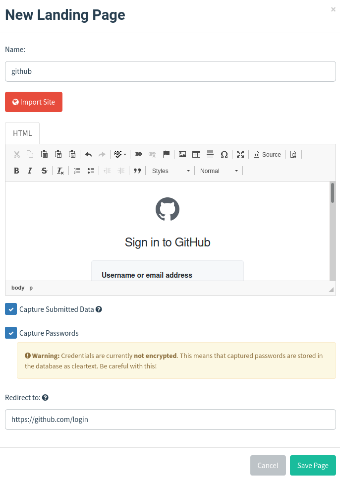
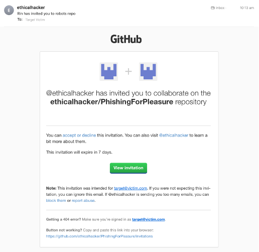
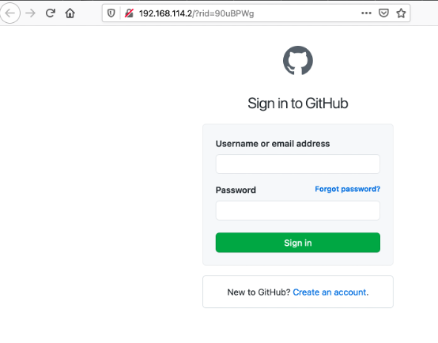
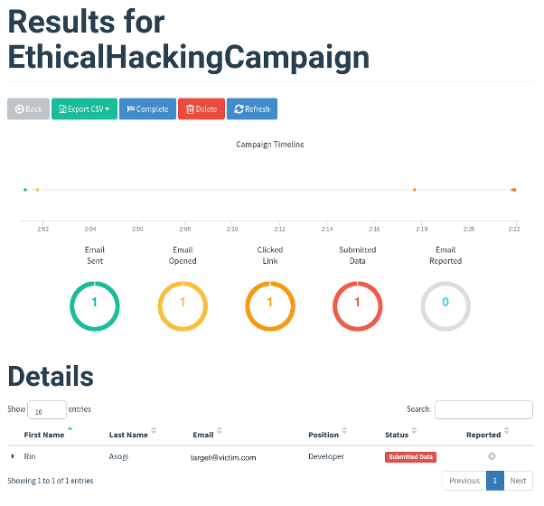

# Social Engineering

> In the previous chapter we saw a sophisticated means of gaining initial access through custom exploitation of external services. In this chapter, we will look at a very common, and surprisingly effective means of gaining initial access, asking a user to provide their credentials by simply asking them! Social engineering is the practice of getting users to provide information by pretending to be a legitimate site or person who would normally have a right to it. We will look at how to use email phishing as a means of tricking people to give up information, including credentials. We will cover the use of a social engineering tool Gophish and also how carry out a phishing attack in the Hack The Box machine SneakyMailer.

## What is Social Engineering?

In many cases, if you want access to a network, machine or even physical premises, the easiest thing to do is to simply ask for it, especially if you pretend to be someone that has a legitimate reason to be asking. More formally, social engineering is the use of deception to manipulate a person into revealing some information or taking some sort of inappropriate action on the attacker's behalf. Social engineering relies on exploiting human behavior based on both their general human behaviors, and also through manipulation of individuals based on their personal life or work.

Social engineering takes advantage of the fact that people generally:

* want to be helpful
* tend to trust people and communications that come from trusted people
* are concerned about getting in trouble
* are willing to cut corners
* are willing to believe in good fortune
* don't understand how technology works

Take all of these factors, add to them the number of legitimate emails that prompt for some sort of interaction, it is not surprising that getting people to do something that allows attackers to capture credentials, or run malware, is relatively straightforward.

The principal way in which social engineering attacks are made is through phishing. Attackers primarily use email to carry out attacks but the same techniques can be applied to phishing by way of SMS , direct messages in messaging apps, automated robocalls through telephones and even videoconferencing apps.

The goal of a phishing attack is to either get a user to click on a link that takes them to a site under the attacker's control, or downloads and installs malware directly. In another variant, malware may be sent directly as an attachment of the message and the receiver of the email is socially engineered into installing the malware directly.

We are going to look at phishing in more detail by exploring the use of a social engineering tool called Gophish. We will focus on attacks that trick a user into providing credentials on a fake login page copied from a genuine service.

## Going Phishing with Gophish

Phishing provides the largest and potentially most effective way of getting malware onto a computer or convincing a target to reveal their user credentials, personal or financial information and even take other actions on the attacker's behalf. Phishing's most common channel is email and there are a number of tools that simplify the ability to create phishing emails, send them to targets and monitor the responses.

Although there are a couple of tools on Parrot OS, they are dated, and their source code is not maintained. The tool we will use is called Gophish \(which can be installed from https://github.com/gophish/gophish\) which is written in the programming language Go and handles phishing campaigns and monitor the results. Although it can be used for attacking, it can also be used for training staff in cybersecurity awareness by auditing how many would respond to a particular phishing attack.

Phishing attacks are generally never one-off events but are instead part of a campaign which is a series of attacks carried out over a period of time to achieve a set of goals.

Setting up a campaign involves; using an SMTP server to send the mail, choosing the email text that you want to send, and selecting the users that the emails are going to be sent to. To get an idea of how this works in practice, we can run through a simple example of setting up a credential harvesting website locally and send a phishing email.

There are a number of challenges an attacker needs to overcome when sending phishing emails and that is a large reason that so many of them don't get through to the victim and end up in the spam folder instead. The first is finding an open relay SMTP server. An SMTP server is said to be an open relay when it allows unauthorized emails to be sent through it and allows the sender email address and display name to be spoofed. An alternative to finding an open relay SMTP server is for the attacker to set up their own SMTP server. In either case, SMTP servers can become blacklisted if they are seen to be sending out large numbers of emails that have been flagged as spam or phishing. A blacklisted SMTP server may be prevented from sending email and may have all of its email flagged as spam.

An attacker could also use stolen credentials to use a legitimate email service to send emails and this might work when the email attack is targeted at a specific person, an attack known as a spear phishing attacks.

Choosing the content of the email involves the attacker masquerading as a sender and creating an email in the style of one that would be sent by them. Attackers often pretend to be a group like IT support or help desk asking for email account verification. Other commonly spoofed organizations are couriers or postal services sending email that claims there to be unpaid shipping on a parcel that contains something of value. You will have likely seen many examples of these types of emails arriving in your inbox or spam folder on a daily basis.

Setting up a spoofed website is perhaps the easiest part of the phishing campaign. In our example we are going to clone the GitHub login page, but it is straightforward to use any social media login page, or any other company's login page for that matter. Once the spoofed site is set up, Gophish will record visits to the site and optionally will record the usernames and passwords entered by victims. Once the credentials are harvested, the user can be redirected to the real site to reduce suspicion that they were tricked.

Normally, an attacker would make the site more convincing by using SSL and having a certificate that matched the domain name chosen for the site. Users have been taught to make sure that the sites they visit are protected by looking for the padlock in the browser that indicates the site is using SSL and that the certificate is valid. Browsers will now warn users when they visit a site that is not SSL protected. Also, you would want a URL that is close enough to the real URL you are spoofing in order to pass casual scrutiny by the user. In our exercise, we are not going to bother with SSL certificates or setting up a domain for the URL.

## Creating a phishing campaign in Gophish

To install Gophish, you can download a release, unzip and use it directly \(https://github.com/gophish/gophish/releases/\). When run as root, Gophish will start two web servers, one on port 80 that will host the phishing landing pages and the other on port 3333 which is the administration site. Opening the admin site in a browser, you can log in with the user admin and the password that was printed out on the console when you ran it. You will be prompted to change the admin password. You will see the Dashboard shown in Figure 6-1.

To start, we will create a sending profile. For this, I am going to use a Gmail account that I have created specifically to use for this example. If you create an account on Gmail, you will need to change the security settings for Gmail to allow non-secure applications to access the account. Click on Sending Profiles and then Add New and then complete the form using the details of your Gmail account as shown in Figure 6-2. In the From field, the name that you add here will be displayed in the receiver's inbox. If you are using Gmail, the from email address will always be the email of the account you are using to send the email. To change this, you would need to use your own SMTP server. This is not so much of a problem as many users will not check this when reading emails.

Next, we are going to create an email template that will be based on the invitations that GitHub sends to users to collaborate on a repository. I have copied the HTML from a real email but if you don't have one, you can just type an email in the editor. Email templates will substitute values in the template that are in double braces {{}}. The ones we are using here are the target's email address {{.Email}}, and the phishing URL {{.URL}} which is used as a link in the text.

Save the template and now click on Landing Page and Add New to create a new landing page \(Figure 6-4\). We can use the Import Site button to import the page from the GitHub Login page and add the same URL to redirect to after the credentials are captured.

Now that this has been done, we need to define the list of users to send emails to in the Users & Groups page. Here, just add your own email address or create another account to receive the emails. The first and last name and position can all be used within the email templates to add to the personalization of the emails sent.

Finally, we can create a campaign and send the phishing email. In Campaign, click New Campaign and fill out the details \(Figure 6-5\). For the URL, you want to use your own IP address.

Once the Launch Campaign button is pressed, the email should be sent and you should receive an email based on the template you used \(Figure 6-6\).

Clicking on the accept or decline link will take you to the phishing landing page shown in Figure 6-7.

Entering a username and password and clicking Sign in should then redirect you to the GitHub login page with no feedback. Note that if you actually have a GitHub account and are already authenticated by the browser, when the phishing landing page redirects, it will take you straight to your default GitHub page and so it will look like the login was successful.

The Dashboard page on Gophish will update to say that the email was clicked and that you visited the landing page \(Figure 6-8\).

Creating a new campaign in Gophish

You can click the Submitted Data button to view the details of the interaction with the target page \(Figure 6-9\) and see the data entered in the login page \(Figure 6-10\).

.

.

